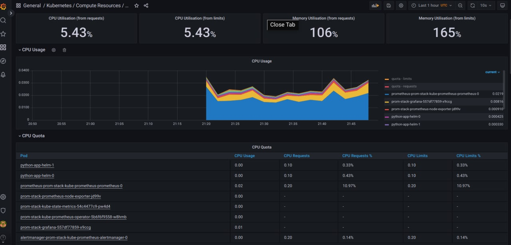

# K8s, Prometheus, Init Containers

## Main Part

1. Firstly, I describe components of the stack and their purpose:
   
   * **The Prometheus Operator** - tool for automating configuration and management of Prometheus in k8s.
   * **Highly available Prometheus** - monitoring tool for applications which uses time series database for collecting metrics and provide query language and alerting.
   * **Highly available Alertmanager** - tool that receive alert from different services and manage them. For example, it can send alert to the user.
   * **Prometheus node-exporter** - export os and hardware metrics of a node in k8s and send it to Prometheus.
   * **Prometheus Adapter for Kubernetes Metrics APIs** - it collects the metrics of k8s and send to Prometheus. It helps in Horizontal Pod Autoscaler.
   * **kube-state-metrics** - collects metrics of objects in kubernetes through Kubernetes API server. It consider objects, such as deployments, nodes and pods.
   * **Grafana** - interactive web application for monitoring the services visualizing the data. It provides graphs, charts, tables, alerts and others.

2. Firstly, start minikube using the following command which allow to see all metrics (thanks to Vladimir Markov for this command):
   ```commandline
   minikube start --kubernetes-version=v1.23.0 --memory=6g --bootstrapper=kubeadm --extra-config=kubelet.authentication-token-webhook=true --extra-config=kubelet.authorization-mode=Webhook --extra-config=scheduler.bind-address=0.0.0.0 --extra-config=controller-manager.bind-address=0.0.0.0
   ```
   
3. Install the helm chart to k8s cluster:

   ```
   $ helm repo add prometheus-community https://prometheus-community.github.io/helm-charts
   "prometheus-community" has been added to your repositories
   
   $ helm repo update
   Hang tight while we grab the latest from your chart repositories...
   ...Successfully got an update from the "prometheus-community" chart repository
   Update Complete. ⎈Happy Helming!⎈
   
   $ helm install prom-stack prometheus-community/kube-prometheus-stack
   NAME: prom-stack
   LAST DEPLOYED: Tue Dec  6 00:16:45 2022
   NAMESPACE: default
   STATUS: deployed
   REVISION: 1
   NOTES:
   kube-prometheus-stack has been installed. Check its status by running:
   kubectl --namespace default get pods -l "release=prom-stack"
   
   Visit https://github.com/prometheus-operator/kube-prometheus for instructions on how to create & configure Alertmanager and Prometheus instances using the Operator.
   ```

   Install app's helm chart:

   ```
   $ helm secrets install python-app-helm ./python-app-helm -n default -f ./python-app-helm/secrets.yaml
   NAME: python-app-helm
   LAST DEPLOYED: Tue Dec  6 00:10:14 2022
   NAMESPACE: default
   STATUS: deployed
   REVISION: 1
   NOTES:
   Get the application URL by running these commands:
   NOTE: It may take a few minutes for the LoadBalancer IP to be available.
   You can watch the status of by running 'kubectl get --namespace default svc -w python-app-helm'
   export SERVICE_IP=$(kubectl get svc --namespace default python-app-helm --template "{{ range (index .status.loadBalancer.ingress 0) }}{{.}}{{ end }}")
   echo http://$SERVICE_IP:80
   removed './python-app-helm/secrets.yaml.dec'
   ```

   See result of deployment. This command return status of pods, stateful sets, services, persistent volume claims and configmaps: 

   ```
   $ kubectl get po,sts,svc,pvc,cm
   NAME                                                         READY   STATUS    RESTARTS        AGE
   pod/alertmanager-prom-stack-kube-prometheus-alertmanager-0   2/2     Running   1 (3m37s ago)   3m53s
   pod/prom-stack-grafana-557df77859-x9ccg                      3/3     Running   0               4m6s
   pod/prom-stack-kube-prometheus-operator-5b6f6f9558-w8hmb     1/1     Running   0               4m6s
   pod/prom-stack-kube-state-metrics-54c4477c9-pw4d4            1/1     Running   0               4m6s
   pod/prom-stack-prometheus-node-exporter-jd99v                1/1     Running   0               4m6s
   pod/prometheus-prom-stack-kube-prometheus-prometheus-0       2/2     Running   0               3m53s
   pod/python-app-helm-0                                        1/1     Running   0               10m
   pod/python-app-helm-1                                        1/1     Running   0               10m
   
   NAME                                                                    READY   AGE
   statefulset.apps/alertmanager-prom-stack-kube-prometheus-alertmanager   1/1     3m53s
   statefulset.apps/prometheus-prom-stack-kube-prometheus-prometheus       1/1     3m53s
   statefulset.apps/python-app-helm                                        2/2     10m
   
   NAME                                              TYPE           CLUSTER-IP       EXTERNAL-IP   PORT(S)                      AGE
   service/alertmanager-operated                     ClusterIP      None             <none>        9093/TCP,9094/TCP,9094/UDP   3m53s
   service/kubernetes                                ClusterIP      10.96.0.1        <none>        443/TCP                      13m
   service/prom-stack-grafana                        ClusterIP      10.107.99.216    <none>        80/TCP                       4m6s
   service/prom-stack-kube-prometheus-alertmanager   ClusterIP      10.108.66.15     <none>        9093/TCP                     4m6s
   service/prom-stack-kube-prometheus-operator       ClusterIP      10.109.27.109    <none>        443/TCP                      4m6s
   service/prom-stack-kube-prometheus-prometheus     ClusterIP      10.99.45.44      <none>        9090/TCP                     4m6s
   service/prom-stack-kube-state-metrics             ClusterIP      10.101.158.183   <none>        8080/TCP                     4m6s
   service/prom-stack-prometheus-node-exporter       ClusterIP      10.103.74.59     <none>        9100/TCP                     4m6s
   service/prometheus-operated                       ClusterIP      None             <none>        9090/TCP                     3m53s
   service/python-app-helm                           LoadBalancer   10.103.208.209   <pending>     80:30942/TCP                 10m
   
   NAME                                                        STATUS   VOLUME                                     CAPACITY   ACCESS MODES   STORAGECLASS   AGE
   persistentvolumeclaim/persistent-volume-python-app-helm-0   Bound    pvc-8484e6d2-6dd9-4fd7-b32f-b9674699ff5a   128Mi      RWO            standard       10m
   persistentvolumeclaim/persistent-volume-python-app-helm-1   Bound    pvc-7201cd03-d46d-4fae-8614-a327187e22d9   128Mi      RWO            standard       10m
   
   NAME                                                                     DATA   AGE
   configmap/kube-root-ca.crt                                               1      13m
   configmap/prom-stack-grafana                                             1      4m6s
   configmap/prom-stack-grafana-config-dashboards                           1      4m6s
   configmap/prom-stack-kube-prometheus-alertmanager-overview               1      4m6s
   configmap/prom-stack-kube-prometheus-apiserver                           1      4m6s
   configmap/prom-stack-kube-prometheus-cluster-total                       1      4m6s
   configmap/prom-stack-kube-prometheus-controller-manager                  1      4m6s
   configmap/prom-stack-kube-prometheus-etcd                                1      4m6s
   configmap/prom-stack-kube-prometheus-grafana-datasource                  1      4m6s
   configmap/prom-stack-kube-prometheus-grafana-overview                    1      4m6s
   configmap/prom-stack-kube-prometheus-k8s-coredns                         1      4m6s
   configmap/prom-stack-kube-prometheus-k8s-resources-cluster               1      4m6s
   configmap/prom-stack-kube-prometheus-k8s-resources-namespace             1      4m6s
   configmap/prom-stack-kube-prometheus-k8s-resources-node                  1      4m6s
   configmap/prom-stack-kube-prometheus-k8s-resources-pod                   1      4m6s
   configmap/prom-stack-kube-prometheus-k8s-resources-workload              1      4m6s
   configmap/prom-stack-kube-prometheus-k8s-resources-workloads-namespace   1      4m6s
   configmap/prom-stack-kube-prometheus-kubelet                             1      4m6s
   configmap/prom-stack-kube-prometheus-namespace-by-pod                    1      4m6s
   configmap/prom-stack-kube-prometheus-namespace-by-workload               1      4m6s
   configmap/prom-stack-kube-prometheus-node-cluster-rsrc-use               1      4m6s
   configmap/prom-stack-kube-prometheus-node-rsrc-use                       1      4m6s
   configmap/prom-stack-kube-prometheus-nodes                               1      4m6s
   configmap/prom-stack-kube-prometheus-nodes-darwin                        1      4m6s
   configmap/prom-stack-kube-prometheus-persistentvolumesusage              1      4m6s
   configmap/prom-stack-kube-prometheus-pod-total                           1      4m6s
   configmap/prom-stack-kube-prometheus-prometheus                          1      4m6s
   configmap/prom-stack-kube-prometheus-proxy                               1      4m6s
   configmap/prom-stack-kube-prometheus-scheduler                           1      4m6s
   configmap/prom-stack-kube-prometheus-workload-total                      1      4m6s
   configmap/prometheus-prom-stack-kube-prometheus-prometheus-rulefiles-0   29     3m53s
   configmap/python-app-helm-config
   ```

4. Open grafana to see the metrics:

   Firstly, change config port. Open file using below command and change row `type: ClusterIP` to `type: NodePort`:
   ```
   $ kubectl edit svc prom-stack-grafana 
   service/prom-stack-grafana edited
   ```
   Then use credentials to login grafana:
   ```commandline
   login: admin
   password: prom-operator
   ```
   

   * Check how much CPU and Memory your StatefulSet is consuming (Kubernetes/Compute Resources/Namespace (Workload)). 
   
     

     
   
   * Check which Pod is using CPU more than others and which is less in the default namespace (Kubernetes/Compute Resources/Namespace (Pods)).
     
   
   * Check how much memory is used on your node, in % and mb (Kubernetes/Compute Resources/Namespace (Pods)).
     
   
   * Check how many pods and containers actually ran by the Kubelet service (Kubernetes/Kublet).
     
   
   * Check which Pod is using network more than others and which is less in the default namespace (Kubernetes/Networking/Namespace (Pods)).
     
   
   * Check how many alerts you have. Also you can see them in the Web UI by the minikube service monitoring-kube-prometheus-alertmanager command (Alert Manager/Overview).
     

6. Create Init container to download any file, like in the tutorial:
   * I used url for manifect, but also you can provide file `init-contaiiners.yaml` to a command:
   
       ```
       $ kubectl apply -f https://k8s.io/examples/pods/init-containers.yaml
       pod/init-demo created
     
       $ kubectl get pod init-demo
       NAME        READY   STATUS    RESTARTS   AGE
       init-demo   1/1     Running   0          32s
       ```
   * See the nginx file saved in container:
   
       ```
       $ kubectl exec pod/init-demo -- cat /usr/share/nginx/html/index.html
       Defaulted container "nginx" out of: nginx, install (init)
       <html><head></head><body><header>
       <title>http://info.cern.ch</title>
       </header>
       
       <h1>http://info.cern.ch - home of the first website</h1>
       <p>From here you can:</p>
       <ul>
       <li><a href="http://info.cern.ch/hypertext/WWW/TheProject.html">Browse the first website</a></li>
       <li><a href="http://line-mode.cern.ch/www/hypertext/WWW/TheProject.html">Browse the first website using the line-mode browser simulator</a></li>
       <li><a href="http://home.web.cern.ch/topics/birth-web">Learn about the birth of the web</a></li>
       <li><a href="http://home.web.cern.ch/about">Learn about CERN, the physics laboratory where the web was born</a></li>
       </ul>
       </body></html>
       ```

## Bonus Part

1. Get metrics from app. 

   Firstly, I added `servicemonitor.yaml`:
   ```
   apiVersion: monitoring.coreos.com/v1
   kind: ServiceMonitor
   metadata:
   name: {{ include "python-app-helm.fullname" . }}
   labels:
     {{- include "python-app-helm.labels" . | nindent 4 }}
     release: service-bonus
   spec:
     selector:
       matchLabels:
         {{- include "python-app-helm.selectorLabels" . | nindent 6 }}
     endpoints:
       - port: http
   ```
   
   To access the prometheus change config port. Open file using below command and change row `type: ClusterIP` to `type: NodePort`:
   
   ```
   $ kubectl edit svc prom-stack-kube-prometheus-prometheus
   service/prom-stack-kube-prometheus-prometheus edited
   ```
   
2. Create a queue of three Init containers, which add new lines to the file `/bonus/result.txt`.
   
   ```
   $ kubectl apply -f init-containers-bonus.yaml 
   pod/init-demo-bonus created   
   
   $ kubectl get pod init-demo-bonus                                  
   NAME              READY   STATUS    RESTARTS   AGE
   init-demo-bonus   1/1     Running   0          9s

   $ kubectl exec pod/init-demo-bonus -- cat /bonus/result.txt
   Defaulted container "nginx" out of: nginx, step1 (init), step2 (init), step3 (init)
   some data 1
   some data 2
   some data 3 
   ```