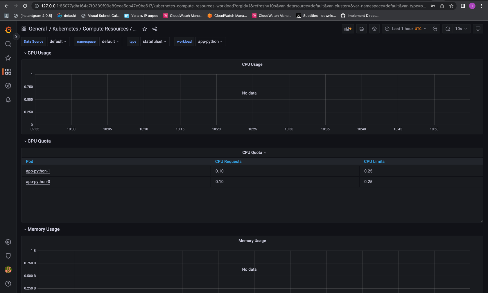
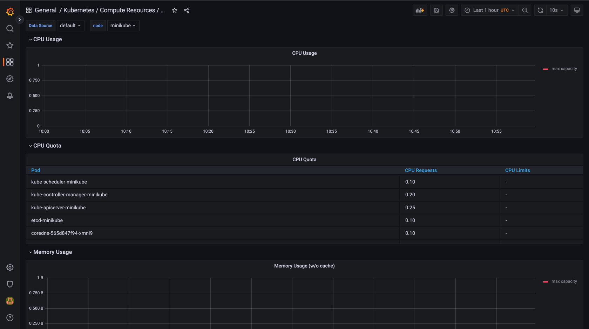
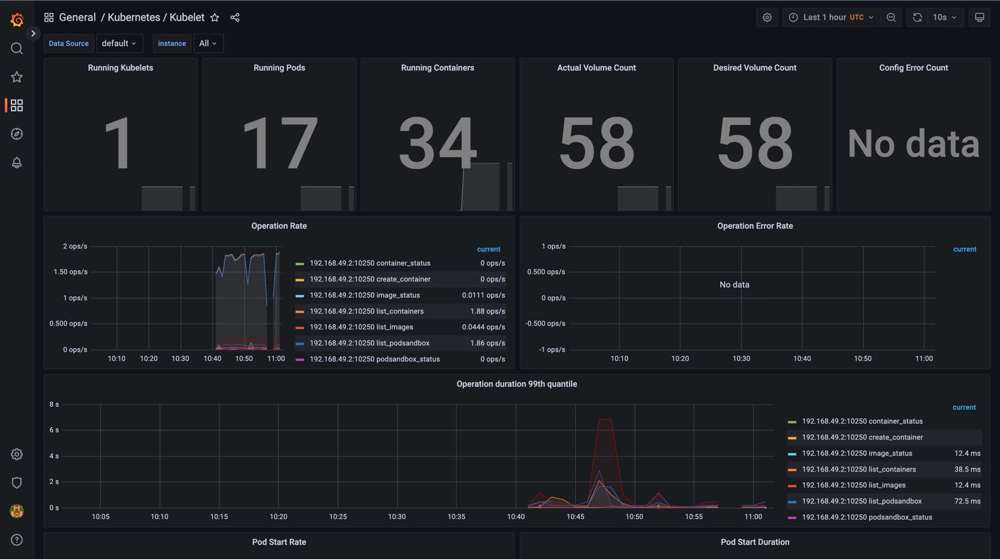

# Prometheus Stack Components

### Prometheus Operator
Simplify prometheus deployment and configuration.

### Prometheus
The prometheus itself, the metric database.

### Alertmanager
Sends annoying alerts to different channels.

### Node exporter
Export node (OS) metrics from apps.

### Prometheus Adapter for Kubernetes Metrics APIs
Adapter that communicate between k8s and prometheus

### Kube State Metrics
Get metrics from objects in k8s.

### Grafana
UI dashboard, that visualize metrics from difference sources.

# Installation

1. Install prometheus.
```shell
helm repo add prometheus-community https://prometheus-community.github.io/helm-charts
helm repo update
helm install prometheus prometheus-community/kube-prometheus-stack
```

2. Install app.
```shell
helm secrets install app-python ./app-python  -n default -f ./secrets.yaml
```

3. Check.
```shell
(iu-devops-labs) f3line@kitty-2 k8s % kubectl get po,sts,svc,pvc,cm
NAME                                                         READY   STATUS    RESTARTS        AGE
pod/alertmanager-prometheus-kube-prometheus-alertmanager-0   2/2     Running   1 (2m38s ago)   3m45s
pod/app-python-0                                             1/1     Running   0               4m12s
pod/app-python-1                                             1/1     Running   0               4m12s
pod/prometheus-grafana-5d9f5d6499-2f8v6                      3/3     Running   0               4m27s
pod/prometheus-kube-prometheus-operator-689dd6679c-cxgkg     1/1     Running   0               4m27s
pod/prometheus-kube-state-metrics-6cfd96f4c8-9vcrn           1/1     Running   0               4m27s
pod/prometheus-prometheus-kube-prometheus-prometheus-0       2/2     Running   0               3m45s
pod/prometheus-prometheus-node-exporter-zxz4t                1/1     Running   0               4m27s

NAME                                                                    READY   AGE
statefulset.apps/alertmanager-prometheus-kube-prometheus-alertmanager   1/1     3m46s
statefulset.apps/app-python                                             2/2     4m12s
statefulset.apps/prometheus-prometheus-kube-prometheus-prometheus       1/1     3m45s

NAME                                              TYPE        CLUSTER-IP       EXTERNAL-IP   PORT(S)                      AGE
service/alertmanager-operated                     ClusterIP   None             <none>        9093/TCP,9094/TCP,9094/UDP   3m46s
service/app-python                                NodePort    10.105.179.82    <none>        8000:30476/TCP               4m12s
service/kubernetes                                ClusterIP   10.96.0.1        <none>        443/TCP                      35d
service/prometheus-grafana                        ClusterIP   10.97.153.201    <none>        80/TCP                       4m27s
service/prometheus-kube-prometheus-alertmanager   ClusterIP   10.104.16.181    <none>        9093/TCP                     4m27s
service/prometheus-kube-prometheus-operator       ClusterIP   10.102.38.150    <none>        443/TCP                      4m27s
service/prometheus-kube-prometheus-prometheus     ClusterIP   10.105.124.80    <none>        9090/TCP                     4m27s
service/prometheus-kube-state-metrics             ClusterIP   10.108.6.138     <none>        8080/TCP                     4m27s
service/prometheus-operated                       ClusterIP   None             <none>        9090/TCP                     3m45s
service/prometheus-prometheus-node-exporter       ClusterIP   10.105.188.255   <none>        9100/TCP                     4m27s

NAME                                                 STATUS   VOLUME                                     CAPACITY   ACCESS MODES   STORAGECLASS   AGE
persistentvolumeclaim/app-python-data-app-python-0   Bound    pvc-b1c91e2b-3688-49e1-a33f-0214cb16cc9d   128Mi      RWO            standard       7d2h
persistentvolumeclaim/app-python-data-app-python-1   Bound    pvc-32e45a46-f929-45db-9763-feb12f0536a9   128Mi      RWO            standard       7d2h

NAME                                                                     DATA   AGE
configmap/app-python-config                                              1      4m12s
configmap/kube-root-ca.crt                                               1      35d
configmap/prometheus-grafana                                             1      4m27s
configmap/prometheus-grafana-config-dashboards                           1      4m27s
configmap/prometheus-kube-prometheus-alertmanager-overview               1      4m27s
configmap/prometheus-kube-prometheus-apiserver                           1      4m27s
configmap/prometheus-kube-prometheus-cluster-total                       1      4m27s
configmap/prometheus-kube-prometheus-controller-manager                  1      4m27s
configmap/prometheus-kube-prometheus-etcd                                1      4m27s
configmap/prometheus-kube-prometheus-grafana-datasource                  1      4m27s
configmap/prometheus-kube-prometheus-grafana-overview                    1      4m27s
configmap/prometheus-kube-prometheus-k8s-coredns                         1      4m27s
configmap/prometheus-kube-prometheus-k8s-resources-cluster               1      4m27s
configmap/prometheus-kube-prometheus-k8s-resources-namespace             1      4m27s
configmap/prometheus-kube-prometheus-k8s-resources-node                  1      4m27s
configmap/prometheus-kube-prometheus-k8s-resources-pod                   1      4m27s
configmap/prometheus-kube-prometheus-k8s-resources-workload              1      4m27s
configmap/prometheus-kube-prometheus-k8s-resources-workloads-namespace   1      4m27s
configmap/prometheus-kube-prometheus-kubelet                             1      4m27s
configmap/prometheus-kube-prometheus-namespace-by-pod                    1      4m27s
configmap/prometheus-kube-prometheus-namespace-by-workload               1      4m27s
configmap/prometheus-kube-prometheus-node-cluster-rsrc-use               1      4m27s
configmap/prometheus-kube-prometheus-node-rsrc-use                       1      4m27s
configmap/prometheus-kube-prometheus-nodes                               1      4m27s
configmap/prometheus-kube-prometheus-nodes-darwin                        1      4m27s
configmap/prometheus-kube-prometheus-persistentvolumesusage              1      4m27s
configmap/prometheus-kube-prometheus-pod-total                           1      4m27s
configmap/prometheus-kube-prometheus-prometheus                          1      4m27s
configmap/prometheus-kube-prometheus-proxy                               1      4m27s
configmap/prometheus-kube-prometheus-scheduler                           1      4m27s
configmap/prometheus-kube-prometheus-workload-total                      1      4m27s
configmap/prometheus-prometheus-kube-prometheus-prometheus-rulefiles-0   29     3m45s
```

4. Setup tunnel to grafana.
```shell
(iu-devops-labs) f3line@kitty-2 k8s % minikube service prometheus-grafana
|-----------|--------------------|-------------|--------------|
| NAMESPACE |        NAME        | TARGET PORT |     URL      |
|-----------|--------------------|-------------|--------------|
| default   | prometheus-grafana |             | No node port |
|-----------|--------------------|-------------|--------------|
😿  service default/prometheus-grafana has no node port
🏃  Starting tunnel for service prometheus-grafana.
|-----------|--------------------|-------------|------------------------|
| NAMESPACE |        NAME        | TARGET PORT |          URL           |
|-----------|--------------------|-------------|------------------------|
| default   | prometheus-grafana |             | http://127.0.0.1:65077 |
|-----------|--------------------|-------------|------------------------|
🎉  Opening service default/prometheus-grafana in default browser...
❗  Because you are using a Docker driver on darwin, the terminal needs to be open to run it.
```
5. Check resources. Most of the graphs are invalid.
    1. Check how much CPU and Memory your StatefulSet is consuming
        
    2. Check which Pod is using CPU more than others and which is less in the default namespace.
        
    3. Check how much memory is used on your node, in % and mb.
        
        
    4. Check how many pods and containers actually ran by the Kubelet service.
        
    5. Check which Pod is using network more than others and which is less in the default namespace.
        
    6. Check how many alerts you have. Also you can see them in the Web UI by the `minikube service monitoring-kube-prometheus-alertmanager` command.
        

# Init Containers

1. I add new volume and init container, that gets my ip to `statefulset.yaml`.

2. Install app.
```shell
helm secrets install app-python ./app-python  -n default -f ./secrets.yaml
```

3. Test.
```shell
(iu-devops-labs) f3line@kitty-2 k8s % kubectl exec pod/app-python-0 -- ls init
Defaulted container "app-python" out of: app-python, app-python-init (init)
ip.txt


(iu-devops-labs) f3line@kitty-2 k8s % kubectl exec pod/app-python-0 -- cat init/ip.txt
Defaulted container "app-python" out of: app-python, app-python-init (init)
52.33.103.59
```
