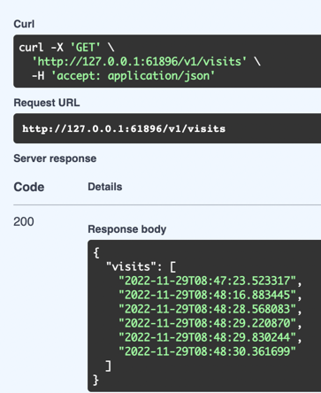
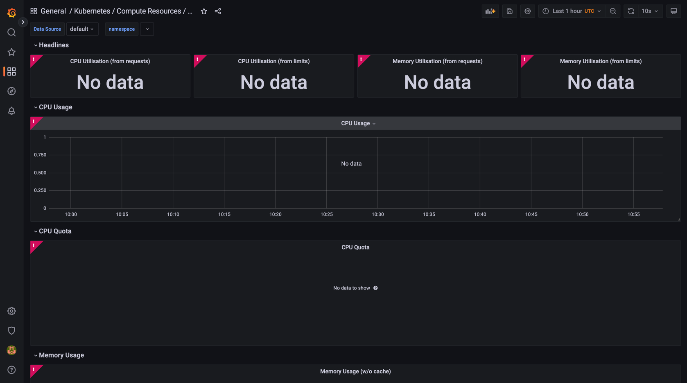
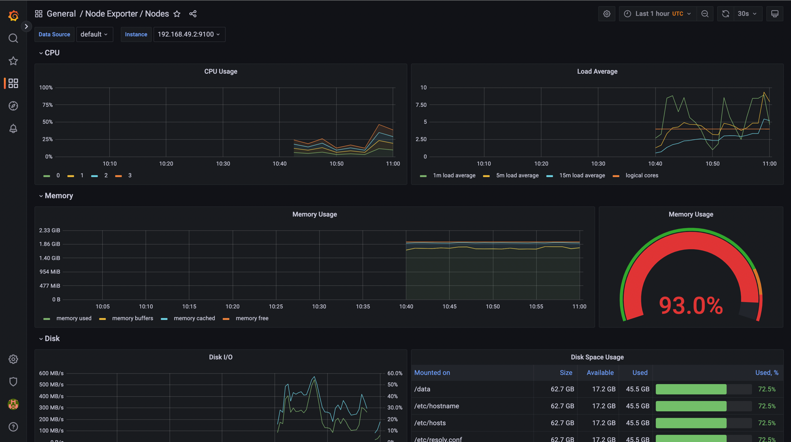

# Components of Promethous stack:

1) The Prometheus Operator - provides management of prometheus
2) Highly available Prometheus - needed for system monitoring
3) Highly available Alertmanager - handles alerts sent by client applications, groups and manages alerts 
4) Prometheus node-exporter - exposing OS metrics
5) Prometheus Adapter for Kubernetes Metrics APIs - adapts kubernetes metrics
6) kube-state-metrics - listens to the Kubernetes API server and generates metrics about the state of the objects.
7) Grafana - data visualization tool for monitoring


```bash
 kubectl get po,sts,svc,pvc,cm
NAME                                                      READY   STATUS              RESTARTS       AGE
pod/prometheus-stack-grafana-6b9dd74dbc-8rcqg             0/3     ContainerCreating   0              37s
pod/prometheus-stack-kube-prom-operator-db5945d59-kwn28   0/1     ContainerCreating   0              37s
pod/prometheus-stack-kube-state-metrics-cfbb785b-dpdlz    0/1     ContainerCreating   0              37s
pod/prometheus-stack-prometheus-node-exporter-mhdkz       1/1     Running             0              37s
pod/time-app-0                                            1/1     Running             1 (7d ago)     7d
pod/time-app-1                                            1/1     Running             1 (9m1s ago)   7d

NAME                        READY   AGE
statefulset.apps/time-app   2/2     7d

NAME                                                TYPE           CLUSTER-IP       EXTERNAL-IP   PORT(S)          AGE
service/kubernetes                                  ClusterIP      10.96.0.1        <none>        443/TCP          36d
service/prometheus-stack-grafana                    ClusterIP      10.108.160.202   <none>        80/TCP           37s
service/prometheus-stack-kube-prom-alertmanager     ClusterIP      10.97.241.83     <none>        9093/TCP         37s
service/prometheus-stack-kube-prom-operator         ClusterIP      10.107.15.162    <none>        443/TCP          37s
service/prometheus-stack-kube-prom-prometheus       ClusterIP      10.97.184.65     <none>        9090/TCP         37s
service/prometheus-stack-kube-state-metrics         ClusterIP      10.103.168.210   <none>        8080/TCP         37s
service/prometheus-stack-prometheus-node-exporter   ClusterIP      10.97.246.5      <none>        9100/TCP         37s
service/time-app                                    LoadBalancer   10.111.12.99     <pending>     5000:30041/TCP   7d

NAME                                                  STATUS   VOLUME                                     CAPACITY   ACCESS MODES   STORAGECLASS   AGE
persistentvolumeclaim/persistence-volume-time-app-0   Bound    pvc-8ed2c053-4c5b-4444-b7d2-0f728cd75a44   512Mi      RWO            standard       7d
persistentvolumeclaim/persistence-volume-time-app-1   Bound    pvc-2265f460-c853-47ab-9938-0f94a1885491   512Mi      RWO            standard       7d
persistentvolumeclaim/postgres-pv-claim               Bound    pvc-8eaef0e0-b1eb-4e47-bd35-8cd3bc7e1b65   512M       RWO            standard       7d5h

NAME                                                                     DATA   AGE
configmap/kube-root-ca.crt                                               1      36d
configmap/prometheus-stack-grafana                                       1      37s
configmap/prometheus-stack-grafana-config-dashboards                     1      37s
configmap/prometheus-stack-kube-prom-alertmanager-overview               1      37s
configmap/prometheus-stack-kube-prom-apiserver                           1      37s
configmap/prometheus-stack-kube-prom-cluster-total                       1      37s
configmap/prometheus-stack-kube-prom-controller-manager                  1      37s
configmap/prometheus-stack-kube-prom-etcd                                1      37s
configmap/prometheus-stack-kube-prom-grafana-datasource                  1      37s
configmap/prometheus-stack-kube-prom-grafana-overview                    1      37s
configmap/prometheus-stack-kube-prom-k8s-coredns                         1      37s
configmap/prometheus-stack-kube-prom-k8s-resources-cluster               1      37s
configmap/prometheus-stack-kube-prom-k8s-resources-namespace             1      37s
configmap/prometheus-stack-kube-prom-k8s-resources-node                  1      37s
configmap/prometheus-stack-kube-prom-k8s-resources-pod                   1      37s
configmap/prometheus-stack-kube-prom-k8s-resources-workload              1      37s
configmap/prometheus-stack-kube-prom-k8s-resources-workloads-namespace   1      37s
configmap/prometheus-stack-kube-prom-kubelet                             1      37s
configmap/prometheus-stack-kube-prom-namespace-by-pod                    1      37s
configmap/prometheus-stack-kube-prom-namespace-by-workload               1      37s
configmap/prometheus-stack-kube-prom-node-cluster-rsrc-use               1      37s
configmap/prometheus-stack-kube-prom-node-rsrc-use                       1      37s
configmap/prometheus-stack-kube-prom-nodes                               1      37s
configmap/prometheus-stack-kube-prom-nodes-darwin                        1      37s
configmap/prometheus-stack-kube-prom-persistentvolumesusage              1      37s
configmap/prometheus-stack-kube-prom-pod-total                           1      37s
configmap/prometheus-stack-kube-prom-prometheus                          1      37s
configmap/prometheus-stack-kube-prom-proxy                               1      37s
configmap/prometheus-stack-kube-prom-scheduler                           1      37s
configmap/prometheus-stack-kube-prom-workload-total                      1      37s
configmap/time-app-configmap                                             1      14d
```

kubectl get po,sts,svc,pvc,cm - getting information about pods, services, persistance volumes, config maps

# Cpu & memory:


# Namespace resources consumption


# Node memory consumption


# Kubelet


# Network


# Alertmanager


# 