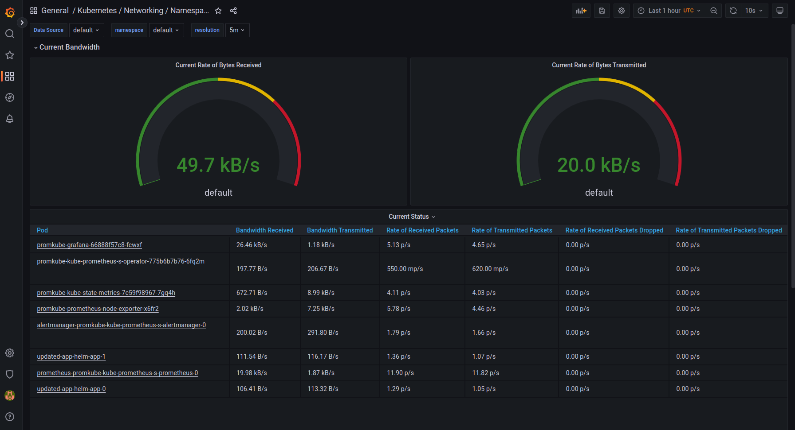

# 1 Explanation

Prometheus Operator - prometheus management tools in k8s
Prometheus - monitoring system
Alertmanager - a system for working with alerts
Peometheus node exporter - used to collect metrics about k8s nodes
Prometheus Adapter for Kubernetes Metrics APIs - provides metrics API for k8s
Grafana - an analytics tool
kube-state-metrics - metrics of k8 objects

# 2 Output

```
$ kubectl get po,sts,svc,pvc,cm
NAME                                                         READY   STATUS    RESTARTS       AGE
pod/alertmanager-monitoring-kube-prometheus-alertmanager-0   2/2     Running   1 (114s ago)   2m43s
pod/monitoring-grafana-66c67bcd8f-bw5n9                      3/3     Running   0              3m17s
pod/monitoring-kube-prometheus-operator-d6cfb6b6-x8xh2       1/1     Running   0              3m17s
pod/monitoring-kube-state-metrics-57479f96d5-dwcz5           1/1     Running   0              3m17s
pod/monitoring-prometheus-node-exporter-zph9j                1/1     Running   0              3m17s
pod/prometheus-monitoring-kube-prometheus-prometheus-0       1/2     Running   0              2m42s

NAME                                                                    READY   AGE
statefulset.apps/alertmanager-monitoring-kube-prometheus-alertmanager   1/1     2m43s
statefulset.apps/prometheus-monitoring-kube-prometheus-prometheus       0/1     2m42s

NAME                                              TYPE           CLUSTER-IP      EXTERNAL-IP   PORT(S)                      AGE
service/alertmanager-operated                     ClusterIP      None            <none>        9093/TCP,9094/TCP,9094/UDP   2m43s
service/kubernetes                                ClusterIP      10.96.0.1       <none>        443/TCP                      6m18s
service/monitoring-grafana                        LoadBalancer   10.111.68.4     <pending>     80:32259/TCP                 3m17s
service/monitoring-kube-prometheus-alertmanager   LoadBalancer   10.102.215.38   <pending>     9093:31434/TCP               3m17s
service/monitoring-kube-prometheus-operator       ClusterIP      10.99.127.70    <none>        443/TCP                      3m17s
service/monitoring-kube-prometheus-prometheus     ClusterIP      10.96.144.19    <none>        9090/TCP                     3m17s
service/monitoring-kube-state-metrics             ClusterIP      10.108.23.21    <none>        8080/TCP                     3m17s
service/monitoring-prometheus-node-exporter       ClusterIP      10.102.109.28   <none>        9100/TCP                     3m17s
service/prometheus-operated                       ClusterIP      None            <none>        9090/TCP                     2m42s

NAME                                                                     DATA   AGE
configmap/kube-root-ca.crt                                               1      5m56s
configmap/monitoring-grafana                                             1      3m18s
configmap/monitoring-grafana-config-dashboards                           1      3m18s
configmap/monitoring-kube-prometheus-alertmanager-overview               1      3m18s
configmap/monitoring-kube-prometheus-apiserver                           1      3m18s
configmap/monitoring-kube-prometheus-cluster-total                       1      3m18s
configmap/monitoring-kube-prometheus-controller-manager                  1      3m18s
configmap/monitoring-kube-prometheus-etcd                                1      3m18s
configmap/monitoring-kube-prometheus-grafana-datasource                  1      3m18s
configmap/monitoring-kube-prometheus-grafana-overview                    1      3m18s
configmap/monitoring-kube-prometheus-k8s-coredns                         1      3m18s
configmap/monitoring-kube-prometheus-k8s-resources-cluster               1      3m18s
configmap/monitoring-kube-prometheus-k8s-resources-namespace             1      3m18s
configmap/monitoring-kube-prometheus-k8s-resources-node                  1      3m18s
configmap/monitoring-kube-prometheus-k8s-resources-pod                   1      3m18s
configmap/monitoring-kube-prometheus-k8s-resources-workload              1      3m18s
configmap/monitoring-kube-prometheus-k8s-resources-workloads-namespace   1      3m18s
configmap/monitoring-kube-prometheus-kubelet                             1      3m18s
configmap/monitoring-kube-prometheus-namespace-by-pod                    1      3m18s
configmap/monitoring-kube-prometheus-namespace-by-workload               1      3m18s
configmap/monitoring-kube-prometheus-node-cluster-rsrc-use               1      3m18s
configmap/monitoring-kube-prometheus-node-rsrc-use                       1      3m18s
configmap/monitoring-kube-prometheus-nodes                               1      3m18s
configmap/monitoring-kube-prometheus-nodes-darwin                        1      3m18s
configmap/monitoring-kube-prometheus-persistentvolumesusage              1      3m18s
configmap/monitoring-kube-prometheus-pod-total                           1      3m18s
configmap/monitoring-kube-prometheus-prometheus                          1      3m18s
configmap/monitoring-kube-prometheus-proxy                               1      3m18s
configmap/monitoring-kube-prometheus-scheduler                           1      3m18s
configmap/monitoring-kube-prometheus-workload-total                      1      3m18s
configmap/prometheus-monitoring-kube-prometheus-prometheus-rulefiles-0   29     2m43s

```

# 3 Questions

## 1 Statefulset


## 2 Pods


## 3 Node


## 4 Kubelet


## 5 Network


## 6 Alert


# 4 Init container

```
$ kubectl apply -f moscow-time/templates/init-containers.yaml
pod/moscow-time created
```

```
$ kubectl exec -it moscow-time -- cat ./usr/share/nginx/html/index.html
Defaulted container "nginx" out of: nginx, install (init)
Unable to use a TTY - input is not a terminal or the right kind of file
<html><head></head><body><header>
<title>http://info.cern.ch</title>
</header>

<h1>http://info.cern.ch - home of the first website</h1>
<p>From here you can:</p>
<ul>
<li><a href="http://info.cern.ch/hypertext/WWW/TheProject.html">Browse the first website</a></li>
<li><a href="http://line-mode.cern.ch/www/hypertext/WWW/TheProject.html">Browse the first website using the line-mode browser simulator</a></li>
<li><a href="http://home.web.cern.ch/topics/birth-web">Learn about the birth of the web</a></li>
<li><a href="http://home.web.cern.ch/about">Learn about CERN, the physics laboratory where the web was born</a></li>
</ul>
</body></html>

```