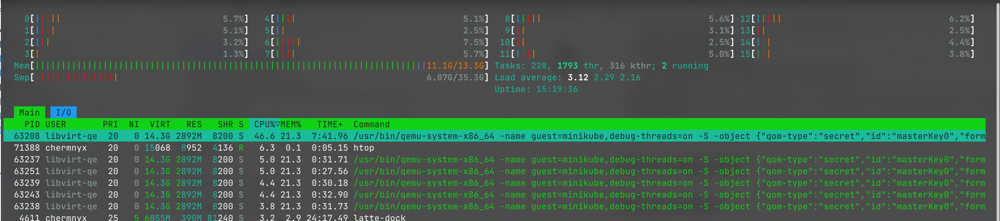

# Lab 11

## Secrets using kubectl

```bash
$ kubectl apply -f secret-raw.yml
secret/app-secret created
$ kubectl get secrets app-secret -o yaml
apiVersion: v1
data:
  password: YWJvYmExMzM34LaeCg==
kind: Secret
metadata:
  annotations:
    kubectl.kubernetes.io/last-applied-configuration: |
      {"apiVersion":"v1","data":{"password":"YWJvYmExMzM34LaeCg=="},"kind":"Secret","metadata":{"annotations":{},"name":"app-secret","namespace":"default"},"type":"Opaque"}
  creationTimestamp: "2022-11-14T15:42:46Z"
  name: app-secret
  namespace: default
  resourceVersion: "890"
  uid: 1cfe7a4f-bbf8-4d6b-9f28-7d23df9c30aa
type: Opaque
$ kubectl get secrets app-secret -o jsonpath='{.data.password}' | base64 -d
aboba1337ඞ
```

## Secrets using Helm 

Installation:

```bash
$ helm package package
$ helm secrets install app-python webapp-0.1.0.tgz -f val_python.yml -f secrets.yaml
$ helm secrets install app-rust webapp-0.1.0.tgz -f val_rust.yml -f secrets.yaml
```

Verification

```bash
$ kubectl get svc,deployments,secrets
NAME                        TYPE           CLUSTER-IP       EXTERNAL-IP   PORT(S)        AGE
service/app-python-webapp   LoadBalancer   10.106.229.119   <pending>     80:32393/TCP   44s
service/app-rust-webapp     LoadBalancer   10.103.245.91    <pending>     80:30629/TCP   43s
service/kubernetes          ClusterIP      10.96.0.1        <none>        443/TCP        40m

NAME                                READY   UP-TO-DATE   AVAILABLE   AGE
deployment.apps/app-python-webapp   3/3     3            3           44s
deployment.apps/app-rust-webapp     3/3     3            3           43s

NAME                                      TYPE                 DATA   AGE
secret/app-python-webapp                  Opaque               1      44s
secret/app-rust-webapp                    Opaque               1      43s
secret/app-secret                         Opaque               1      35m
secret/sh.helm.release.v1.app-python.v1   helm.sh/release.v1   1      44s
secret/sh.helm.release.v1.app-rust.v1     helm.sh/release.v1   1      43s

$ kubectl exec --tty --stdin app-python-webapp-7cb857bd4d-4pgv5 -- printenv | grep -i 'aboba|password'
PASSWORD=aboba1337ඞ
ABOBA=アボバ
```

## Resource limits

As you can see in file [values.yaml](./app_helm/package/values.yaml), the cpu limit is 0.1 of a core. Let's connect to the container and execute busy wait there:

```bash
$ kubectl exec --tty --stdin app-python-webapp-54c498c88d-5dbr7 -- sh
$ while true; do sleep 1& done
```


As you can see, VM with kubernetes pods (also includes cannot use more than 60% of one CPU core instead of using 100% of the CPU.
