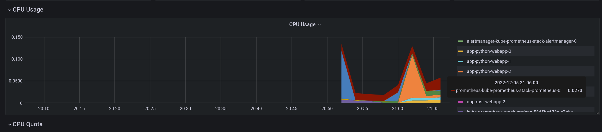
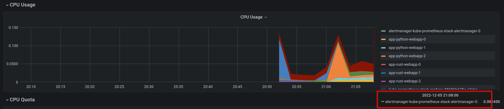
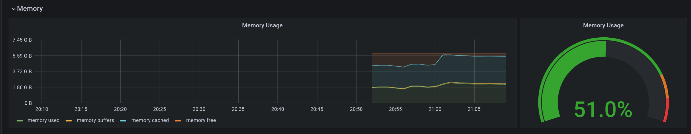
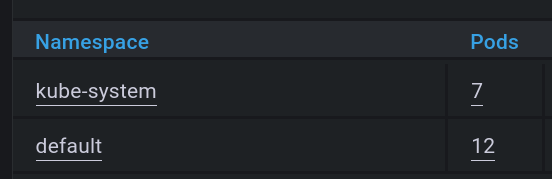
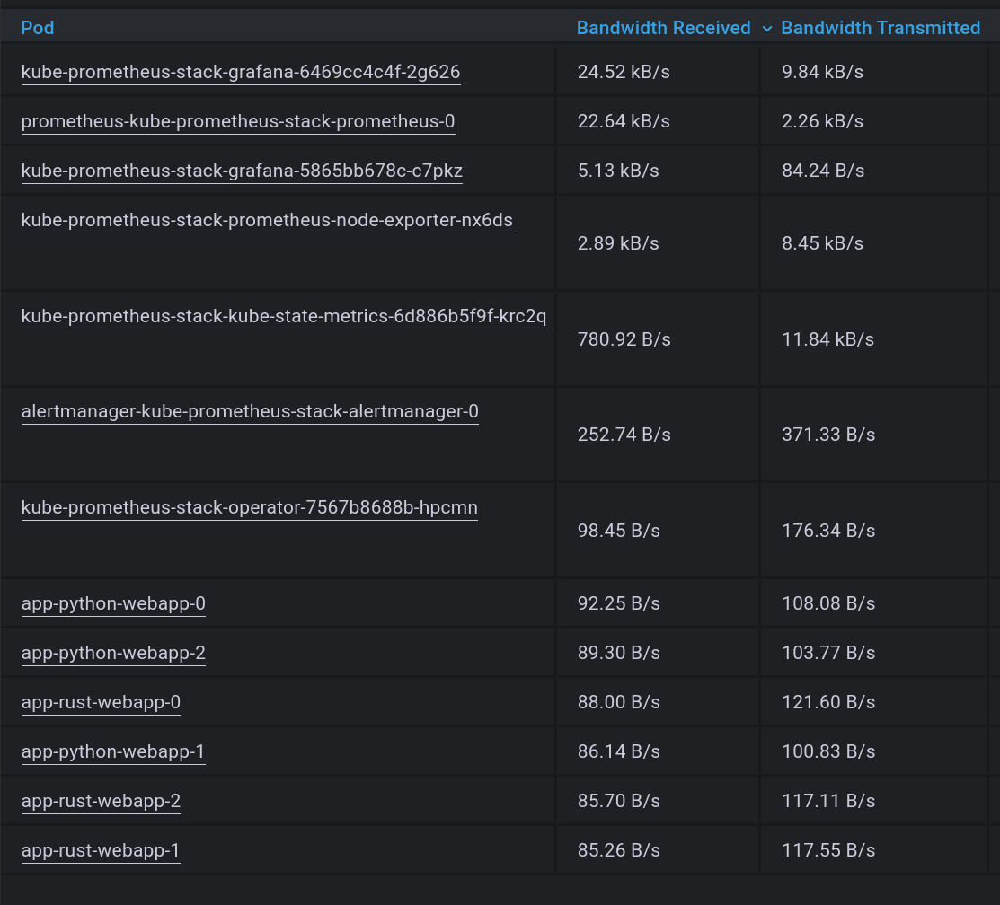
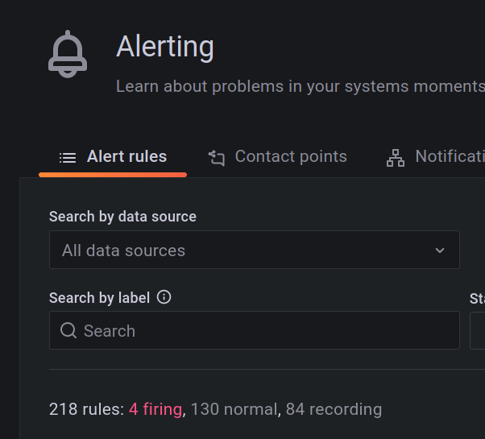

# Lab 14

## Kube Prometheus Stack

### Components

#### The Prometheus Operator

Manages Prometheus cluster inside k8s. Provides CRDs, Prometheus deployment, Prometheus config auto-generation.

#### Prometheus

The monitoring system itself that collects metrics from targets.

#### Alertmanager

Handles alerts sent based on metric values in Prometheus.

#### Prometheus node-exporter

Collects hardware-specific metrics from a device (like cpu usage, memory util, etc).

#### Prometheus Adapter for Kubernetes Metrics APIs

Sens k8s-specific metrics in Prometheus format to Prometheus.

#### kube-state-metrics

Exporter for k8s object state. Sends the metrics to Prometheus.

#### Grafana

A tool for data visualization

### minkube considiration

minikube requires some additional tweaks in config and an older k8s version to work with the Prometheus Operator.

See <https://github.com/prometheus-operator/kube-prometheus#minikube>


### Deployment 

Run

```bash
$ cd k8s/monitoring
$ helm install -f values.yml kube-prometheus-stack prometheus-community/kube-prometheus-stack

$ kubectl get po,sts,svc,pvc,cm
NAME                                                            READY   STATUS    RESTARTS      AGE
pod/alertmanager-kube-prometheus-stack-alertmanager-0           2/2     Running   1 (12m ago)   12m
pod/app-python-webapp-0                                         1/1     Running   0             3m18s
pod/app-python-webapp-1                                         1/1     Running   0             2m26s
pod/app-python-webapp-2                                         1/1     Running   0             114s
pod/app-rust-webapp-0                                           1/1     Running   0             3m17s
pod/app-rust-webapp-1                                           1/1     Running   0             2m47s
pod/app-rust-webapp-2                                           1/1     Running   0             2m40s
pod/kube-prometheus-stack-grafana-6469cc4c4f-2g626              3/3     Running   0             6m55s
pod/kube-prometheus-stack-kube-state-metrics-6d886b5f9f-krc2q   1/1     Running   0             13m
pod/kube-prometheus-stack-operator-7567b8688b-hpcmn             1/1     Running   0             13m
pod/kube-prometheus-stack-prometheus-node-exporter-nx6ds        1/1     Running   0             13m
pod/prometheus-kube-prometheus-stack-prometheus-0               2/2     Running   0             12m

NAME                                                               READY   AGE
statefulset.apps/alertmanager-kube-prometheus-stack-alertmanager   1/1     12m
statefulset.apps/app-python-webapp                                 3/3     3m18s
statefulset.apps/app-rust-webapp                                   3/3     3m17s
statefulset.apps/prometheus-kube-prometheus-stack-prometheus       1/1     12m

NAME                                                     TYPE           CLUSTER-IP       EXTERNAL-IP   PORT(S)                      AGE
service/alertmanager-operated                            ClusterIP      None             <none>        9093/TCP,9094/TCP,9094/UDP   12m
service/app-python-webapp                                LoadBalancer   10.109.77.114    <pending>     80:32060/TCP                 3m18s
service/app-rust-webapp                                  LoadBalancer   10.104.62.170    <pending>     80:31046/TCP                 3m17s
service/kube-prometheus-stack-alertmanager               ClusterIP      10.108.101.3     <none>        9093/TCP                     13m
service/kube-prometheus-stack-grafana                    LoadBalancer   10.111.179.69    <pending>     80:32595/TCP                 13m
service/kube-prometheus-stack-kube-state-metrics         ClusterIP      10.98.86.110     <none>        8080/TCP                     13m
service/kube-prometheus-stack-operator                   ClusterIP      10.101.108.208   <none>        443/TCP                      13m
service/kube-prometheus-stack-prometheus                 ClusterIP      10.109.157.234   <none>        9090/TCP                     13m
service/kube-prometheus-stack-prometheus-node-exporter   ClusterIP      10.104.35.171    <none>        9100/TCP                     13m
service/kubernetes                                       ClusterIP      10.96.0.1        <none>        443/TCP                      27m
service/prometheus-operated                              ClusterIP      None             <none>        9090/TCP                     12m

NAME                                                                 STATUS   VOLUME                                     CAPACITY   ACCESS MODES   STORAGECLASS   AGE
persistentvolumeclaim/app-python-webapp-volume-app-python-webapp-0   Bound    pvc-8752cb22-261a-4f81-9da8-1d87fe2864cd   64Mi       RWO            standard       3m18s
persistentvolumeclaim/app-python-webapp-volume-app-python-webapp-1   Bound    pvc-4b52deed-3c65-4da1-a96f-b70fe8843b75   64Mi       RWO            standard       2m26s
persistentvolumeclaim/app-python-webapp-volume-app-python-webapp-2   Bound    pvc-c1a35810-8a78-499e-bf25-4206ed7e24fe   64Mi       RWO            standard       114s
persistentvolumeclaim/app-rust-webapp-volume-app-rust-webapp-0       Bound    pvc-db293c85-569e-48fc-a510-bed2994e5dfe   64Mi       RWO            standard       3m17s
persistentvolumeclaim/app-rust-webapp-volume-app-rust-webapp-1       Bound    pvc-2a3a2a59-9ab4-4b66-826f-73c8bd981da1   64Mi       RWO            standard       2m47s
persistentvolumeclaim/app-rust-webapp-volume-app-rust-webapp-2       Bound    pvc-4bf3f183-7f47-41df-932f-0938b9243883   64Mi       RWO            standard       2m40s

NAME                                                                DATA   AGE
configmap/app-python-webapp-config                                  1      3m18s
configmap/app-rust-webapp-config                                    1      3m17s
configmap/kube-prometheus-stack-alertmanager-overview               1      13m
configmap/kube-prometheus-stack-apiserver                           1      13m
configmap/kube-prometheus-stack-cluster-total                       1      13m
configmap/kube-prometheus-stack-controller-manager                  1      13m
configmap/kube-prometheus-stack-etcd                                1      13m
configmap/kube-prometheus-stack-grafana                             1      13m
configmap/kube-prometheus-stack-grafana-config-dashboards           1      13m
configmap/kube-prometheus-stack-grafana-datasource                  1      13m
configmap/kube-prometheus-stack-grafana-overview                    1      13m
configmap/kube-prometheus-stack-k8s-coredns                         1      13m
configmap/kube-prometheus-stack-k8s-resources-cluster               1      13m
configmap/kube-prometheus-stack-k8s-resources-namespace             1      13m
configmap/kube-prometheus-stack-k8s-resources-node                  1      13m
configmap/kube-prometheus-stack-k8s-resources-pod                   1      13m
configmap/kube-prometheus-stack-k8s-resources-workload              1      13m
configmap/kube-prometheus-stack-k8s-resources-workloads-namespace   1      13m
configmap/kube-prometheus-stack-kubelet                             1      13m
configmap/kube-prometheus-stack-namespace-by-pod                    1      13m
configmap/kube-prometheus-stack-namespace-by-workload               1      13m
configmap/kube-prometheus-stack-node-cluster-rsrc-use               1      13m
configmap/kube-prometheus-stack-node-rsrc-use                       1      13m
configmap/kube-prometheus-stack-nodes                               1      13m
configmap/kube-prometheus-stack-nodes-darwin                        1      13m
configmap/kube-prometheus-stack-persistentvolumesusage              1      13m
configmap/kube-prometheus-stack-pod-total                           1      13m
configmap/kube-prometheus-stack-prometheus                          1      13m
configmap/kube-prometheus-stack-proxy                               1      13m
configmap/kube-prometheus-stack-scheduler                           1      13m
configmap/kube-prometheus-stack-workload-total                      1      13m
configmap/kube-root-ca.crt                                          1      27m
configmap/prometheus-kube-prometheus-stack-prometheus-rulefiles-0   29     12m
```

#### Check how much CPU and Memory your StatefulSet is consuming.


#### Check which Pod is using CPU more than others and which is less in the default namespace.

Most cpu: 


Least cpu:


#### Check how much memory is used on your node, in % and mb.



#### Check how many pods and containers actually ran by the Kubelet service.



#### Check which Pod is using network more than others and which is less in the default namespace



Most: kube-prometheus-stack-grafana-6469cc4c4f-2g626

Least: app-rust-webapp-1

#### Check how many alerts you have. Also you can see them in the Web UI by the minikube service monitoring-kube-prometheus-alertmanager command.



## Init containers

```bash
$ kubectl -n init-containers get all
NAME                         READY   STATUS    RESTARTS   AGE
pod/init-containers-test-0   1/1     Running   0          29s
pod/init-containers-test-1   1/1     Running   0          12s

NAME                                    READY   AGE
statefulset.apps/init-containers-test   2/2     29s

$ kubectl -n init-containers describe pod/init-containers-test-0
# ...
Events:
  Type     Reason            Age   From               Message
  ----     ------            ----  ----               -------
  Warning  FailedScheduling  54s   default-scheduler  0/1 nodes are available: 1 pod has unbound immediate PersistentVolumeClaims.
  Normal   Scheduled         53s   default-scheduler  Successfully assigned init-containers/init-containers-test-0 to minikube
  Normal   Pulling           52s   kubelet            Pulling image "busybox"
  Normal   Pulled            50s   kubelet            Successfully pulled image "busybox" in 1.504017708s
  Normal   Created           50s   kubelet            Created container init-1
  Normal   Started           50s   kubelet            Started container init-1
  Normal   Pulling           50s   kubelet            Pulling image "busybox"
  Normal   Pulled            48s   kubelet            Successfully pulled image "busybox" in 1.451409143s
  Normal   Created           48s   kubelet            Created container init-1-bonus
  Normal   Started           48s   kubelet            Started container init-1-bonus
  Normal   Pulling           48s   kubelet            Pulling image "busybox"
  Normal   Pulled            46s   kubelet            Successfully pulled image "busybox" in 1.438479711s
  Normal   Created           46s   kubelet            Created container init-2-bonus
  Normal   Started           46s   kubelet            Started container init-2-bonus
  Normal   Pulling           45s   kubelet            Pulling image "busybox"
  Normal   Pulled            44s   kubelet            Successfully pulled image "busybox" in 1.465683619s
  Normal   Created           44s   kubelet            Created container init-3-bonus
  Normal   Started           44s   kubelet            Started container init-3-bonus
  Normal   Pulling           43s   kubelet            Pulling image "k8s.gcr.io/nginx-slim:0.8"
  Normal   Pulled            38s   kubelet            Successfully pulled image "k8s.gcr.io/nginx-slim:0.8" in 5.519803339s
  Normal   Created           38s   kubelet            Created container init-containers-test
  Normal   Started           38s   kubelet            Started container init-containers-test
  
$ kubectl -n init-containers exec init-containers-test-0 -- ls /usr/share/nginx/html
Defaulted container "init-containers-test" out of: init-containers-test, init-1 (init), init-1-bonus (init), init-2-bonus (init), init-3-bonus (init)
1.txt
LAB14.md

$ kubectl -n init-containers exec init-containers-test-0 -- cat /usr/share/nginx/html/1.txt
Defaulted container "init-containers-test" out of: init-containers-test, init-1 (init), init-1-bonus (init), init-2-bonus (init), init-3-bonus (init)
1
2
3
```

## Kube Monitoring Custom Metric

```bash
$ kubectl get servicemonitors.monitoring.coreos.com
NAME                                             AGE
app-python-webapp                                11s
app-rust-webapp                                  10s
kube-prometheus-stack-alertmanager               55m
kube-prometheus-stack-apiserver                  55m
kube-prometheus-stack-coredns                    55m
kube-prometheus-stack-grafana                    55m
kube-prometheus-stack-kube-controller-manager    55m
kube-prometheus-stack-kube-etcd                  55m
kube-prometheus-stack-kube-proxy                 55m
kube-prometheus-stack-kube-scheduler             55m
kube-prometheus-stack-kube-state-metrics         55m
kube-prometheus-stack-kubelet                    55m
kube-prometheus-stack-operator                   55m
kube-prometheus-stack-prometheus                 55m
kube-prometheus-stack-prometheus-node-exporter   55m
```

Sample metric: 

