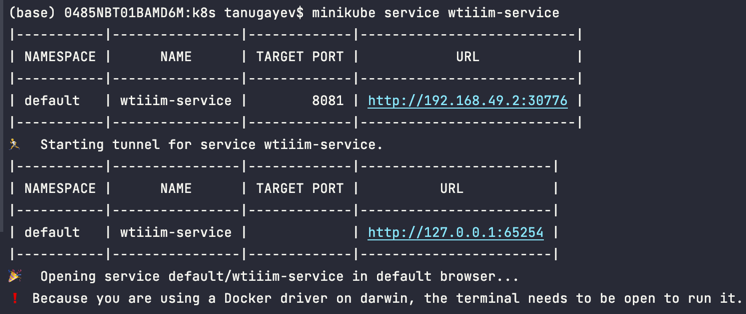
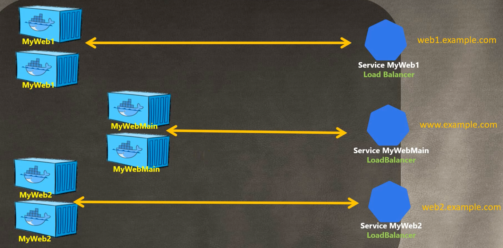
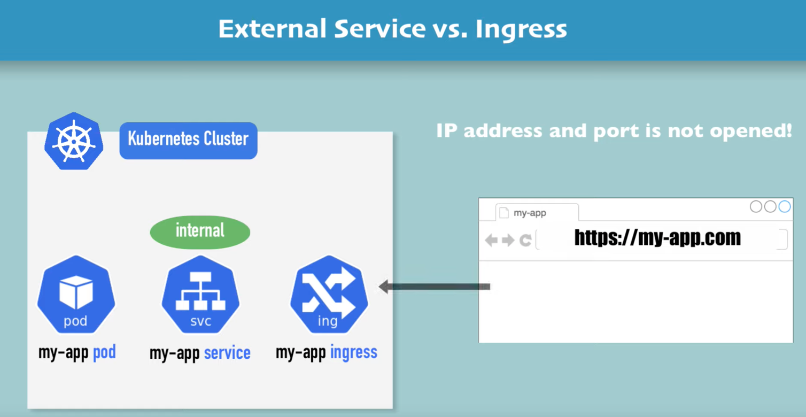
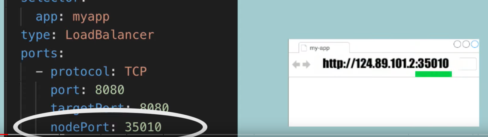
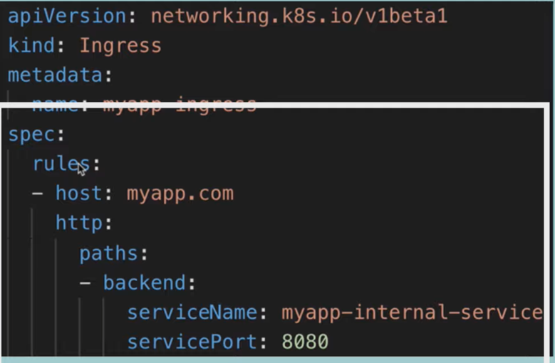
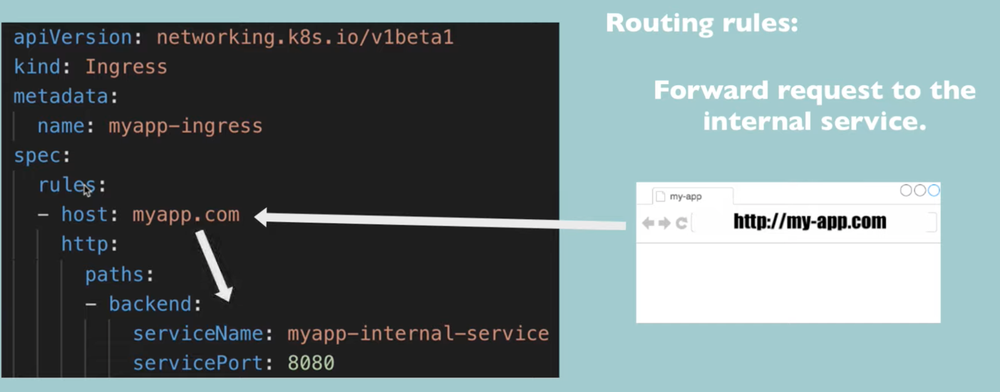
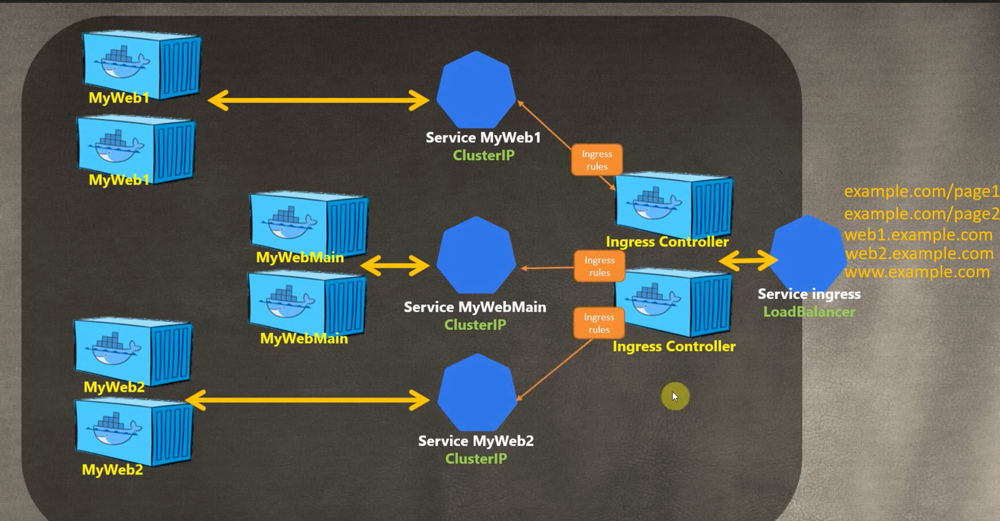
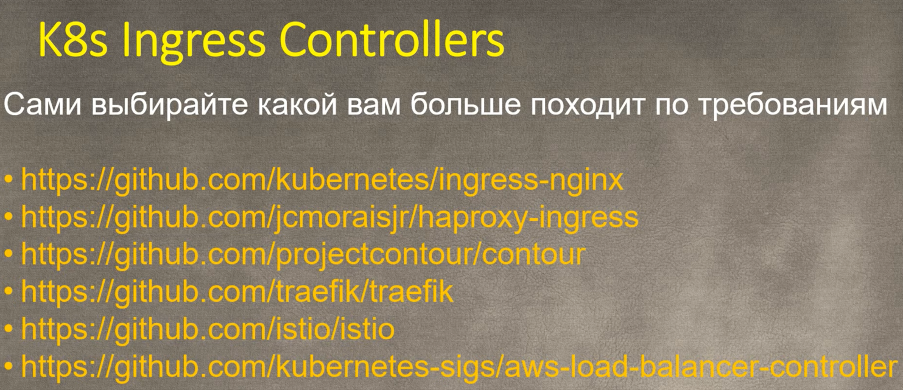
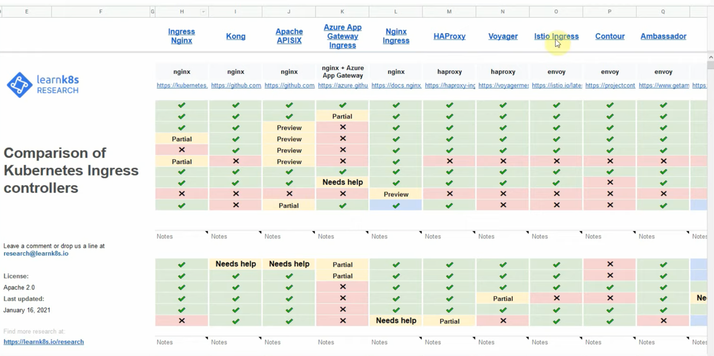

## Lab 9 - kubernetes

### Python

1. `kubectl apply -f .`

2. `minikube service wtiiim-service`



Note that the port in the cli 65254 corresponds to the port in the browser


```bash
$ kubectl get pods,svc
NAME                                       READY   STATUS    RESTARTS   AGE
pod/wtiiim-deployment-5ff54dbf96-69vtt     1/1     Running   0          11m
pod/wtiiim-deployment-5ff54dbf96-fxdhg     1/1     Running   0          11m
pod/wtiiim-deployment-5ff54dbf96-wblm5     1/1     Running   0          11m

NAME                       TYPE           CLUSTER-IP      EXTERNAL-IP   PORT(S)          AGE
service/kubernetes         ClusterIP      10.96.0.1       <none>        443/TCP          42m
service/wtiiim-service     LoadBalancer   10.111.28.17    <pending>     8081:30776/TCP   11m
```

```bash
$ minikube service --all
         
|-----------|------------|-------------|--------------|
| NAMESPACE |    NAME    | TARGET PORT |     URL      |
|-----------|------------|-------------|--------------|
| default   | kubernetes |             | No node port |
|-----------|------------|-------------|--------------|
😿  service default/kubernetes has no node port
|-----------|----------------|-------------|---------------------------|
| NAMESPACE |      NAME      | TARGET PORT |            URL            |
|-----------|----------------|-------------|---------------------------|
| default   | wtiiim-service |        8081 | http://192.168.49.2:30776 |
|-----------|----------------|-------------|---------------------------|
🏃  Starting tunnel for service kubernetes.
🏃  Starting tunnel for service wtiiim-service.
|-----------|------------------|-------------|------------------------|
| NAMESPACE |       NAME       | TARGET PORT |          URL           |
|-----------|------------------|-------------|------------------------|
| default   | kubernetes       |             | http://127.0.0.1:49482 |
| default   | wtiiim-service   |             | http://127.0.0.1:49500 |
|-----------|------------------|-------------|------------------------|
🎉  Opening service default/kubernetes in default browser...
🎉  Opening service default/wtiiim-service in default browser...
❗  Because you are using a Docker driver on darwin, the terminal needs to be open to run it.
    
```


### JS

```bash
$ kubectl apply -f .
deployment.apps/wtiiim-deployment unchanged
deployment.apps/wtiiim-js-deployment created
service/wtiiim-service unchanged
service/wtiiim-js-service created
```

```bash 
$ minikube service --all
|-----------|------------|-------------|--------------|
| NAMESPACE |    NAME    | TARGET PORT |     URL      |
|-----------|------------|-------------|--------------|
| default   | kubernetes |             | No node port |
|-----------|------------|-------------|--------------|
😿  service default/kubernetes has no node port
|-----------|-------------------|-------------|---------------------------|
| NAMESPACE |       NAME        | TARGET PORT |            URL            |
|-----------|-------------------|-------------|---------------------------|
| default   | wtiiim-js-service |        8082 | http://192.168.49.2:32062 |
|-----------|-------------------|-------------|---------------------------|
|-----------|----------------|-------------|---------------------------|
| NAMESPACE |      NAME      | TARGET PORT |            URL            |
|-----------|----------------|-------------|---------------------------|
| default   | wtiiim-service |        8081 | http://192.168.49.2:30776 |
|-----------|----------------|-------------|---------------------------|
🏃  Starting tunnel for service kubernetes.
🏃  Starting tunnel for service wtiiim-js-service.
🏃  Starting tunnel for service wtiiim-service.
|-----------|-------------------|-------------|------------------------|
| NAMESPACE |       NAME        | TARGET PORT |          URL           |
|-----------|-------------------|-------------|------------------------|
| default   | kubernetes        |             | http://127.0.0.1:50197 |
| default   | wtiiim-js-service |             | http://127.0.0.1:50215 |
| default   | wtiiim-service    |             | http://127.0.0.1:50221 |
|-----------|-------------------|-------------|------------------------|
🎉  Opening service default/kubernetes in default browser...
🎉  Opening service default/wtiiim-js-service in default browser...
🎉  Opening service default/wtiiim-service in default browser...
❗  Because you are using a Docker driver on darwin, the terminal needs to be open to run it.
```

My JS app running:


My Python app running:


```bash
$ kubectl get pods,svc
NAME                                        READY   STATUS    RESTARTS      AGE
pod/wtiiim-deployment-5ff54dbf96-69vtt      1/1     Running   1 (20m ago)   63m
pod/wtiiim-deployment-5ff54dbf96-fxdhg      1/1     Running   1 (20m ago)   63m
pod/wtiiim-deployment-5ff54dbf96-wblm5      1/1     Running   1 (20m ago)   63m
pod/wtiiim-js-deployment-7445c9868c-6tqqv   1/1     Running   0             19m
pod/wtiiim-js-deployment-7445c9868c-bt6tt   1/1     Running   0             19m
pod/wtiiim-js-deployment-7445c9868c-qtbg2   1/1     Running   0             19m

NAME                        TYPE           CLUSTER-IP      EXTERNAL-IP   PORT(S)          AGE
service/kubernetes          ClusterIP      10.96.0.1       <none>        443/TCP          95m
service/wtiiim-js-service   LoadBalancer   10.109.87.9     <pending>     8082:32062/TCP   19m
service/wtiiim-service      LoadBalancer   10.111.28.17    <pending>     8081:30776/TCP   63m
```

### Research


pic from https://www.youtube.com/watch?v=ThP-OEjpDZk

this is without ingress controllers

each load balancer costs you money to maintain

when you have a lot of applications it becomes expensive, so people made Ingress Controllers

#### Ingress

source: https://www.youtube.com/watch?v=80Ew_fsV4rM

Ingress is a Kubernetes component used to abstract out the IP and port of the app
into an actual domain name



So when a request comes from a browser, it goes it ingress -> internal service -> app pod

without ingress:


with ingress:


we write routing rules

in this example with ingress, all reqs coming to `myapp.com`
get forwarded to `myapp-internal-service`



external vs internal services:


#### Ingress controller

with Ingress controller you have intermediate services and ingress controllers that
manage where to route

basically, as i understand, ingress controller has a mapping and it knows where to
map your address that you request with the correct service

it follows the Ingress rules to get to the correct service

for each of our apps we need an ingress rule



there's different open-source ingress controllers out of the box you can use:


comparison accross ingress controllers:


so, basically you just deploy ingress controller apply and write the rules
this is also why we need it

#### StatefulSet

source: https://www.youtube.com/watch?v=pPQKAR1pA9U

stateful app stores data and response depends on state
while stateless app depends on only req payload

stateless apps are deployed using deployment components.
it allows to replicate that app.

stateful apps are deployed using stateful set component.

#### DaemonSet

#### PersistentVolumes

### P. S.

Also here's the result of 3 step in the lab9.md:

```bash
$ minikube service --all
|-----------|------------|-------------|--------------|
| NAMESPACE |    NAME    | TARGET PORT |     URL      |
|-----------|------------|-------------|--------------|
| default   | kubernetes |             | No node port |
|-----------|------------|-------------|--------------|
😿  service default/kubernetes has no node port
|-----------|------|-------------|---------------------------|
| NAMESPACE | NAME | TARGET PORT |            URL            |
|-----------|------|-------------|---------------------------|
| default   | lab9 |        8080 | http://192.168.49.2:31402 |
|-----------|------|-------------|---------------------------|
🏃  Starting tunnel for service kubernetes.
🏃  Starting tunnel for service lab9.
|-----------|-------------------|-------------|------------------------|
| NAMESPACE |       NAME        | TARGET PORT |          URL           |
|-----------|-------------------|-------------|------------------------|
| default   | kubernetes        |             | http://127.0.0.1:50197 |
| default   | lab9              |             | http://127.0.0.1:50203 |
|-----------|-------------------|-------------|------------------------|
🎉  Opening service default/kubernetes in default browser...
🎉  Opening service default/lab9 in default browser...

```