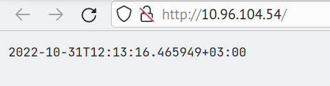
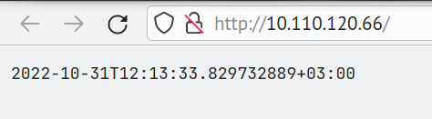

# k8s

## Usage

In this lab i've used Kustomization to minimize for 2 apps boilerplate. Use `kubectl apply -k python` or `kubectl apply -k rust` to deploy the project.

Before running the code you may need to change minikube config:

```yaml
- cpus: 16
- driver: kvm2
- memory: 8192
```

## Outputs

### `kubectl get pods,svc`

```
NAME                              READY   STATUS    RESTARTS   AGE
pod/app-python-579689cffb-4ghdm   1/1     Running   0          109s
pod/app-python-579689cffb-sgbpj   1/1     Running   0          109s
pod/app-python-579689cffb-z6k66   1/1     Running   0          109s
pod/app-rust-6cbb95d6b8-4d5lg     1/1     Running   0          109s
pod/app-rust-6cbb95d6b8-8n8dh     1/1     Running   0          109s
pod/app-rust-6cbb95d6b8-qr5kq     1/1     Running   0          109s

NAME                 TYPE        CLUSTER-IP      EXTERNAL-IP   PORT(S)   AGE
service/app-python   ClusterIP   10.96.104.54    <none>        80/TCP    109s
service/app-rust     ClusterIP   10.110.120.66   <none>        80/TCP    109s
service/kubernetes   ClusterIP   10.96.0.1       <none>        443/TCP   2m12s
```

### `minikube service --all`

```
|-----------|------------|-------------|--------------|
| NAMESPACE |    NAME    | TARGET PORT |     URL      |
|-----------|------------|-------------|--------------|
| default   | app-python |             | No node port |
|-----------|------------|-------------|--------------|
😿  service default/app-python has no node port
|-----------|----------|-------------|--------------|
| NAMESPACE |   NAME   | TARGET PORT |     URL      |
|-----------|----------|-------------|--------------|
| default   | app-rust |             | No node port |
|-----------|----------|-------------|--------------|
😿  service default/app-rust has no node port
|-----------|------------|-------------|--------------|
| NAMESPACE |    NAME    | TARGET PORT |     URL      |
|-----------|------------|-------------|--------------|
| default   | kubernetes |             | No node port |
|-----------|------------|-------------|--------------|
😿  service default/kubernetes has no node port
```

### Screenshots

#### `app_python`

```bash
$ http http://10.96.104.54
HTTP/1.1 200 OK
content-length: 32
content-type: text/plain; charset=utf-8
date: Mon, 31 Oct 2022 09:09:53 GMT
server: uvicorn

2022-10-31T12:09:54.001036+03:00
```



#### `app_rust`

```bash
$ http http://10.110.120.66
HTTP/1.1 200 OK
content-length: 35
content-type: text/plain; charset=utf-8
date: Mon, 31 Oct 2022 09:10:14 GMT
permissions-policy: interest-cohort=()
server: Rocket
x-content-type-options: nosniff
x-frame-options: SAMEORIGIN

2022-10-31T12:10:14.386712766+03:00
```



## Bonus task descriptions

### Ingress controller

A daemon that forwards requests based on Ingress rules to the selected services. For example, we can forward port 80 to the ingress controller and add rules "forward domain1.company to service 1, forward domain2.company to service 2".

Functionality:

- Routing
- Load balancing
- SSL and verification
- Rollout management (e.g. canary deployments)
- Fallback to default backend (e.g. we can show code 5xx if a service is down and no backups are available)

### Ingress

A rule for Ingress controller. Sometimes input traffic to the cluster is also called "ingress".

### StatefulSet

An alternative for Deployment for stateful application. Compared to Deployment, it also includes pvc management.

### DaemonSet

Ensures that pods are running on all the nodes of the cluster. Automatically scales the pod when nodes in cluster are changed.

### PersistentVolumes

A data storage volume (block or filesystem). Can be requested by PersistentVolumeClaim or manually and then assigned to a pod.
