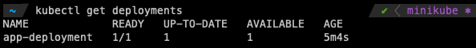
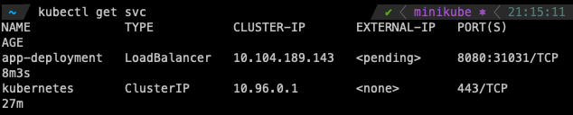
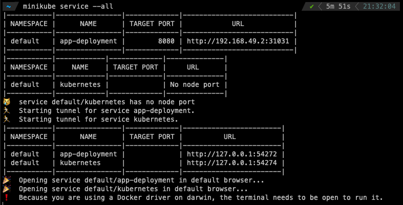
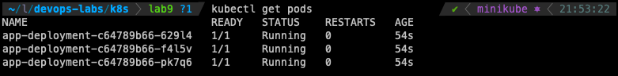
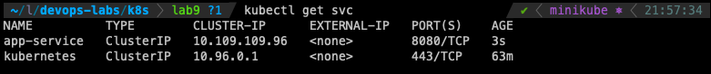
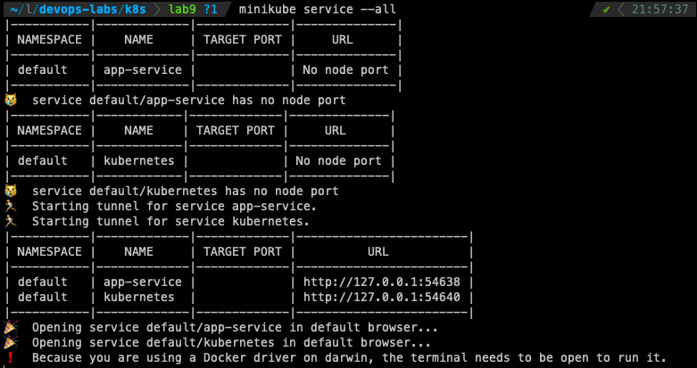

# Kubernetes - Lab 9

## Part 1 : Manual deployment

## 1.1 Steps

References: [Creating a deployment](https://kubernetes.io/docs/tutorials/hello-minikube/#create-a-deployment) , [Creating a service](https://kubernetes.io/docs/tutorials/hello-minikube/#create-a-service)

1. Install `kubectl` and `minikube`

2. Deployed the app in kubectl using `kubectl create deployment app-deployment --image=migorr/time-app-devops:latest`

3. Create a service and expose it on port 8080 `kubectl expose deployment app-deployment --type=LoadBalancer --port=8080`

## 1.2 Results

- `kubectl get deployments`

- `kubectl get svc`

- `minikube service --all`

- Browser screenshoot

## Part 2 : Deployment with configuration files

## 2.1 Steps

1. To deploy pods, I used `kubectl apply -f deployment.yml`

2. To create a service from config, I used `kubectl apply -f service.yml`

## 2.2 Results

- `kubectl get pods`

- `kubectl get svc`

- `minikube service --all`

- Browser screenshoot

## Part 3 (Bonus): Definitions

1. <u><b>Ingress:</b></u>

    This is an API object that exposes HTTP and HTTPS routes from outside the cluster to services within the cluster, allowing external access to the cluster's services.

2. <u><b>Ingress controller</b></u>

    It allows to define how external clients are routed to a cluster's internal Services.

3. <u><b>StatefulSet</b></u>

    This is a controller in Kubernetes that manages the deployment and scaling of a set of Pods by assigning them a unique identity.

4. <u><b>DaemonSet</b></u>

    It is used to ensure that all nodes (or a specific subset of them) are running exactly one copy of a pod.

5. <u><b>PersistentVolumes</b></u>

    PV are used to provide persistent storage for the containerized applications. One of the most important functionalities of persistent volume is providing storage beyond the lifecycle of a pod.