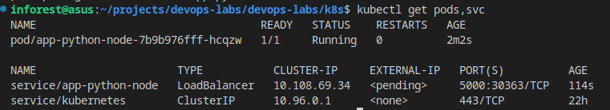
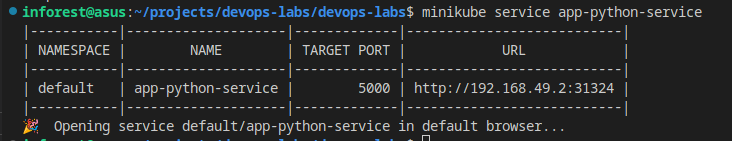
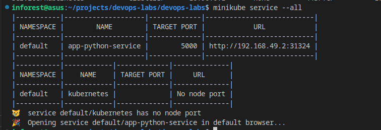
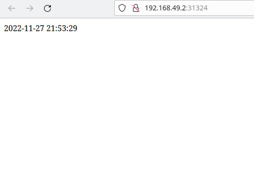

# Kubernetes

## How to run using command
- Start minikube
    ```
    minikube start
    ```
- Deploy from the image using kubectl
    ```
    kubectl create deployment app-python-node --image=inforest/app_python:app_python
    ```

- Create a service and expose port
    ```
    kubectl expose deployment app-python-node --type=LoadBalancer --port=5000
    ```

### See results
To see results write 
```
kubectl get pods,svc
```

For me it was



## Writing yml files

### See results, using yml files in k8s/python directory







