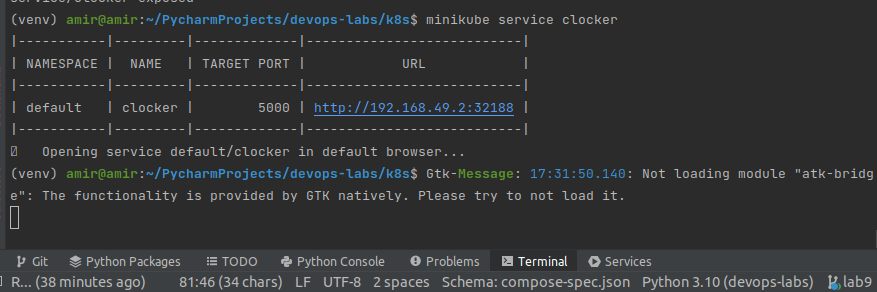
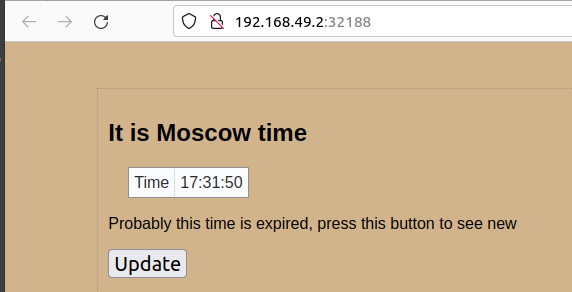
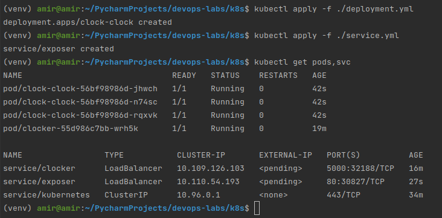
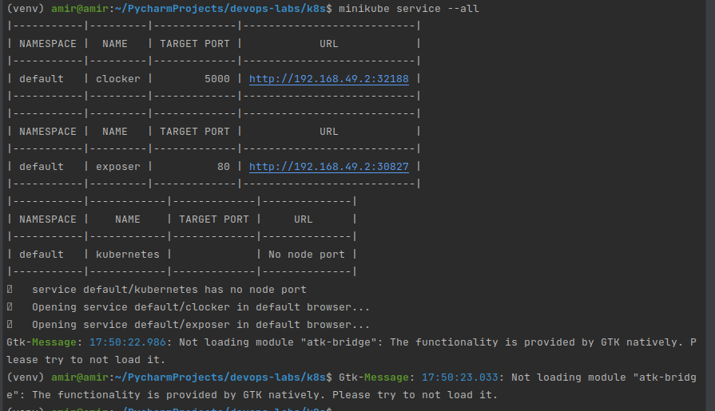
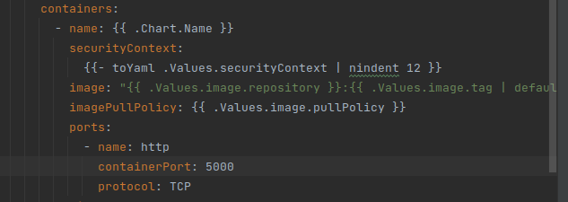
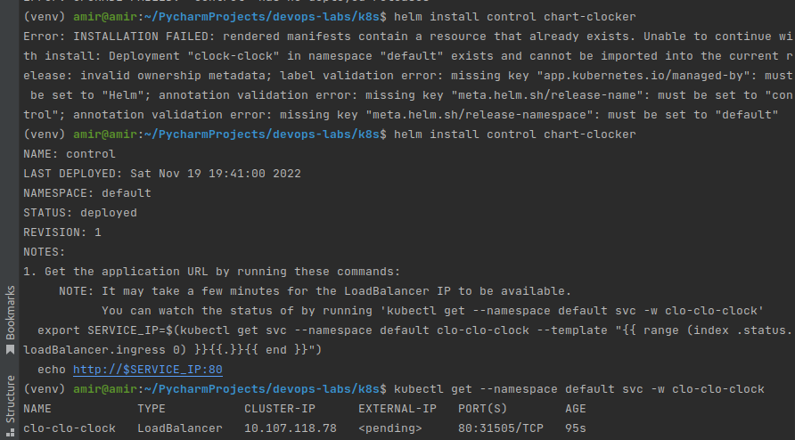
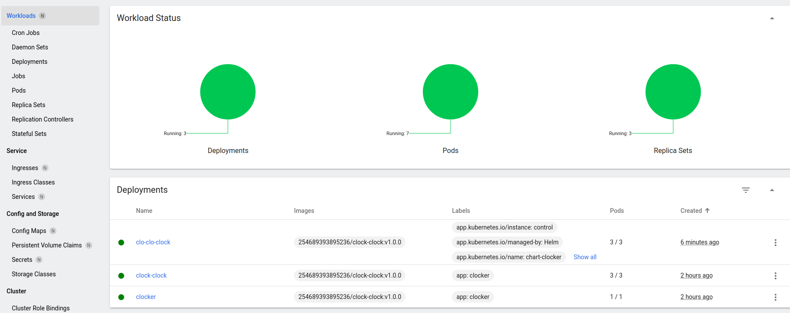
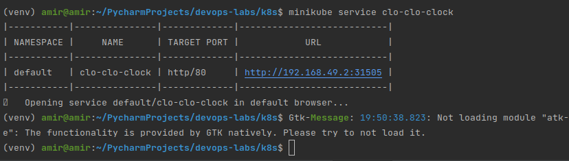

# k8s lab report 

## Manual deployment

I downloaded kubectl and minikube,
started minikube. After kubectl was configured to use "minikube" cluster

I deployed docker image
`kubectl create deployment clocker --image=254689393895236/clock-clock:v1.0.0`

after exposed deployment
`kubectl expose deployment clocker --type=LoadBalancer --port=5000`

then I checked the service availability



url addresses are identical

the output from
`kubectl get pods,svc` command:

```
$ kubectl get pods,svc
NAME                           READY   STATUS    RESTARTS   AGE
pod/clocker-55d986c7bb-wrh5k   1/1     Running   0          4m52s

NAME                 TYPE           CLUSTER-IP       EXTERNAL-IP   PORT(S)          AGE
service/clocker      LoadBalancer   10.109.126.103   <pending>     5000:32188/TCP   2m21s
service/kubernetes   ClusterIP      10.96.0.1        <none>        443/TCP          20m
```

---
## With configuration 

I created config files and applied them

Below you will see the commands applied and output
of `kubectl get pods,svc`


and `minikube service --all`



## Helm setup and configuration

I created a chart with bash command `helm create <name>`
After I edited `values.yaml` and `deployment.yaml`

In `deployment.yaml` inside templates folder
I changed containerPort since in `service.yml`



After I installed helm packages
`helm install control chart-clocker`
the result are below:




(Be sure You have kubernetes cluster running)

the result of `minikube service clo-clo-clock`


```
$ kubectl get pods,svc
NAME                                 READY   STATUS    RESTARTS      AGE
pod/clo-clo-clock-6fbf7985fb-8qzdg   1/1     Running   0             11m
pod/clo-clo-clock-6fbf7985fb-bf5v2   1/1     Running   0             11m
pod/clo-clo-clock-6fbf7985fb-xgx2b   1/1     Running   0             11m
pod/clock-clock-56bf98986d-jhwch     1/1     Running   1 (36m ago)   125m
pod/clock-clock-56bf98986d-n74sc     1/1     Running   1 (36m ago)   125m
pod/clock-clock-56bf98986d-rqxvk     1/1     Running   1 (36m ago)   125m
pod/clocker-55d986c7bb-wrh5k         1/1     Running   1 (36m ago)   143m

NAME                    TYPE           CLUSTER-IP       EXTERNAL-IP   PORT(S)          AGE
service/clo-clo-clock   LoadBalancer   10.107.118.78    <pending>     80:31505/TCP     11m
service/clocker         LoadBalancer   10.109.126.103   <pending>     5000:32188/TCP   141m
service/exposer         LoadBalancer   10.110.54.193    <pending>     80:30827/TCP     125m
service/kubernetes      ClusterIP      10.96.0.1        <none>        443/TCP          159m
```