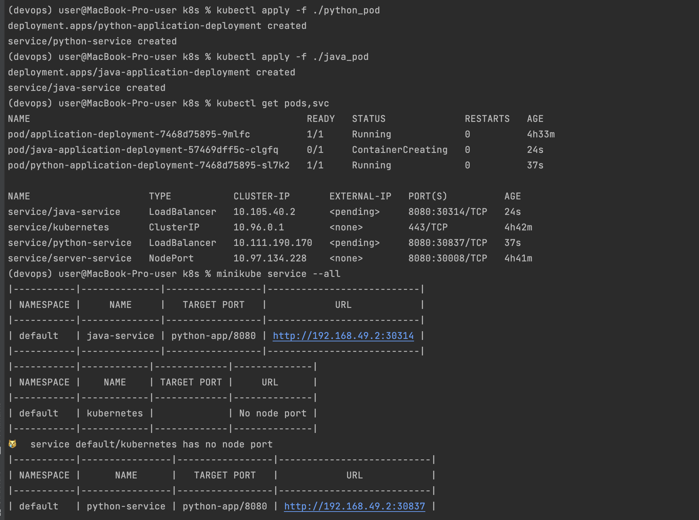
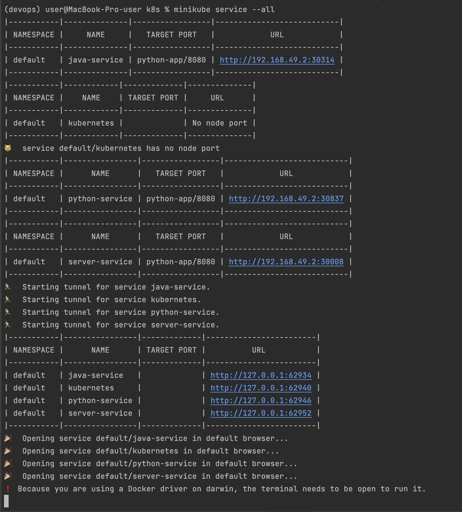
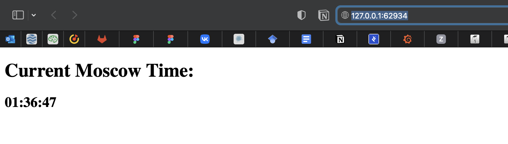

# K8s
### Output for pods

### Output for services

### IP proof


# Bonus task

### Ingress
Some kind of API, that takes applications from outside the scope
of a cluster and manages its access to the working cluster  
Furthermore it provides security via SSL and can do load-balancing

### Ingress controller
As I understood it is the typical controller as a pattern, but used to suppot Ingress
itself which is described in the above section  
There are various Ingress controllers that can be used to run
Ingress, such as nginx, AWS and others

### StatefulSet
It is an API similar to the **deployment**, but used to work with
**stateful** applications inside the cluster  
However in this scenario pods their persistent identifier therefore
they are not interchangeable as it was using **deployment**  
This approach also can be used if we want to use storage volumes

### DaemonSet
As it comes from its name this set has a similar attitude
towards typical set as a daemon threads to the usual ones  
Daemon set allows to run copy of pods, so they will be removed 
from the cluster with the original ones.  
It can be used in order to provide nods monitoring, logging
or running cluster storage daemon

### PersistentVolumes
This is a storage manager as it comes from its name.  
PersistentVolumes provides API for the cluster administration
in a convenient abstract way, so that they don't have to
differentiate the way of how storage is managed from its consumption.  
There is no clear difference in terms of its architecture from 
usual pods, but PersistentVolumes captures storage implementation
details and has an independent lifecycle from other pods.

# Helm

## Output from terminal for both applications

```
(devops) user@mbp-user k8s % helm create python-app-helm                      
Creating python-app-helm

(devops) user@mbp-user k8s % helm create java-app-helm                        
Creating java-app-helm

(devops) user@mbp-user k8s % helm package python-app-helm              
Successfully packaged chart and saved it to: /Users/user/Documents/Innopolis/devops/k8s/python-app-helm-0.1.0.tgz

(devops) user@mbp-user k8s % helm package java-app-helm
Successfully packaged chart and saved it to: /Users/user/Documents/Innopolis/devops/k8s/java-app-helm-0.1.0.tgz

(devops) user@mbp-user k8s % helm install python-app-helm ./python-app-helm-0.1.0.tgz
NAME: python-app-helm
LAST DEPLOYED: Tue Nov  8 05:16:11 2022
NAMESPACE: default
STATUS: deployed
REVISION: 1
NOTES:
1. Get the application URL by running these commands:
  export POD_NAME=$(kubectl get pods --namespace default -l "app.kubernetes.io/name=python-app-helm,app.kubernetes.io/instance=python-app-helm" -o jsonpath="{.items[0].metadata.name}")
  export CONTAINER_PORT=$(kubectl get pod --namespace default $POD_NAME -o jsonpath="{.spec.containers[0].ports[0].containerPort}")
  echo "Visit http://127.0.0.1:8080 to use your application"
  kubectl --namespace default port-forward $POD_NAME 8080:$CONTAINER_PORT

(devops) user@mbp-user k8s % helm install java-app-helm ./java-app-helm-0.1.0.tgz
NAME: java-app-helm
LAST DEPLOYED: Tue Nov  8 05:19:16 2022
NAMESPACE: default
STATUS: deployed
REVISION: 1
NOTES:
1. Get the application URL by running these commands:
  export POD_NAME=$(kubectl get pods --namespace default -l "app.kubernetes.io/name=java-app-helm,app.kubernetes.io/instance=java-app-helm" -o jsonpath="{.items[0].metadata.name}")
  export CONTAINER_PORT=$(kubectl get pod --namespace default $POD_NAME -o jsonpath="{.spec.containers[0].ports[0].containerPort}")
  echo "Visit http://127.0.0.1:8080 to use your application"
  kubectl --namespace default port-forward $POD_NAME 8080:$CONTAINER_PORT


(devops) user@mbp-user k8s % minikube service python-app-helm java-app-helm  
|-----------|-----------------|-------------|---------------------------|
| NAMESPACE |      NAME       | TARGET PORT |            URL            |
|-----------|-----------------|-------------|---------------------------|
| default   | python-app-helm | http/80     | http://192.168.49.2:32163 |
|-----------|-----------------|-------------|---------------------------|
|-----------|-----------------|-------------|---------------------------|
| NAMESPACE |      NAME       | TARGET PORT |            URL            |
|-----------|-----------------|-------------|---------------------------|
| default   | java-app-helm   | http/80     | http://192.168.49.2:32264 |
|-----------|-----------------|-------------|---------------------------|
🏃  Starting tunnel for service python-app-helm.
🏃  Starting tunnel for service java-app-helm.
|-----------|-----------------|-------------|------------------------|
| NAMESPACE |      NAME       | TARGET PORT |          URL           |
|-----------|-----------------|-------------|------------------------|
| default   | python-app-helm |             | http://127.0.0.1:53471 |
| default   | java-app-helm   |             | http://127.0.0.1:53477 |
|-----------|-----------------|-------------|------------------------|
🎉  Opening service default/python-app-helm in default browser...
🎉  Opening service default/java-app-helm in default browser...
❗  Because you are using a Docker driver on darwin, the terminal needs to be open to run it.

(devops) user@mbp-user k8s % kubectl get pods,svc
NAME                                   READY   STATUS    RESTARTS   AGE
pod/python-app-helm-7c6gw4794b-r6ksh   1/1     Running   0          34m50s
pod/java-app-helm-8c6de3744b-r6ksh     1/1     Running   0          34m50s

NAME                         TYPE           CLUSTER-IP      EXTERNAL-IP   PORT(S)          AGE
service/python-app-helm      LoadBalancer   10.104.250.74   <pending>     80:32163/TCP     34m50s
service/java-app-helm        LoadBalancer   10.104.250.74   <pending>     80:32264/TCP     34m50s
service/kubernetes           ClusterIP      10.96.0.1       <none>        443/TCP          6d18h

(devops) user@mbp-user k8s % helm list                                               
NAME            NAMESPACE       REVISION        UPDATED                                STATUS          CHART                   APP VERSION
python-app-helm default         1               2022-11-07 23:09:28.074735 +0300 MSK   deployed        python-app-helm-0.1.0 
java-app-helm default           1               2022-11-07 23:09:28.074735 +0300 MSK   deployed        java-app-helm-0.1.0 

```

# Bonus task
### Library Charts
Charts in form of shared template with definitions and primitives
### Umbrella Charts
An abstraction in form of chart with for provided k8s components
