# K8s - Lab 10

## Lab9
## Manually deploying Python app

* Output after running `kubectl get pods`:
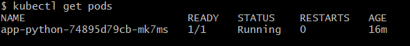
* Output after running `kubectl get svc`:
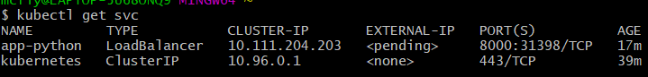

## Deploying Python app with the use of configuration files

Configuration files for Python app are inside folder `/k8s/app-python`.

### Output after running `kubectl get pods`:
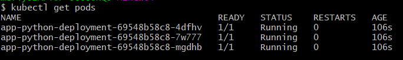
### Output after running `kubectl get svc`:
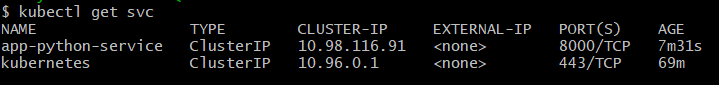
### Output after running `minikube service --all`:
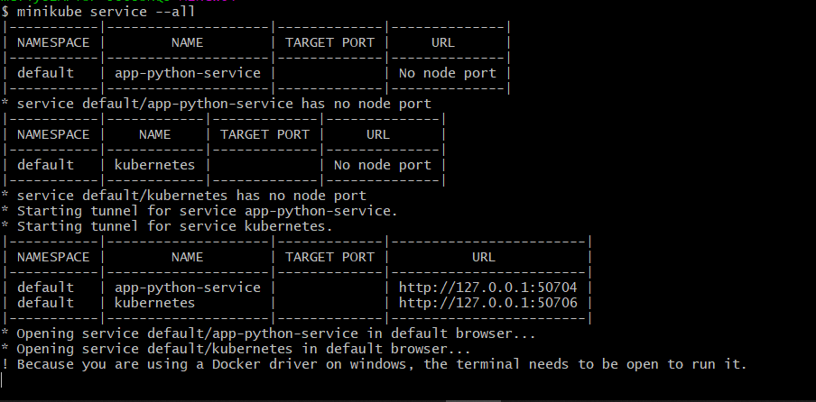
Screenshot from the browser:
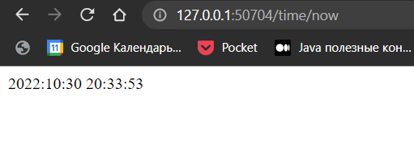

### Bonus task

## Deploying Java app with the use of configuration files

Configuration files for Java app are inside folder `/k8s/app-java`.

### Output after running `kubectl get pods`:
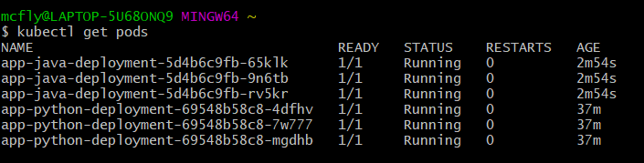
### Output after running `kubectl get svc`:
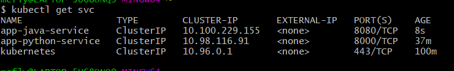
### Output after running `minikube service --all`:
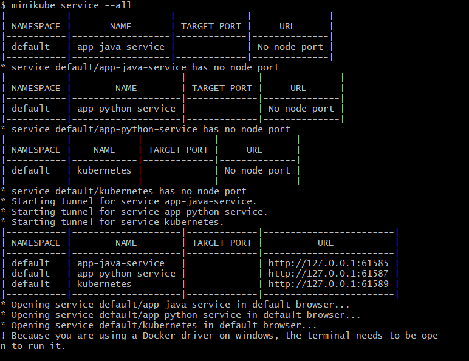
Screenshot from the browser:
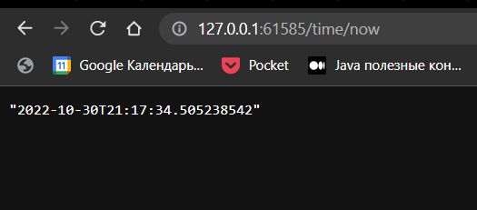

### Explanation of concepts - Lab9

* Ingress - resource in K8s that contains set of rules to handle requests 
from outside world(for example, HTTP requests) to internal k8s services(for routing)
* Ingress Controller - controller(pod) that takes Ingress resource and sets up 
a reversed proxy(that listens all incoming traffic).
* StatefulSet - k8s object that manages pods(for example, scaling)
* DaemonSet - k8s object that guarantees that a copy of pod will be run on 
all or specific nodes
* PersistentVolumes - storage system resource(for example, physical SSD device) that
can be used pods as filesystem(persistent one). It's lifecycle does not dependent on 
the lifecycle of the pod.

## Lab10

This lab is implemented in folder `./app-helm`.

Values for `app-python` reside in the file `app-python-values.yaml`. 

Values for `app-java` reside in the file `app-java-values.yaml`. 

### Deploying Python app using Helm

* Navigate to `/k8s/app-helm`
* Apply helm:
```shell
heml install app-python . -f ./app-python-values.yaml
```

#### Output after running `kubectl get pods`:
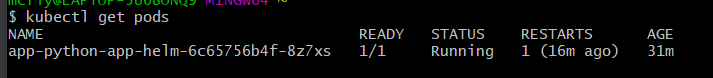

#### Output after running `kubectl get svc`:
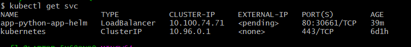

#### Output after running `minikube service app-python-app-helm`:
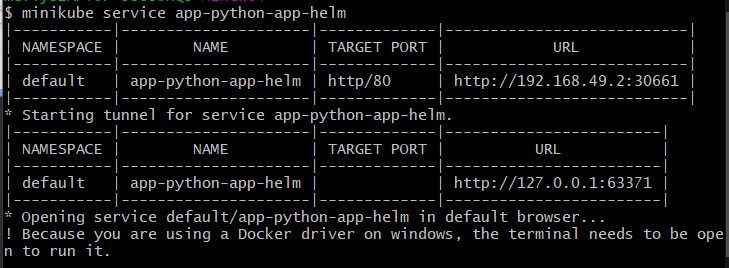

Screenshot from the browser:
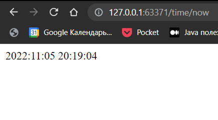

#### Workloads page in minikube Dashboard
Screenshot from the browser:
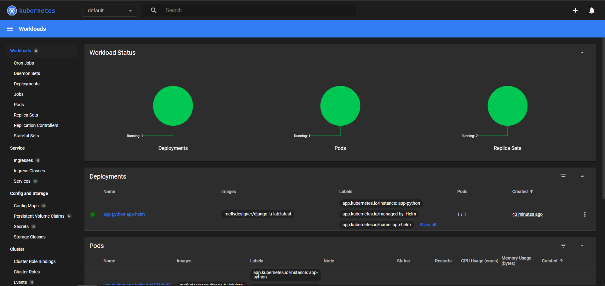

### Bonus task

### Deploying Java app using Helm

* Navigate to `/k8s/app-helm`
* Apply helm:
```shell
heml install app-java . -f ./app-java-values.yaml
```

#### Output after running `kubectl get pods`:
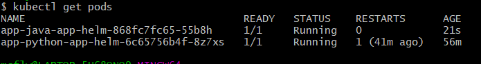

#### Output after running `kubectl get svc`:
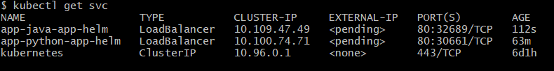

#### Output after running `minikube service app-java-app-helm`:
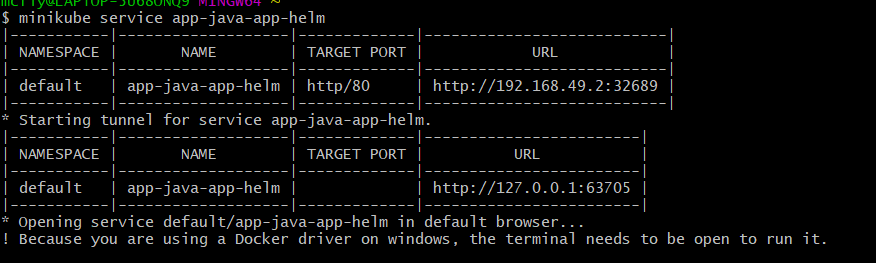

Screenshot from the browser:
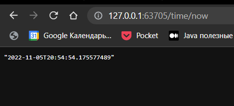

#### Workloads page in minikube Dashboard
Screenshot from the browser:
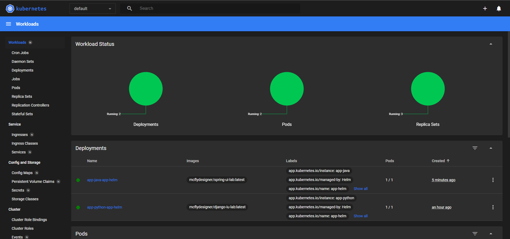

### Explanation of concepts - Lab10

* Library charts - a helm chart containing reusable templates. 
It allows us to define common templates that may be shared across different 
projects as a dependency. For instance, we may put some specific definitions in library
and then simply add it as a dependency.
* Umbrella charts - a helm chart containing multiple sub-charts. It allows us to maintain a
large application with different components or applications inside(each application may have its own helm chart).
Umbrella chart will deploy all components as a single unit. Besides, if one of the components 
will fail during deployment, all components will be rolled back.
