# Kubernetes

## Manual deploy

```plain
    kubectl create deployment app-python-node --image danmory/python_kremlin_chimes

    kubectl expose deployment app-python-node --type=LoadBalancer --port=8000

    minikube service app-python-node
```

Output of ``kubectl get pods,svc`` command:

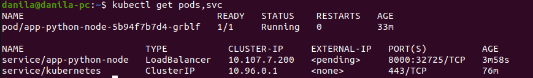

## With config files

### Python

```plain
    kubectl apply -f k8s/app_python/deployment.yml 

    kubectl apply -f k8s/app_python/service.yml 

    minikube service app-python-service
```

Output of ``kubectl get pods,svc`` command:

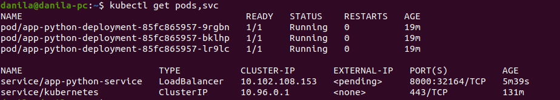

Output of ``minikube service --all`` command:


Page on the browser:

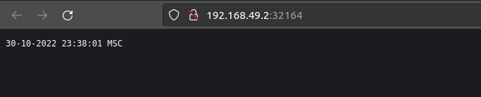

### Go

```plain
    kubectl apply -f k8s/app_go/deployment.yml 

    kubectl apply -f k8s/app_go/service.yml 

    minikube service app-go-service
```

Output of ``kubectl get pods,svc`` command:

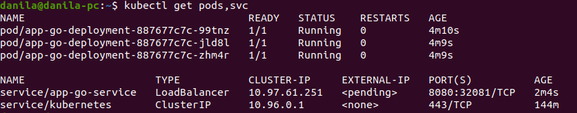

Output of ``minikube service --all`` command:

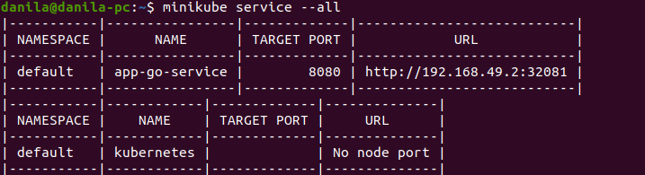

Page on the browser:

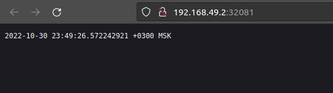

## Answers

Ingress is a resource through which routing rules
are written from external sources to internal services.

Ingress controller is a cluster service which allows Ingress to work.

StatefulSets are used for working with stateful applications
which require some storage, volume.

DaemonSet ensures that all pods under its control
are running on cluster nodes.

PersistentVolumes is a volume provisioned by admins.
They do not depend on lifecycle of individual pods.

## Helm

To use helm enter *k8s* directory and run:

``$ helm install -f <values.yaml> ./helm-app/ --generate-name``

### with Python app

Workloads statuses:

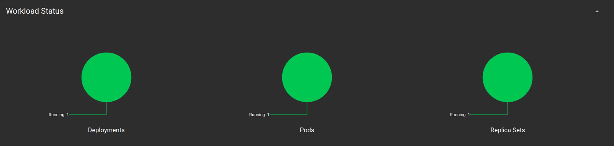

Output of ``minikube service <service_name>``:

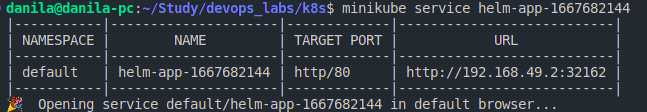

In browser:

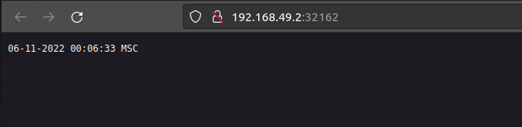

Output of ``kubectl get pods,svc``:

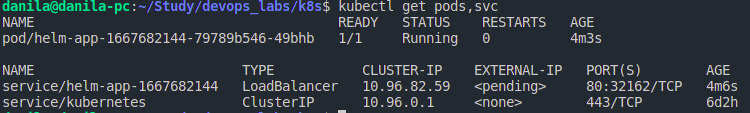

### with Go app

Output of ``minikube service <service_name>``:

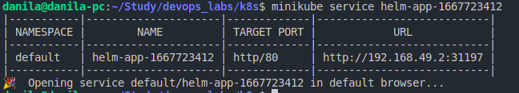

In browser:

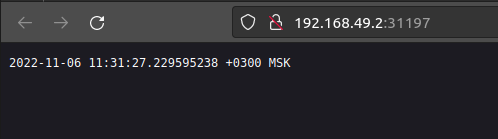

Output of ``kubectl get pods,svc``:

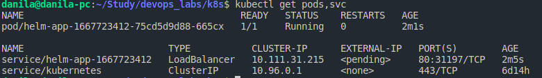

### with Go + Python applications

Output of ``kubectl get pods,svc``:

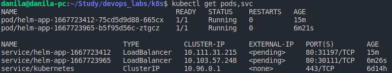

Workload statuses:

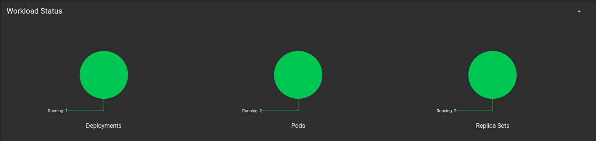

### Helm answers

Library Charts - reusable chart definitions
(like ordinary library in any programming language: you can just import it
and use where needed).

Umbrella charts - higher order charts with multiple charts inside
which should be deployed as a single one.
