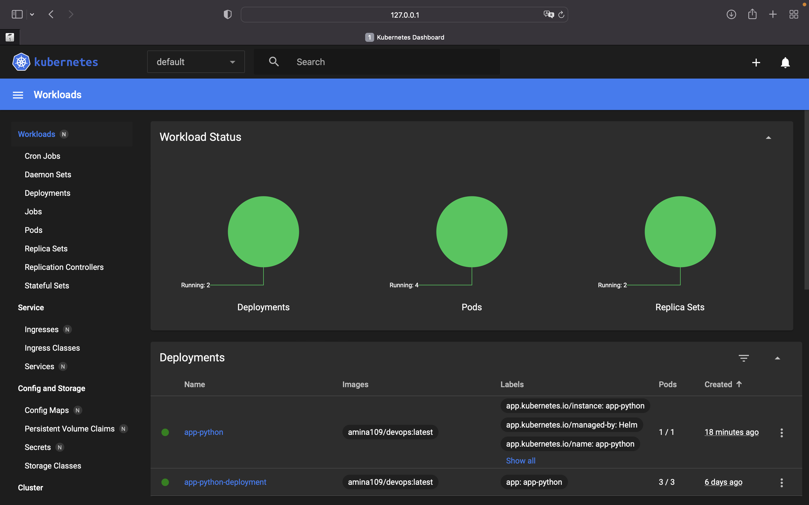

# Kubernetes

1. Installed `kubectl` and `minikube` and moved to `k8s` dir.

1. Started `minikube` via:
    `minikube start`

1. Created the Deployment:

    ```sh
    kubectl create deployment app-python --image=amina109/devops:latest
    deployment.apps/app-python created
    ```

1. Checked that it exists:

    ```sh
    kubectl get deployment app-python
    NAME         READY   UP-TO-DATE   AVAILABLE   AGE
    app-python   1/1     1            1           19s
    ```

1. Exposed it on port 8000:

    ```sh
    kubectl expose deployment app-python --type=LoadBalancer --port=8000
    service/app-python exposed
    ```

1. The output of `kubectl get pods,svc` command:

    ```sh
    NAME                             READY   STATUS    RESTARTS   AGE
    pod/app-python-84977b4d7-lm8dr   1/1     Running   0          12m

    NAME                 TYPE           CLUSTER-IP     EXTERNAL-IP   PORT(S)          AGE
    service/app-python   LoadBalancer   10.109.1.144   <pending>     8000:31261/TCP   9m8s
    service/kubernetes   ClusterIP      10.96.0.1      <none>        443/TCP          14m
    ```

1. Cleaned up by `minikube delete`.

1. Created a `deployment.yml` file following [this tutorial](https://kubernetes.io/docs/concepts/workloads/controllers/deployment/#creating-a-deployment).

1. Created a `service.yml` manifest following [this tutorial](https://kubernetes.io/docs/concepts/services-networking/service/#defining-a-service).

1. Created the Deployment by running the following commands:

    ```sh
    minikube start
    kubectl apply -f deployment.yml
    kubectl apply -f service.yml
    ```

1. The output of `kubectl get pods,svc` command:

    ```sh
    NAME                                         READY   STATUS    RESTARTS   AGE
    pod/app-python-deployment-575dcb886f-4mpb2   1/1     Running   0          22s
    pod/app-python-deployment-575dcb886f-qdbt7   1/1     Running   0          22s
    pod/app-python-deployment-575dcb886f-qgdrs   1/1     Running   0          22s

    NAME                         TYPE           CLUSTER-IP     EXTERNAL-IP   PORT(S)        AGE
    service/app-python-service   LoadBalancer   10.102.34.62   <pending>     80:30545/TCP   13s
    service/kubernetes           ClusterIP      10.96.0.1      <none>        443/TCP        45s
    ```

1. The output of `minikube service --all` command:

    ```sh

    |-----------|--------------------|-------------|---------------------------|
    | NAMESPACE |        NAME        | TARGET PORT |            URL            |
    |-----------|--------------------|-------------|---------------------------|
    | default   | app-python-service |          80 | http://192.168.49.2:30545 |
    |-----------|--------------------|-------------|---------------------------|
    |-----------|------------|-------------|--------------|
    | NAMESPACE |    NAME    | TARGET PORT |     URL      |
    |-----------|------------|-------------|--------------|
    | default   | kubernetes |             | No node port |
    |-----------|------------|-------------|--------------|
    😿  service default/kubernetes has no node port
    🏃  Starting tunnel for service app-python-service.
    🏃  Starting tunnel for service kubernetes.
    |-----------|--------------------|-------------|------------------------|
    | NAMESPACE |        NAME        | TARGET PORT |          URL           |
    |-----------|--------------------|-------------|------------------------|
    | default   | app-python-service |             | http://127.0.0.1:54670 |
    | default   | kubernetes         |             | http://127.0.0.1:54671 |
    |-----------|--------------------|-------------|------------------------|
    🎉  Opening service default/app-python-service in default browser...
    🎉  Opening service default/kubernetes in default browser...
    ❗  Because you are using a Docker driver on darwin, the terminal needs to be open to run it.
    ```

1. Result from the browser:
    

## Terminology

`Ingress` is a kind of router that describes the rules by which traffic can flow from an external source to services within the cluster.

`Ingress controller` - Pod, it is needed for Ingress to start working in the Kubernetes cluster. Ingress Controller implements the rules described in Ingress.

`StatefulSet` is a Kubernetes resource that is responsible for saving, tracking, and maintaining a set of IDs and states for each pod. As the StatefulSet provides uniqueness of modules, then even when moving replicas all module identification data will be saved. This controller is used to manage stateful applications.

`DaemonSet` is a Kubernetes object that is responsible for running a copy of the specified Pods on all (or also specified) nodes of the cluster. The DaemonSet controller can distribute pod modules to nodes even before the launch of the Kubernetes scheduler. Thus, pod modules from the DaemonSet will be launched earlier than those from the main Deployment or StatefulSet.

`PersistentVolumes` - the data storage system in the Kubernetes cluster, the duration of its life cycle does not depend on the Pods that use it.

## Helm

1. I install helm via:

    `brew install helm`

1. Then I created chart:

    ```sh
    cd k8s
    helm create app-python
    ```

1. And changed repository name and tag inside the `values.yaml`, and containerPort in the d`eployment.yml`.

1. After that, I packaged the chart up for distribution:
    `helm package app-python`

1. And that chart can now easily be installed by:
    `helm install app-python .//app-python-0.1.0.tgz`

1. The result:

    ```sh
    NAME: app-python
    LAST DEPLOYED: Mon Nov  7 17:02:52 2022
    NAMESPACE: default
    STATUS: deployed
    REVISION: 1
    NOTES:
    1. Get the application URL by running these commands:
        NOTE: It may take a few minutes for the LoadBalancer IP to be available.
            You can watch the status of by running 'kubectl get --namespace default svc -w app-python'
    export SERVICE_IP=$(kubectl get svc --namespace default app-python --template "{{ range (index .status.loadBalancer.ingress 0) }}{{.}}{{ end }}")
    echo http://$SERVICE_IP:80
    ```

1. Result of `minikube dashboard` command for troubleshooting:

    ```sh
    🤔  Verifying dashboard health ...
    🚀  Launching proxy ...
    🤔  Verifying proxy health ...
    🎉  Opening http://127.0.0.1:51708/api/v1/namespaces/kubernetes-dashboard/services/http:kubernetes-dashboard:/proxy/ in your default browser...
    ```

    

1. Output of `minikube service app-python`:

    ```sh
    |-----------|------------|-------------|---------------------------|
    | NAMESPACE |    NAME    | TARGET PORT |            URL            |
    |-----------|------------|-------------|---------------------------|
    | default   | app-python | http/80     | http://192.168.49.2:30298 |
    |-----------|------------|-------------|---------------------------|
    🏃  Starting tunnel for service app-python.
    |-----------|------------|-------------|------------------------|
    | NAMESPACE |    NAME    | TARGET PORT |          URL           |
    |-----------|------------|-------------|------------------------|
    | default   | app-python |             | http://127.0.0.1:52053 |
    |-----------|------------|-------------|------------------------|
    🎉  Opening service default/app-python in default browser...
    ❗  Because you are using a Docker driver on darwin, the terminal needs to be open to run it.
    ```

    

1. Output of `kubectl get pods,svc`:

    ```sh
    NAME                                         READY   STATUS    RESTARTS        AGE
    pod/app-python-849ff67fc8-mpt45              1/1     Running   1 (6m11s ago)   20m
    pod/app-python-deployment-575dcb886f-4mpb2   1/1     Running   1 (6m10s ago)   6d18h
    pod/app-python-deployment-575dcb886f-qdbt7   1/1     Running   1 (6m10s ago)   6d18h
    pod/app-python-deployment-575dcb886f-qgdrs   1/1     Running   1 (6m10s ago)   6d18h

    NAME                         TYPE           CLUSTER-IP      EXTERNAL-IP   PORT(S)        AGE
    service/app-python           LoadBalancer   10.107.53.172   <pending>     80:30298/TCP   20m
    service/app-python-service   LoadBalancer   10.102.34.62    <pending>     80:30545/TCP   6d18h
    service/kubernetes           ClusterIP      10.96.0.1       <none>        443/TCP        6d18h
    ```

## Terminology (lab10)

`Library Charts` are charts template with primitives and definitions that you can simply use in your code without having to write everything manually. Thanks to this library, you can avoid a large number of repetitive pieces of code.

`Umbrella charts` (charts of charts) are a higher-level enchantment that consist of subcharts and combine them in itself. You can use it to install multiple components as a single one.
