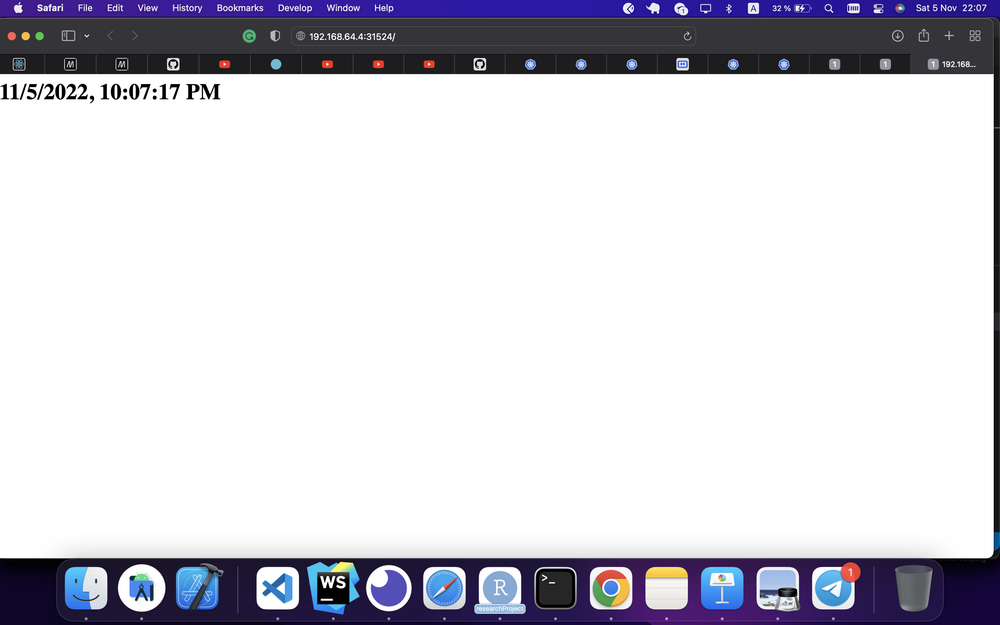
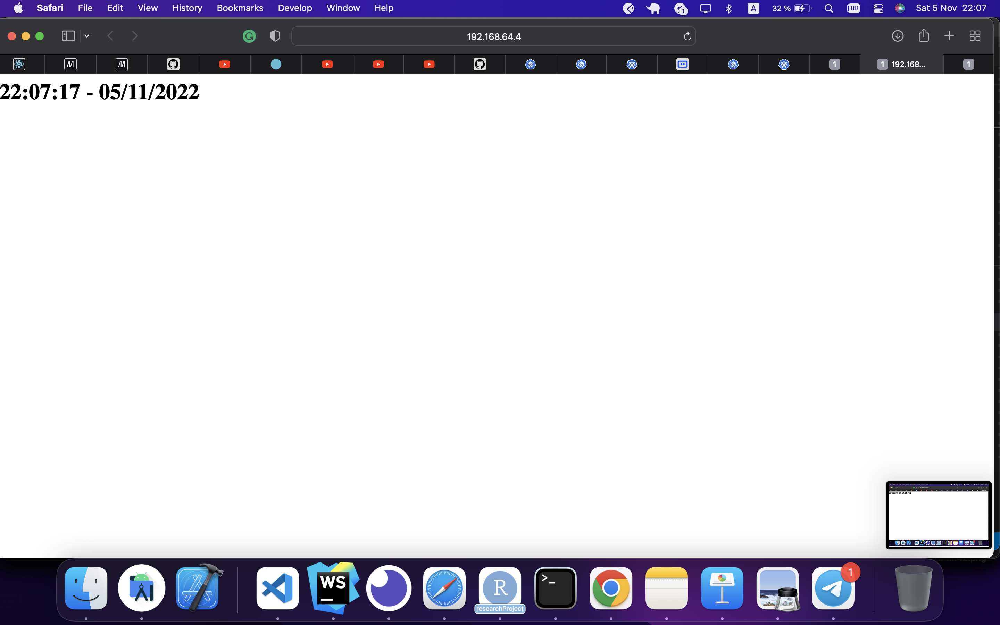
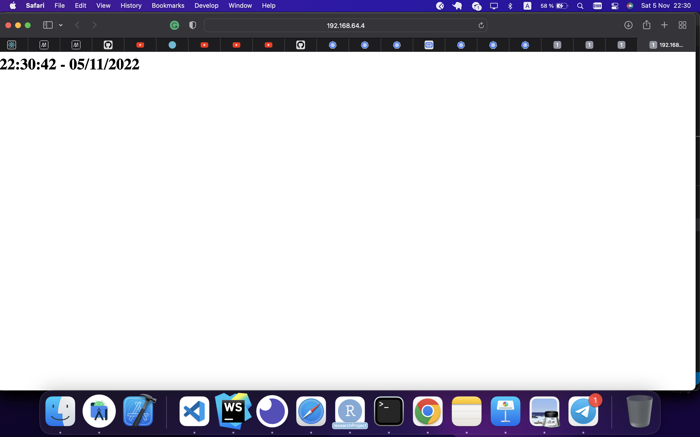
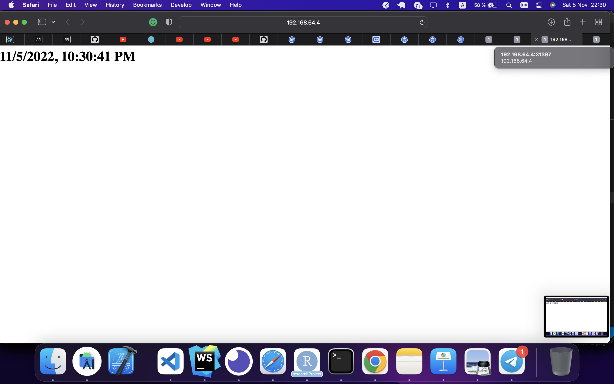
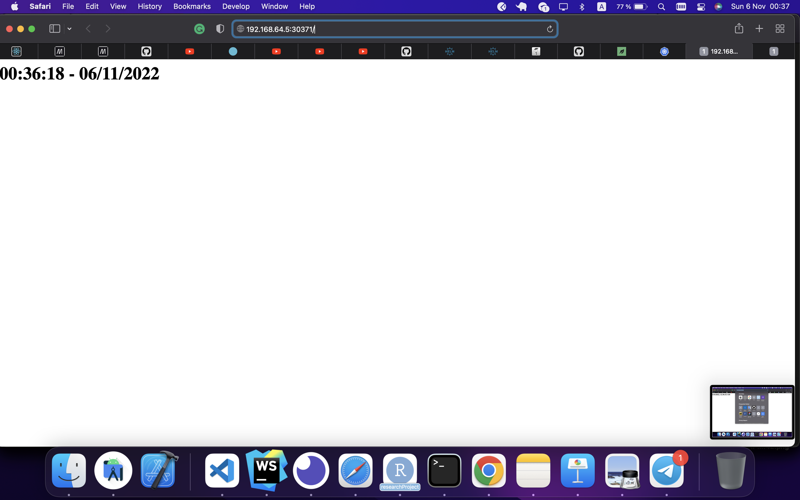
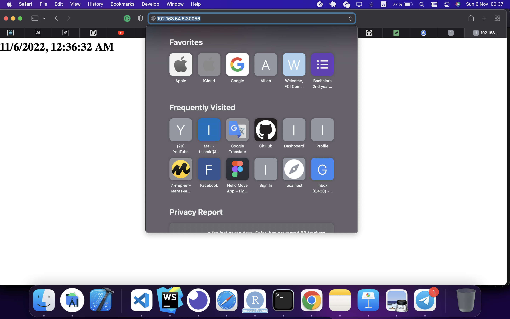

# lab 9
## 1. After deploying and making a service

### The Output of ``` kubectl get pods,svc```

```sh
NAME                              READY   STATUS    RESTARTS   AGE
pod/app-python-64d6bc4d8d-xsjlt   1/1     Running   0          6m14s

NAME                 TYPE           CLUSTER-IP     EXTERNAL-IP   PORT(S)          AGE
service/app-python   LoadBalancer   10.106.60.82   <pending>     8080:31216/TCP   3m44s
service/kubernetes   ClusterIP      10.96.0.1      <none>        443/TCP          12h
```

### The Output of ``` minikube service --all```

```sh
|-----------|-------------|-------------|---------------------------|
| NAMESPACE |    NAME     | TARGET PORT |            URL            |
|-----------|-------------|-------------|---------------------------|
| default   | app-express |        8080 | http://192.168.64.4:31524 |
|-----------|-------------|-------------|---------------------------|
|-----------|------------|-------------|---------------------------|
| NAMESPACE |    NAME    | TARGET PORT |            URL            |
|-----------|------------|-------------|---------------------------|
| default   | app-python |        8080 | http://192.168.64.4:30982 |
|-----------|------------|-------------|---------------------------|
|-----------|------------|-------------|--------------|
| NAMESPACE |    NAME    | TARGET PORT |     URL      |
|-----------|------------|-------------|--------------|
| default   | kubernetes |             | No node port |
|-----------|------------|-------------|--------------|
😿  service default/kubernetes has no node port
🎉  Opening service default/app-express in default browser...
🎉  Opening service default/app-python in default browser...
```

### Screenshot from App1

### Screenshot from App2


## 2. After writing deployment and service configuration files for both apps

### The Output of ``` kubectl get pods,svc```

```sh
 kubectl get pods,svc
NAME                               READY   STATUS    RESTARTS   AGE
pod/app-express-5b88854d68-ddkhn   1/1     Running   0          87s
pod/app-express-5b88854d68-dxmjp   1/1     Running   0          95s
pod/app-express-5b88854d68-td2g7   1/1     Running   0          91s
pod/app-python-6b9884b566-4h7r8    1/1     Running   0          4m51s
pod/app-python-6b9884b566-4nxz4    1/1     Running   0          4m51s
pod/app-python-6b9884b566-h84wz    1/1     Running   0          4m51s

NAME                  TYPE           CLUSTER-IP       EXTERNAL-IP   PORT(S)          AGE
service/app-express   LoadBalancer   10.106.202.225   <pending>     8080:31397/TCP   2m13s
service/app-python    LoadBalancer   10.104.167.148   <pending>     8080:30291/TCP   2m46s
service/kubernetes    ClusterIP      10.96.0.1        <none>        443/TCP          2m45s
```

### The Output of ``` minikube service --all```

```sh
|-----------|-------------|-------------|---------------------------|
| NAMESPACE |    NAME     | TARGET PORT |            URL            |
|-----------|-------------|-------------|---------------------------|
| default   | app-express |        8080 | http://192.168.64.4:31397 |
|-----------|-------------|-------------|---------------------------|
|-----------|------------|-------------|---------------------------|
| NAMESPACE |    NAME    | TARGET PORT |            URL            |
|-----------|------------|-------------|---------------------------|
| default   | app-python |        8080 | http://192.168.64.4:30291 |
|-----------|------------|-------------|---------------------------|
|-----------|------------|-------------|--------------|
| NAMESPACE |    NAME    | TARGET PORT |     URL      |
|-----------|------------|-------------|--------------|
| default   | kubernetes |             | No node port |
|-----------|------------|-------------|--------------|
😿  service default/kubernetes has no node port
🎉  Opening service default/app-express in default browser...
🎉  Opening service default/app-python in default browser...
```

### Screenshot from App1

### Screenshot from App2



## Explanation for Ingress, Ingress controller, StatefulSet, DaemonSet, PersistentVolumes

### Ingress

Ingress exposes HTTP and HTTPS routes from outside the cluster to services within the cluster. Traffic routing is controlled by rules defined on the Ingress resource.
You must have an Ingress controller to satisfy an Ingress. 
### Ingress controller
In order for the Ingress resource to work, the cluster must have an ingress controller running.

You may deploy any number of ingress controllers using ingress class within a cluster.

### StatefulSets
StatefulSet is the workload API object used to manage stateful applications.

Manages the deployment and scaling of a set of Pods, and provides guarantees about the ordering and uniqueness of these Pods.

### DaemonSet
A DaemonSet ensures that all (or some) Nodes run a copy of a Pod. As nodes are added to the cluster, Pods are added to them. As nodes are removed from the cluster, those Pods are garbage collected. Deleting a DaemonSet will clean up the Pods it created.

Some typical uses of a DaemonSet are:

running a cluster storage daemon on every node 

running a logs collection daemon on every node

running a node monitoring daemon on every node
### PersistentVolumes
A PersistentVolume (PV) is a piece of storage in the cluster that has been provisioned by an administrator or dynamically provisioned using Storage Classes. It is a resource in the cluster just like a node is a cluster resource. PVs are volume plugins like Volumes, but have a lifecycle independent of any individual Pod that uses the PV. This API object captures the details of the implementation of the storage, be that NFS, iSCSI, or a cloud-provider-specific storage system.


# lab 10

## The output of ```minikube service --all```

```sh
|-----------|------------------------|-------------|---------------------------|
| NAMESPACE |          NAME          | TARGET PORT |            URL            |
|-----------|------------------------|-------------|---------------------------|
| default   | app-express-1667684164 | http/8080   | http://192.168.64.5:30056 |
|-----------|------------------------|-------------|---------------------------|
|-----------|-----------------------|-------------|---------------------------|
| NAMESPACE |         NAME          | TARGET PORT |            URL            |
|-----------|-----------------------|-------------|---------------------------|
| default   | app-python-1667683827 | http/8080   | http://192.168.64.5:30371 |
|-----------|-----------------------|-------------|---------------------------|
|-----------|------------|-------------|--------------|
| NAMESPACE |    NAME    | TARGET PORT |     URL      |
|-----------|------------|-------------|--------------|
| default   | kubernetes |             | No node port |
|-----------|------------|-------------|--------------|
😿  service default/kubernetes has no node port
🎉  Opening service default/app-express-1667684164 in default browser...
🎉  Opening service default/app-python-1667683827 in default browser...
```

## The output of ```kubectl get pods,svc```

```sh
NAME                                         READY   STATUS    RESTARTS   AGE
pod/app-express-1667684164-6c6c5ff67-c9g6q   1/1     Running   0          2m32s
pod/app-express-1667684164-6c6c5ff67-p25zm   1/1     Running   0          2m32s
pod/app-express-1667684164-6c6c5ff67-sqqh9   1/1     Running   0          2m32s
pod/app-python-1667683827-59f646f4f4-2m64x   1/1     Running   0          8m9s
pod/app-python-1667683827-59f646f4f4-bjrn2   1/1     Running   0          8m9s
pod/app-python-1667683827-59f646f4f4-ngzf8   1/1     Running   0          8m9s

NAME                             TYPE           CLUSTER-IP       EXTERNAL-IP   PORT(S)          AGE
service/app-express-1667684164   LoadBalancer   10.108.142.247   <pending>     8080:30056/TCP   2m32s
service/app-python-1667683827    LoadBalancer   10.98.78.124     <pending>     8080:30371/TCP   8m9s
service/kubernetes               ClusterIP      10.96.0.1        <none>        443/TCP          9m2s
```


## Screenshot from App1

## Screenshot from App2



## Bonus task

### Umbrella Chart
An umbrella chart references the version of the Helm chart itself and not the underlying version of the container image. This means that any change to the image version will result in chart modifications to the individual component charts.

A single umbrella chart may have multiple subcharts, each of which functions as a piece of the whole.

The current best practice for composing a complex application from discrete parts is to create a top-level umbrella chart that exposes the global configurations, and then use the charts/ subdirectory to embed each of the components.

### Library chats
A library chart is a type of Helm chart that defines chart primitives or definitions which can be shared by Helm templates in other charts. This allows users to share snippets of code that can be re-used across charts, avoiding repetition and keeping charts DRY.