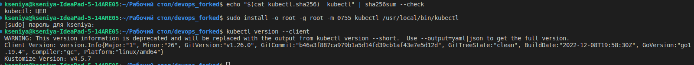

# Lab 9

## k8s

`Kubernetes`. Setup local development environment and prepare a
few manifests for your application.


1. I have installed `kubectl` according to [this tutorial](https://kubernetes.io/docs/tasks/tools/):

    

1. The next step was the installation of the minicube according to [the following manual](https://kubernetes.io/ru/docs/tasks/tools/install-minikube/).

1. I deployed my application in the `minikube` with the use of the `kubectl create`:

    ```terminal
    kubectl create deployment app-python --image=ksev13/devops_forked:latest
    deployment.apps/app-python created
    ```
    And then I confirmed it:
    ```bash
    kubectl get deployment app-python
    NAME         READY   UP-TO-DATE   AVAILABLE   AGE
    app-python   1/1     1            1           49s
    ```

1. I made my application accessible from outside the `Kubernetes` virtual network.
    By following [this example](https://kubernetes.io/docs/tutorials/hello-minikube/#create-a-service), I exposed the Pod to the public internet using the kubectl expose command: 
    
    ```bash 
    kubectl expose deployment app-python --type=LoadBalancer --port=8000
    service/app-python exposed
    ```

1. The output of `kubectl get pods,svc` command:
    ```bash
    The output of kubectl get pods,svc command:

    NAME                             READY   STATUS    RESTARTS   AGE
    pod/app-python-84977b4d7-lm8dr   1/1     Running   0          11m

    NAME                 TYPE           CLUSTER-IP     EXTERNAL-IP   PORT(S)          AGE
    service/app-python   LoadBalancer   10.109.1.144   <pending>     8000:31261/TCP   8m8s
    service/kubernetes   ClusterIP      10.96.0.1      <none>        443/TCP          13m
    ```
1. It wasn't convenient way to manage an app. Therefore, I 1. I cleaned up by `minikube delete` command. 

1. I created a new `deployment.yml` file with the help of [this tutorial](https://kubernetes.io/docs/concepts/workloads/controllers/deployment/#creating-a-deployment) and a new `service.yml` file following [this one](https://kubernetes.io/docs/concepts/services-networking/service/#defining-a-service).

1. After that I created the Deployment by running the following commands:
    ```sh
    minikube start
    kubectl apply -f deployment.yml
    kubectl apply -f service.yml
    ```

1. The output of `kubectl get pods,svc` command:

    ```sh
    NAME                                         READY   STATUS    RESTARTS   AGE
    pod/app-python-deployment-575dcb886f-4mpb2   1/1     Running   0          32s
    pod/app-python-deployment-575dcb886f-qdbt7   1/1     Running   0          32s
    pod/app-python-deployment-575dcb886f-qgdrs   1/1     Running   0          32s

    NAME                         TYPE           CLUSTER-IP     EXTERNAL-IP   PORT(S)        AGE
    service/app-python-service   LoadBalancer   10.102.34.62   <pending>     80:30545/TCP   23s
    service/kubernetes           ClusterIP      10.96.0.1      <none>        443/TCP        55s
    ```

1.  The output of `minikube service --all` command:

    ```sh

    |-----------|--------------------|-------------|---------------------------|
    | NAMESPACE |        NAME        | TARGET PORT |            URL            |
    |-----------|--------------------|-------------|---------------------------|
    | default   | app-python-service |          80 | http://192.168.49.2:30545 |
    |-----------|--------------------|-------------|---------------------------|
    |-----------|------------|-------------|--------------|
    | NAMESPACE |    NAME    | TARGET PORT |     URL      |
    |-----------|------------|-------------|--------------|
    | default   | kubernetes |             | No node port |
    |-----------|------------|-------------|--------------|
    😿  service default/kubernetes has no node port
    🏃  Starting tunnel for service app-python-service.
    🏃  Starting tunnel for service kubernetes.
    |-----------|--------------------|-------------|------------------------|
    | NAMESPACE |        NAME        | TARGET PORT |          URL           |
    |-----------|--------------------|-------------|------------------------|
    | default   | app-python-service |             | http://127.0.0.1:54670 |
    | default   | kubernetes         |             | http://127.0.0.1:54671 |
    |-----------|--------------------|-------------|------------------------|
    🎉  Opening service default/app-python-service in default browser...
    🎉  Opening service default/kubernetes in default browser...
    ❗  Because you are using a Docker driver on darwin, the terminal needs to be open to run it.

1. Screenshot from a browser that shows the same ip as in the latter command:
    

## Bonus

### `Ingress, Ingress controller, StatefulSet, DaemonSet,  PersistentVolumes` in a nutshell:


**Ingress** is an API object, a set of rules within the cluster being created to describe the way how incoming connections can reach the services of one developer's application.

**Ingress controller** is a pod, an Kubernetes application due to which Ingress runs.

**DaemonSet** creates a guarantee that a certain sub will run on the specified nodes of the cluster.

**PersistentVolumes** is analogous to the Kubernetes' physical or virtual machines on which application containers are deployed and run.
