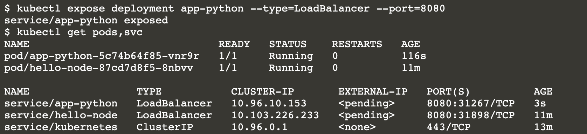
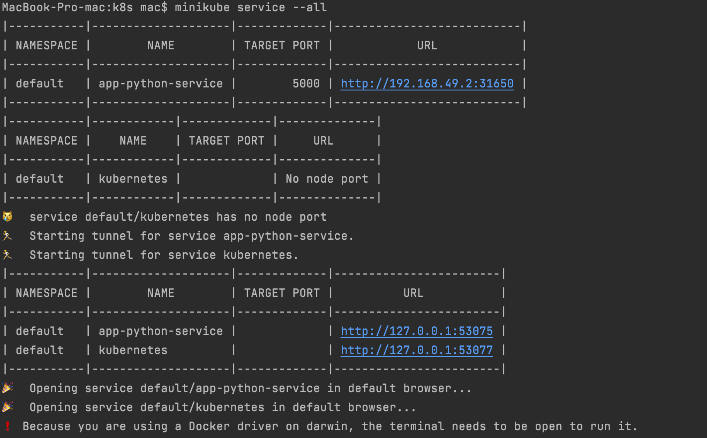
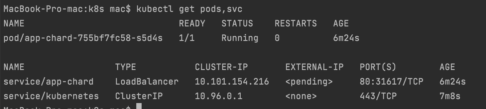
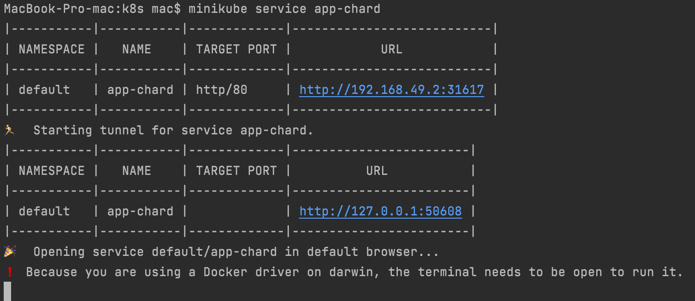

Output of 
```kubectl get pods,svc``` command:
___


Output of ```minikube service --all``` command:
___



Result from browser:
___


#LAB10

Output of ```kubectl get pods,svc``` command::
___


Output of ```minikube service app-chard``` command::
___

