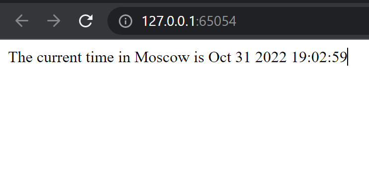

# k8s ✨

## 💎 `kubectl get pods,svc`

```bash
NAME                                   READY   STATUS    RESTARTS   AGE
pod/minikube-python-5bb5ff48d7-tst9d   1/1     Running   0          81s

NAME                      TYPE           CLUSTER-IP    EXTERNAL-IP   PORT(S)          AGE
service/kubernetes        ClusterIP      10.96.0.1     <none>        443/TCP          19m
service/minikube-python   LoadBalancer   10.107.25.8   <pending>     5000:31866/TCP   32s
```

## 💎 `kubectl get pods,svc` again

```bash
NAME                                         READY   STATUS    RESTARTS   AGE
pod/python-app-deployment-7d8ddf48bc-jqznf   1/1     Running   0          5m29s
pod/python-app-deployment-7d8ddf48bc-pp9nb   1/1     Running   0          5m29s
pod/python-app-deployment-7d8ddf48bc-r6jhr   1/1     Running   0          5m29s

NAME                            TYPE        CLUSTER-IP    EXTERNAL-IP   PORT(S)    AGE
service/kubernetes              ClusterIP   10.96.0.1     <none>        443/TCP    64m
service/python-app-deployment   ClusterIP   10.97.157.4   <none>        5000/TCP   3s
```

## 💎 `minikube service --all`

```bash
|-----------|------------|-------------|--------------|
| NAMESPACE |    NAME    | TARGET PORT |     URL      |
|-----------|------------|-------------|--------------|
| default   | kubernetes |             | No node port |
|-----------|------------|-------------|--------------|
😿  service default/kubernetes has no node port
|-----------|-----------------------|-------------|--------------|
| NAMESPACE |         NAME          | TARGET PORT |     URL      |
|-----------|-----------------------|-------------|--------------|
| default   | python-app-deployment |             | No node port |
|-----------|-----------------------|-------------|--------------|
😿  service default/python-app-deployment has no node port
🏃  Starting tunnel for service kubernetes.
🏃  Starting tunnel for service python-app-deployment.
|-----------|-----------------------|-------------|------------------------|
| NAMESPACE |         NAME          | TARGET PORT |          URL           |
|-----------|-----------------------|-------------|------------------------|
| default   | kubernetes            |             | http://127.0.0.1:65052 |
| default   | python-app-deployment |             | http://127.0.0.1:65054 |
|-----------|-----------------------|-------------|------------------------|
🎉  Opening service default/kubernetes in default browser...
🎉  Opening service default/python-app-deployment in default browser...
❗  Because you are using a Docker driver on windows, the terminal needs to be open to run it.
```

## 💎 Screenshots


