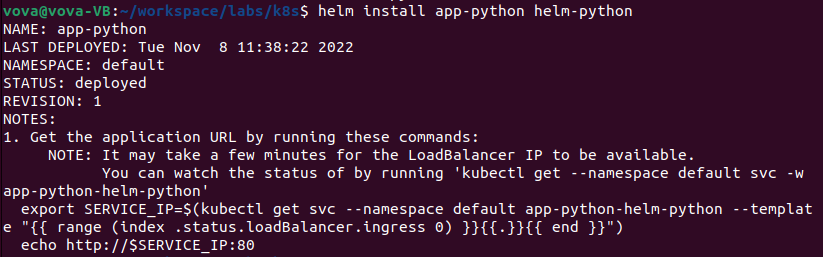
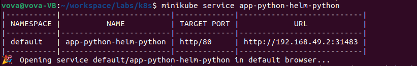
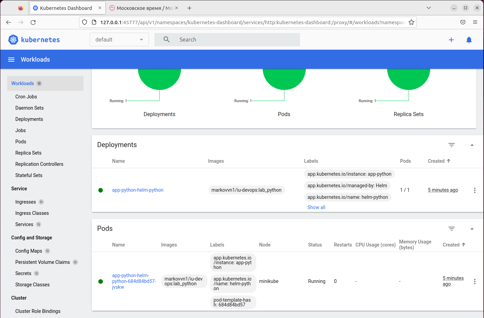
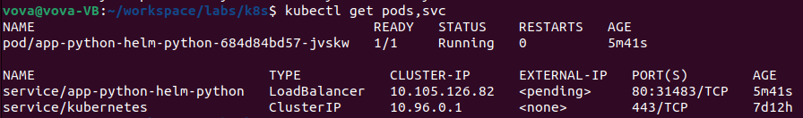
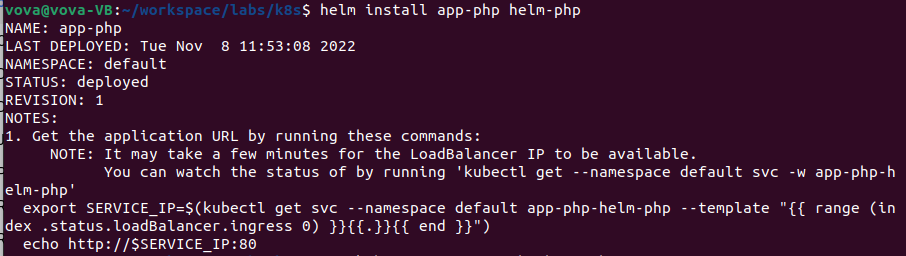
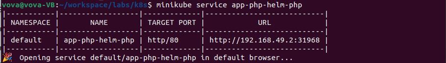
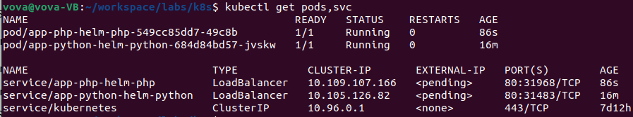
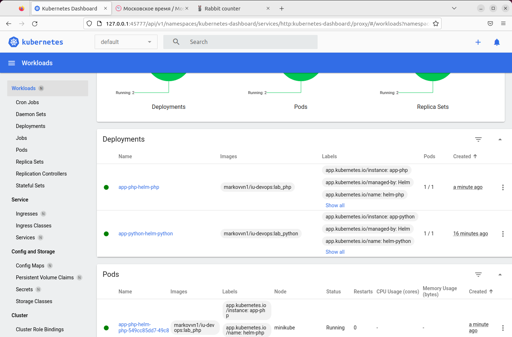

# K8s

### Manual deployment

```bash
kubectl create deployment app-python --image=markovvn1/iu-devops:lab_python
kubectl expose deployment add-python --type=LoadBalancer --port=80
kubectl get (deployments/services)
minikube service app-python
```

Output of the `kubectl get pods,svc` command after manual deployment:


Deployed website:


### Deployment with Configuration Files

```bash
kubectl apply -f <config_file>.yml
```

Output of the `kubectl get pods,svc` command after deployment:


Deployed website:


### [Bonus] Deployment with Configuration Files of PHP app

Output of the `kubectl get pods,svc` command after deployment:


Deployed website:


### [Bonus] K8S definitions

**Ingress** is a Kubernetes object that describes the set of rules for proxying traffic from an external source to services within the K8S cluster. Ingress object requires an ingress controller to route traffic.

The **Ingress controller** is usually a proxy service deployed in a cluster. Required to route the rules specified in the Ingress object.

**StatefulSet** is an API object used to manage and track stateful applications. StatefulSet manages the deployment and scaling of application pods. Helps to handle Pod shutdown events and implement Graceful Shutdown.

**DeamonSet** is a Kubernetes API object that ensures that a certain pod will run on all (or some) nodes.

**PersistentVolumes** is the unit of data storage where applications such as a database can store and work with their data. Several pods can use a single PersistentVolume.

# Helm

Create a template:

```bash
helm create helm-python
```

Change in `helm-python/values.yaml`:

```yaml
...
image:
  repository: markovvn1/iu-devops
  pullPolicy: IfNotPresent
  # Overrides the image tag whose default is the chart appVersion.
  tag: "lab_python"
...
service:
  type: LoadBalancer
  port: 80
```

Install package:

```bash
helm install app-python helm-python
minikube service app-python-helm-python
```









## php-app

Create a template:

```bash
helm create helm-php
```

Change in `helm-python/values.yaml`:

```yaml
...
image:
  repository: markovvn1/iu-devops
  pullPolicy: IfNotPresent
  # Overrides the image tag whose default is the chart appVersion.
  tag: "lab_php"
...
service:
  type: LoadBalancer
  port: 80
```

Install package:

```bash
helm install app-php helm-php
minikube service app-php-helm-php
```









### [Bonus] Helm definitions

**Library charts** - type of Helm chart that allows code snippets to be shared between users, allowing reuse of templates already written.

**Umbrella charts** - type of Helm chart that integrates several Kubernetes components into higher-order chart, allowing for simplified deployment or updating of complex applications by handling a collection of components as a single entity

