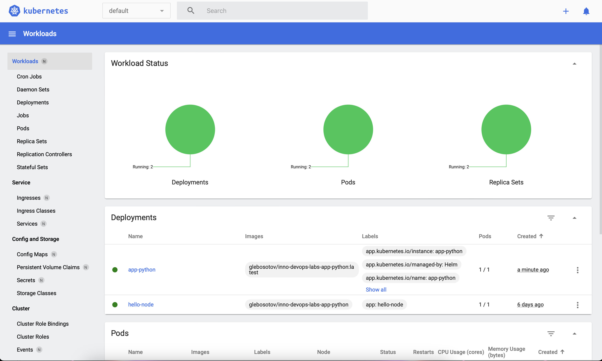

# Lab 9
# Manual approach

```
$ kubectl get pods,svc

NAME                              READY   STATUS    RESTARTS   AGE
pod/python-app-869dc76fc7-tkj7t   1/1     Running   0          45s

NAME                 TYPE           CLUSTER-IP       EXTERNAL-IP   PORT(S)          AGE
service/kubernetes   ClusterIP      10.96.0.1        <none>        443/TCP          66s
service/python-app   LoadBalancer   10.106.114.165   <pending>     8080:30398/TCP   16s
```

# Config approach

```
$ kubectl get pods,svc

NAME                                         READY   STATUS    RESTARTS   AGE
pod/python-app-deployment-7dd784648c-9mg78   1/1     Running   0          75s
pod/python-app-deployment-7dd784648c-jldvb   1/1     Running   0          75s
pod/python-app-deployment-7dd784648c-lnbcz   1/1     Running   0          75s

NAME                 TYPE           CLUSTER-IP       EXTERNAL-IP   PORT(S)          AGE
service/kubernetes   ClusterIP      10.96.0.1        <none>        443/TCP          13m
service/python-app   LoadBalancer   10.108.134.239   <pending>     8080:31471/TCP   75s
```

```
$ minikube service --all

|-----------|------------|-------------|--------------|
| NAMESPACE |    NAME    | TARGET PORT |     URL      |
|-----------|------------|-------------|--------------|
| default   | kubernetes |             | No node port |
|-----------|------------|-------------|--------------|
😿  service default/kubernetes has no node port
|-----------|------------|-------------|---------------------------|
| NAMESPACE |    NAME    | TARGET PORT |            URL            |
|-----------|------------|-------------|---------------------------|
| default   | python-app |        8080 | http://192.168.49.2:31471 |
|-----------|------------|-------------|---------------------------|
🏃  Starting tunnel for service kubernetes.
🏃  Starting tunnel for service python-app.
|-----------|------------|-------------|------------------------|
| NAMESPACE |    NAME    | TARGET PORT |          URL           |
|-----------|------------|-------------|------------------------|
| default   | kubernetes |             | http://127.0.0.1:54335 |
| default   | python-app |             | http://127.0.0.1:54337 |
|-----------|------------|-------------|------------------------|
🎉  Opening service default/kubernetes in default browser...
🎉  Opening service default/python-app in default browser...
❗  Because you are using a Docker driver on windows, the terminal needs to be open to run it.
```

## Screenshot


# Lab 10
## Dashboard



## Commands outputs
```
$ minikube service helm-app-python-app

|-----------|---------------------|-------------|---------------------------|
| NAMESPACE |        NAME         | TARGET PORT |            URL            |
|-----------|---------------------|-------------|---------------------------|
| default   | helm-app-python-app | http/80     | http://192.168.49.2:31744 |
|-----------|---------------------|-------------|---------------------------|
🏃  Starting tunnel for service helm-app-python-app.
|-----------|---------------------|-------------|------------------------|
| NAMESPACE |        NAME         | TARGET PORT |          URL           |
|-----------|---------------------|-------------|------------------------|
| default   | helm-app-python-app |             | http://127.0.0.1:55913 |
|-----------|---------------------|-------------|------------------------|
🎉  Opening service default/helm-app-python-app in default browser...
❗  Because you are using a Docker driver on windows, the terminal needs to be open to run it.
```

```
$ kubectl get pods,svc    
 
NAME                                      READY   STATUS    RESTARTS   AGE
pod/helm-app-python-app-769877748-z44xp   1/1     Running   0          2m27s

NAME                          TYPE           CLUSTER-IP     EXTERNAL-IP   PORT(S)        AGE
service/helm-app-python-app   LoadBalancer   10.106.81.99   <pending>     80:31744/TCP   2m27s
service/kubernetes            ClusterIP      10.96.0.1      <none>        443/TCP        20h
```