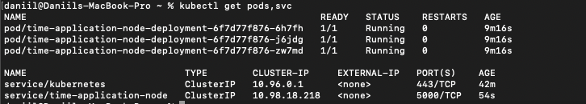
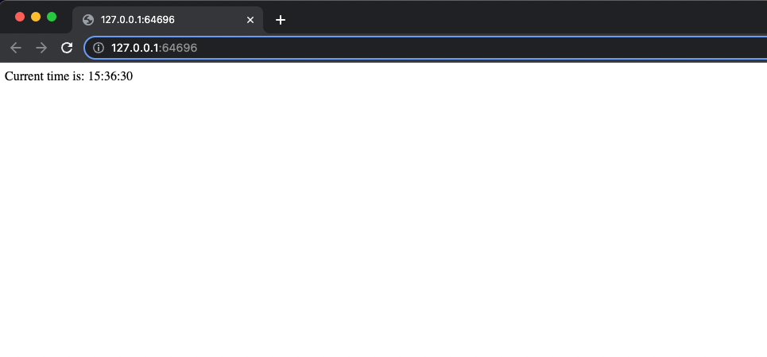
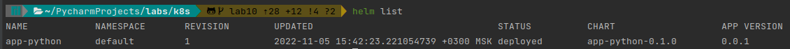

# Kubernetes

## Imperative
`kubectl get pods,svc`:

```text                                                                                                                                                 ✔  minikube ⎈ 
NAME                                READY   STATUS    RESTARTS   AGE
pod/msctime-node-579965846d-jrx5q   1/1     Running   0          8m47s

NAME                   TYPE           CLUSTER-IP       EXTERNAL-IP   PORT(S)          AGE
service/kubernetes     ClusterIP      10.96.0.1        <none>        443/TCP          39m
service/msctime-node   LoadBalancer   10.107.125.188   <pending>     8000:31417/TCP   3m31s
```

## Declarative
`kubectl get pods,svc`:

```text
NAME                                      READY   STATUS    RESTARTS   AGE
pod/msctime-deployment-65d98cf7bb-nd5lg   1/1     Running   0          13m
pod/msctime-deployment-65d98cf7bb-rwtx4   1/1     Running   0          13m
pod/msctime-deployment-65d98cf7bb-x2v4c   1/1     Running   0          13m

NAME                      TYPE        CLUSTER-IP       EXTERNAL-IP   PORT(S)    AGE
service/kubernetes        ClusterIP   10.96.0.1        <none>        443/TCP    62m
service/msctime-service   ClusterIP   10.110.162.242   <none>        8000/TCP   36s
```

`minkube service --all`


From browser:


## Helm 

### Run with Helm

1. Build chart:

   ```bash
   cd k8s/app_python
   helm package app-python
   ```

2. Install chart:

   ```bash
   helm install app-python ./app-python-0.1.0.tgz
   ```

### Outputs

#### `minikube service app-python`


#### `kubectl get pods,svc`


#### `helm list`

