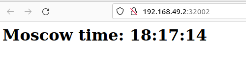
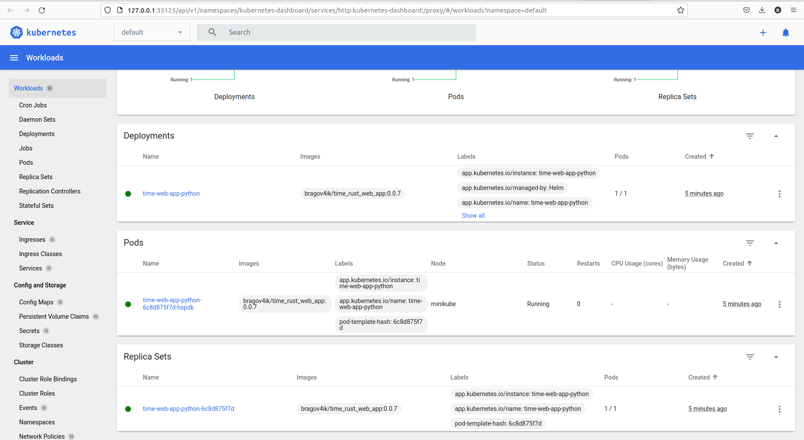
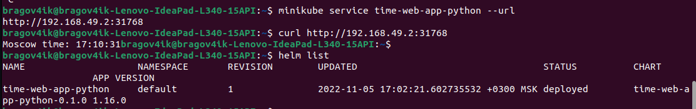
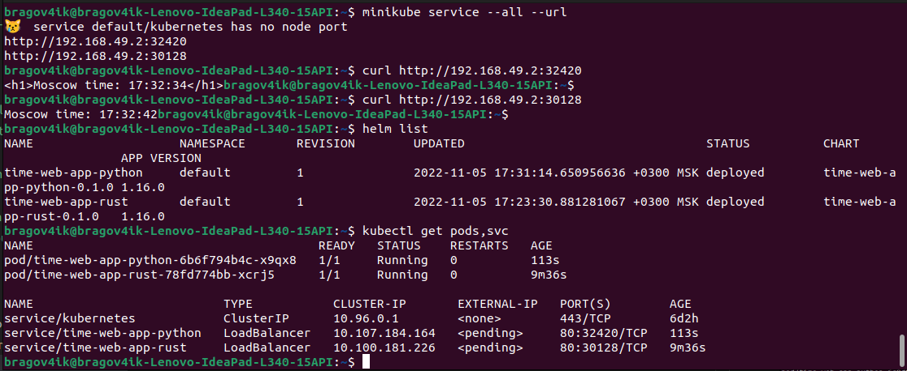

# K8S report

## Manual management

```
$ kubectl get pod,svc
NAME                                    READY   STATUS    RESTARTS   AGE
pod/time-web-app-node-9c7bb6b94-px6t7   1/1     Running   0          10m

NAME                        TYPE           CLUSTER-IP       EXTERNAL-IP   PORT(S)          AGE
service/kubernetes          ClusterIP      10.96.0.1        <none>        443/TCP          20m
service/time-web-app-node   LoadBalancer   10.111.200.137   <pending>     8000:30120/TCP   3m55s
```

Minikube opened the service at `192.168.49.2:30120`, application is accessible through browser.

## Manifest management

```
$ kubectl get pods,svc
NAME                                            READY   STATUS    RESTARTS        AGE
pod/webapp-python-deployment-6b97f8c4c7-lccz4   1/1     Running   2 (6m56s ago)   8m13s
pod/webapp-python-deployment-6b97f8c4c7-pgzrh   1/1     Running   2 (6m56s ago)   8m13s
pod/webapp-python-deployment-6b97f8c4c7-qnvpl   1/1     Running   1 (7m6s ago)    8m13s

NAME                              TYPE           CLUSTER-IP      EXTERNAL-IP   PORT(S)        AGE
service/kubernetes                ClusterIP      10.96.0.1       <none>        443/TCP        3h13m
service/python-time-app-service   LoadBalancer   10.111.160.79   <pending>     80:32002/TCP   3m30s
```

```
$ minikube service --all
|-----------|------------|-------------|--------------|
| NAMESPACE |    NAME    | TARGET PORT |     URL      |
|-----------|------------|-------------|--------------|
| default   | kubernetes |             | No node port |
|-----------|------------|-------------|--------------|
😿  service default/kubernetes has no node port
|-----------|-------------------------|-------------|---------------------------|
| NAMESPACE |          NAME           | TARGET PORT |            URL            |
|-----------|-------------------------|-------------|---------------------------|
| default   | python-time-app-service |          80 | http://192.168.49.2:32002 |
|-----------|-------------------------|-------------|---------------------------|
🎉  Opening service default/python-time-app-service in default browser...
```

browser screenshot:


## Own word explanations of different concept

### Ingress
An entity that provides and controls external access to services running inside kubernetes cluster (they are usually not connected to the Internet).

As mentioned in docs, it usually works with HTTP(S) connections.
Some of its functionality is:
* load balancing
* providing external access to services
* some ssl/tls related stuff
(and other fancy stuff I haven't used/needed yet)

For example, we may want to send requests to path `/aboba` to service `aboba-service` and `/popular-trendy-app` to more scaled `popular-service`.

### Ingress controller
Makes ingress work. There are different controllers available, such as Nginx, one for amazon, one for google cloud (probably yandex cloud one also exists somewhere :P).

### StatefulSet
Manages applications that have state.

Deployments (ReplicaSets) are designed for stateless applications. It means that no matter which of the pods in the set receives the request, the answer should be the same. Also on pod restart no info is usually saved (for example, metric counters in our apps should be erased). Any state that they might have is separated from the pods and is located on a single shared volume (apparently called "PersistentVolumeClaim") and all pods access it to get or put some info.

However, StatefulSet associates a persistent data volume with each pod (thus pods also are distinguished between each other by some ID), that is saved when the pod is restarted or updated. Also, it seems that it can be used when we need ordered update/deployment/scaling (maybe we for some reason may need to update pod 1 first?).

An example I could think of is running distributed system nodes (nod k8s nodes, rather smth like blockchain clients). The state is far easier to save between restarts in order to not synchronize from the very beginning each time (for example, it may require expensive computations like preparing cache for validating new transactions/blocks/other stuff). Also since it's originally a distributed system, each node already works with local state, which is exactly what happens here.

### DaemonSet
Seems similar to a stateful set. Runs a copy of specified pod on each node in the cluster. In the StatefulSet we control how many copies/pods do we have, which are distributed on pods optimally on the nodes according to kubernetes. It is needed when only one pod is needed for each node. Such pods may include some administrative programs (like clientful infrastructure management (Chef, according to quick google)) or monitoring tools for checking metrics for the (virtual) machine itself.

### PersistentVolumes
Volume/storage resource whose lifetime exceedes lifetime of a pod (because persistent). Can be different.

Not sure if it makes sense to go more in detail, volumes seem pretty clear.

# Helm report

## Chart installation

```bash
~/Documents/Studying/devops/k8s$ helm package time-web-app-python
Successfully packaged chart and saved it to: /home/bragov4ik/Documents/Studying/devops/k8s/time-web-app-python-0.1.0.tgz
~/Documents/Studying/devops/k8s$ helm install time-web-app-python time-web-app-python-0.1.0.tgz 
NAME: time-web-app-python
LAST DEPLOYED: Sat Nov  5 17:02:21 2022
NAMESPACE: default
STATUS: deployed
REVISION: 1
NOTES:
1. Get the application URL by running these commands:
     NOTE: It may take a few minutes for the LoadBalancer IP to be available.
           You can watch the status of by running 'kubectl get --namespace default svc -w time-web-app-python'
  export SERVICE_IP=$(kubectl get svc --namespace default time-web-app-python --template "{{ range (index .status.loadBalancer.ingress 0) }}{{.}}{{ end }}")
  echo http://$SERVICE_IP:80

```

## Service expose

```bash
~$ minikube service time-web-app-python --url
http://192.168.49.2:31768
```

## Screenshots






## Bonus task

Helm chart is installed the same way



### Helm library charts

They play basically the same role as libraries in common programming languages. They allow to move commonly repeated code into a separate entity that is imported or used by other charts.

The library charts cannot be deployed themselves and thus can only be a dependency of another chart

So in our case, it seems that python and rust charts are basically the same, they seem to only differ in values provided. Therefore, it makes sense to move most of the code into a library to follow DRY strategy and supply appropriate values to it.

### Umbrella charts

A chart that combines multiple other subcharts. They allow to deploy a complex application consisting of multiple components as a single unit (if it is needed for some reason). Difference with a chart with multiple libraries as dependencies is that it seems to gather full-fledged charts (that can be deployed on their own) rather than some helper code that can't be deployed by itself.
