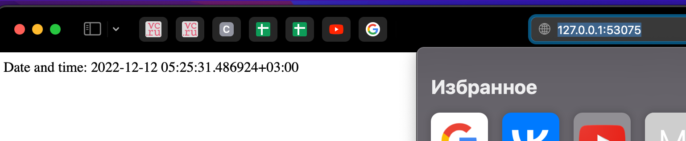

# Outputs of kubectl
## Before configurations file
### kubectl get pods
```
NAME                    READY   STATUS             RESTARTS   AGE
lab-7978b67c54-pkr4m    0/1     ImagePullBackOff   0          8m6s
lab9-548d95bbff-g68jb   1/1     Running            0          4m15s
```
### kubectl get svc
```
NAME         TYPE           CLUSTER-IP     EXTERNAL-IP   PORT(S)        AGE
kubernetes   ClusterIP      10.96.0.1      <none>        443/TCP        34m
lab9         LoadBalancer   10.102.196.1   <pending>     80:30056/TCP   4m25s
```
## After cofiguration files
### kubectl get pods,svc
```
NAME                                    READY   STATUS             RESTARTS   AGE
pod/lab9-74cc6549b7-7sjnd               1/1     Running            0          4m51s
pod/lab9-74cc6549b7-v8w5c               1/1     Running            0          4m51s
pod/lab9-74cc6549b7-xjrgv               1/1     Running            0          4m51s

NAME                 TYPE           CLUSTER-IP     EXTERNAL-IP   PORT(S)        AGE
service/kubernetes   ClusterIP      10.96.0.1      <none>        443/TCP        62m
service/lab9         LoadBalancer   10.103.3.247   <pending>     80:32112/TCP   3m52s
```
### minikube service --all
```
|-----------|------------|-------------|--------------|
| NAMESPACE |    NAME    | TARGET PORT |     URL      |
|-----------|------------|-------------|--------------|
| default   | kubernetes |             | No node port |
|-----------|------------|-------------|--------------|
😿  service default/kubernetes has no node port
|-----------|------|-------------|---------------------------|
| NAMESPACE | NAME | TARGET PORT |            URL            |
|-----------|------|-------------|---------------------------|
| default   | lab9 |          80 | http://192.168.49.2:32112 |
|-----------|------|-------------|---------------------------|
🏃  Starting tunnel for service kubernetes.
🏃  Starting tunnel for service lab9.
|-----------|------------|-------------|------------------------|
| NAMESPACE |    NAME    | TARGET PORT |          URL           |
|-----------|------------|-------------|------------------------|
| default   | kubernetes |             | http://127.0.0.1:37635 |
| default   | lab9       |             | http://127.0.0.1:43889 |
|-----------|------------|-------------|------------------------|
🎉  Opening service default/kubernetes in default browser...
👉  http://127.0.0.1:37635
🎉  Opening service default/lab9 in default browser...
👉  http://127.0.0.1:43889
❗  Because you are using a Docker driver on linux, the terminal needs to be open to run it.
```
### Screenshot


# LAB 10 PART!
## kubectl get pods,svc
NAME
READY   STATUS    RESTARTS      AGE
pod/my-app-69dd4f658d-q2hgm   0/1     Running   2 (25s ago)   85s
pod/my-app-6d4954f5db-stmvf   0/1     Running   1 (6s ago)    46s

NAME
TYPE        CLUSTER-IP      EXTERNAL-IP   PORT(S)   AGE
service/kubernetes   ClusterIP   10.96.0.1       <none>        443/TCP   7d
service/my-app       ClusterIP   10.109.51.146   <none>        80/TCP    85s