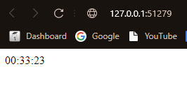

### Output of `kubectl get pods,svc`:
```
homa@LAPTOP-KJ6SQVBF:~/labs$ kubectl get pods,svc
NAME                                READY   STATUS    RESTARTS   AGE
pod/homa3030-app-7b8b69f44f-2mtpb   1/1     Running   0          5m19s

NAME                   TYPE           CLUSTER-IP       EXTERNAL-IP   PORT(S)          AGE
service/homa3030-app   LoadBalancer   10.100.151.208   <pending>     8080:32586/TCP   3m
service/kubernetes     ClusterIP      10.96.0.1        <none>        443/TCP          22m

```

### Output of `kubectl get pods,svc`:
```
homa@LAPTOP-KJ6SQVBF:~/labs$ kubectl get pods,svc
NAME                                READY   STATUS    RESTARTS   AGE
pod/homa3030-app-668fd6f7b6-k49k9   1/1     Running   0          12m
pod/homa3030-app-668fd6f7b6-lqnf7   1/1     Running   0          12m
pod/homa3030-app-668fd6f7b6-zvlkp   1/1     Running   0          12m

NAME                   TYPE           CLUSTER-IP      EXTERNAL-IP   PORT(S)          AGE
service/homa3030-app   LoadBalancer   10.98.134.248   <pending>     8080:32765/TCP   3s
service/kubernetes     ClusterIP      10.96.0.1       <none>        443/TCP          55m
```

### Output of `minikube service --all`:
```
homa@LAPTOP-KJ6SQVBF:~/labs$ minikube service --all
|-----------|--------------|-------------|---------------------------|
| NAMESPACE |     NAME     | TARGET PORT |            URL            |
|-----------|--------------|-------------|---------------------------|
| default   | homa3030-app |        8080 | http://192.168.49.2:32765 |
|-----------|--------------|-------------|---------------------------|
|-----------|------------|-------------|--------------|
| NAMESPACE |    NAME    | TARGET PORT |     URL      |
|-----------|------------|-------------|--------------|
| default   | kubernetes |             | No node port |
|-----------|------------|-------------|--------------|
😿  service default/kubernetes has no node port
🏃  Starting tunnel for service homa3030-app.
🏃  Starting tunnel for service kubernetes.
|-----------|--------------|-------------|------------------------|
| NAMESPACE |     NAME     | TARGET PORT |          URL           |
|-----------|--------------|-------------|------------------------|
| default   | homa3030-app |             | http://127.0.0.1:39127 |
| default   | kubernetes   |             | http://127.0.0.1:37591 |
|-----------|--------------|-------------|------------------------|
🎉  Opening service default/homa3030-app in default browser...
👉  http://127.0.0.1:39127
🎉  Opening service default/kubernetes in default browser...
👉  http://127.0.0.1:37591
❗  Because you are using a Docker driver on linux, the terminal needs to be open to run it.

```

### Screenshot
