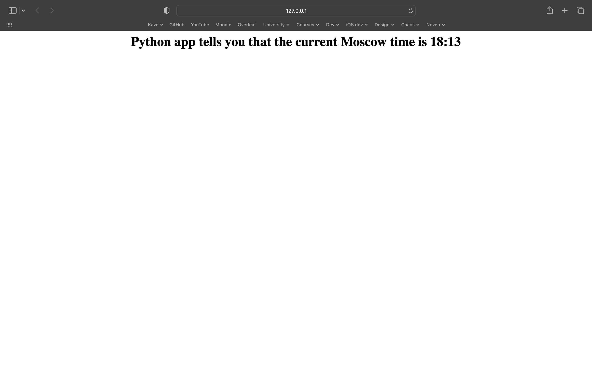
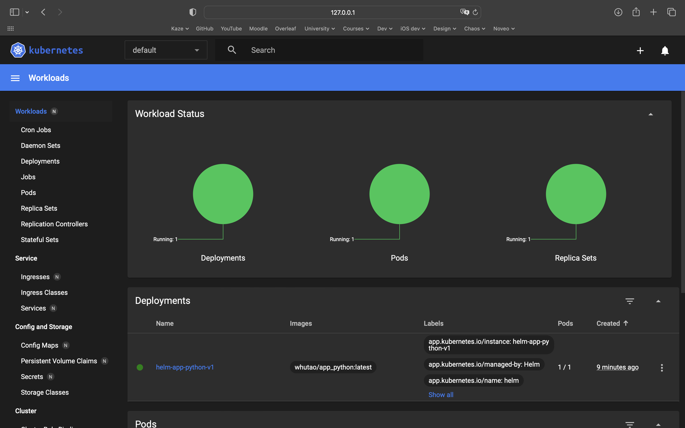
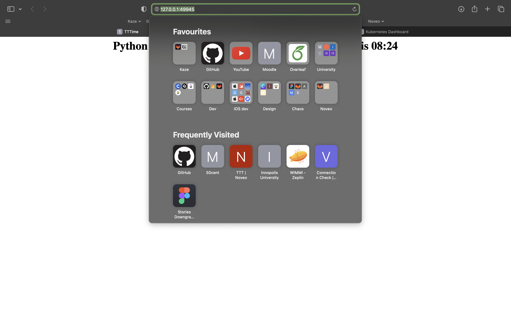

# Kubernetes

## Lab 9

### Command line output

Kubectl output

```commandline
whutao@Romans-MacBook-Pro k8s % kubectl apply -f app_python/service.yml
service/python-application-service configured
whutao@Romans-MacBook-Pro k8s % kubectl apply -f app_python/deployment.yml            
deployment.apps/python-application-deployment configured
whutao@Romans-MacBook-Pro k8s % kubectl get pods,svc                      
NAME                                                 READY   STATUS    RESTARTS   AGE
pod/python-application-deployment-5b85db8f5f-bnrrp   1/1     Running   0          13s

NAME                                 TYPE           CLUSTER-IP       EXTERNAL-IP   PORT(S)          AGE
service/kubernetes                   ClusterIP      10.96.0.1        <none>        443/TCP          9d
service/python-application           LoadBalancer   10.111.175.219   <pending>     5050:30056/TCP   44h
service/python-application-service   LoadBalancer   10.111.164.216   <pending>     8080:30987/TCP   44h
```

Minukube services

```commandline
whutao@Romans-MacBook-Pro k8s % minikube service --all
|-----------|------------|-------------|--------------|
| NAMESPACE |    NAME    | TARGET PORT |     URL      |
|-----------|------------|-------------|--------------|
| default   | kubernetes |             | No node port |
|-----------|------------|-------------|--------------|
😿  service default/kubernetes has no node port
|-----------|--------------------|-------------|---------------------------|
| NAMESPACE |        NAME        | TARGET PORT |            URL            |
|-----------|--------------------|-------------|---------------------------|
| default   | python-application |        5050 | http://192.168.49.2:30056 |
|-----------|--------------------|-------------|---------------------------|
|-----------|----------------------------|-------------------------|---------------------------|
| NAMESPACE |            NAME            |       TARGET PORT       |            URL            |
|-----------|----------------------------|-------------------------|---------------------------|
| default   | python-application-service | python-application/8080 | http://192.168.49.2:30987 |
|-----------|----------------------------|-------------------------|---------------------------|
🏃  Starting tunnel for service kubernetes.
🏃  Starting tunnel for service python-application.
🏃  Starting tunnel for service python-application-service.
|-----------|----------------------------|-------------|------------------------|
| NAMESPACE |            NAME            | TARGET PORT |          URL           |
|-----------|----------------------------|-------------|------------------------|
| default   | kubernetes                 |             | http://127.0.0.1:55246 |
| default   | python-application         |             | http://127.0.0.1:55248 |
| default   | python-application-service |             | http://127.0.0.1:55250 |
|-----------|----------------------------|-------------|------------------------|
🎉  Opening service default/kubernetes in default browser...
🎉  Opening service default/python-application in default browser...
🎉  Opening service default/python-application-service in default browser...
❗  Because you are using a Docker driver on darwin, the terminal needs to be open to run it.
```

### Website



## Lab 10

After creating helm configuration, we should build a package with 

```commandLine
whutao@Romans-MacBook-Pro k8s % helm package helm   
```

and install it using 

```commandLine
whutao@Romans-MacBook-Pro k8s % helm install helm-app-python-v1 ./helm-0.1.0.tgz 
```

The result of `minikube service --all`

```commandLine
whutao@Romans-MacBook-Pro ~ % minikube service --all
|-----------|--------------------|-------------|---------------------------|
| NAMESPACE |        NAME        | TARGET PORT |            URL            |
|-----------|--------------------|-------------|---------------------------|
| default   | helm-app-python-v1 | http/80     | http://192.168.49.2:32455 |
|-----------|--------------------|-------------|---------------------------|
|-----------|------------|-------------|--------------|
| NAMESPACE |    NAME    | TARGET PORT |     URL      |
|-----------|------------|-------------|--------------|
| default   | kubernetes |             | No node port |
|-----------|------------|-------------|--------------|
😿  service default/kubernetes has no node port
🏃  Starting tunnel for service helm-app-python-v1.
🏃  Starting tunnel for service kubernetes.
|-----------|--------------------|-------------|------------------------|
| NAMESPACE |        NAME        | TARGET PORT |          URL           |
|-----------|--------------------|-------------|------------------------|
| default   | helm-app-python-v1 |             | http://127.0.0.1:50061 |
| default   | kubernetes         |             | http://127.0.0.1:50065 |
|-----------|--------------------|-------------|------------------------|
🎉  Opening service default/helm-app-python-v1 in default browser...
🎉  Opening service default/kubernetes in default browser...
❗  Because you are using a Docker driver on darwin, the terminal needs to be open to run it.
```

The output of `kubectl get pods,svc  `

```commandLine
whutao@Romans-MacBook-Pro k8s % kubectl get pods,svc                                     
NAME                                      READY   STATUS    RESTARTS   AGE
pod/helm-app-python-v1-6bf7b89878-rt2cq   1/1     Running   0          17m

NAME                         TYPE           CLUSTER-IP       EXTERNAL-IP   PORT(S)        AGE
service/helm-app-python-v1   LoadBalancer   10.102.93.30     <pending>     80:32455/TCP   17m
service/kubernetes           ClusterIP      10.96.0.1        <none>        443/TCP        19m
```

Then we can check the minikube dashboard to verify that everything is OK.



Also we see that the IP address and port are valid.


