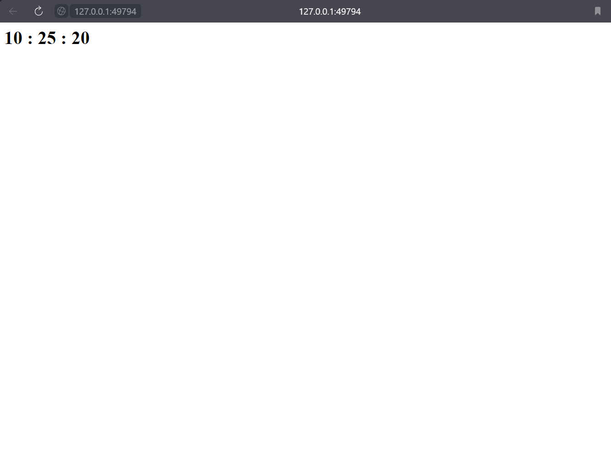

# Without configuration files
## `kubectl get pods`
```
NAME                          READY   STATUS    RESTARTS   AGE
hello-node-7f48bfb94f-4rqp7   1/1     Running   0          99m
```
## `kubectl get svc`

```
NAME         TYPE           CLUSTER-IP       EXTERNAL-IP   PORT(S)          AGE
hello-node   LoadBalancer   10.103.246.178   <pending>     8080:32090/TCP   7m16s
kubernetes   ClusterIP      10.96.0.1        <none>        443/TCP          168m
```

# With deployment.yml and service.yml
## `kubectl get pods`
```
NAME                                         READY   STATUS    RESTARTS   AGE
moscow-time-app-deployment-fdb547d76-59284   1/1     Running   0          21m
moscow-time-app-deployment-fdb547d76-kmlg6   1/1     Running   0          21m
moscow-time-app-deployment-fdb547d76-tnbfv   1/1     Running   0          21m
```

## `kubectl get svc`
```
NAME                  TYPE           CLUSTER-IP     EXTERNAL-IP   PORT(S)          AGE
kubernetes            ClusterIP      10.96.0.1      <none>        443/TCP          3h28m
moscow-time-service   LoadBalancer   10.103.23.20   <pending>     5000:30074/TCP   3m5s
```

## `minikube service --all`
```
|-----------|------------|-------------|--------------|
| NAMESPACE |    NAME    | TARGET PORT |     URL      |
|-----------|------------|-------------|--------------|
| default   | kubernetes |             | No node port |
|-----------|------------|-------------|--------------|
😿  service default/kubernetes has no node port
|-----------|---------------------|-------------|---------------------------|
| NAMESPACE |        NAME         | TARGET PORT |            URL            |
|-----------|---------------------|-------------|---------------------------|
| default   | moscow-time-service |        5000 | http://192.168.49.2:30074 |
|-----------|---------------------|-------------|---------------------------|
🏃  Starting tunnel for service kubernetes.
🏃  Starting tunnel for service moscow-time-service.
|-----------|---------------------|-------------|------------------------|
| NAMESPACE |        NAME         | TARGET PORT |          URL           |
|-----------|---------------------|-------------|------------------------|
| default   | kubernetes          |             | http://127.0.0.1:49792 |
| default   | moscow-time-service |             | http://127.0.0.1:49794 |
|-----------|---------------------|-------------|------------------------|
🎉  Opening service default/kubernetes in default browser...
🎉  Opening service default/moscow-time-service in default browser...
❗  Because you are using a Docker driver on windows, the terminal needs to be open to run it.
```

## Screenshot from browser
