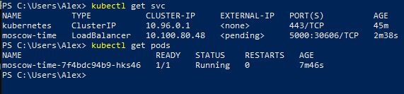
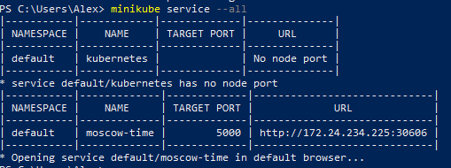
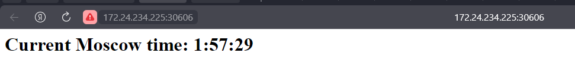
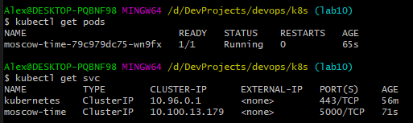
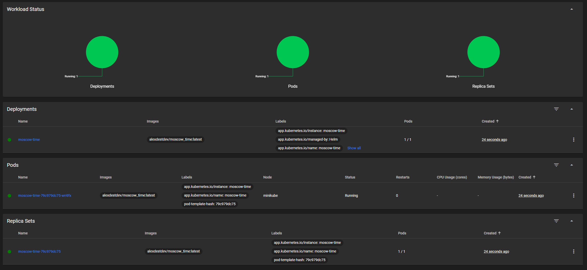
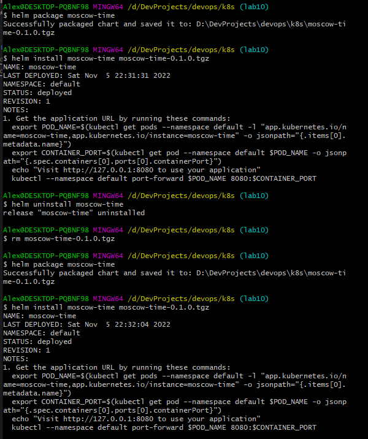

# Kubernets
## Result of commands after deploying
### `kuberctl get pods` and `kuberctl get svc`

### `minikube service --all`
 
### IP of service in browser

## Bonus theory part
- Ingress \
It is route data from HTTP and HTTPS external sources to internal services in cluster
- Ingress controller \
It is used by Ingress resource for running. Also it is not start with cluster, we need to start it by hand
- StatefulSet
It is object for managing stateful applications - manage their storages, guarantees that Pods of cluster will be unique
- DaemonSet \
It created a copy of some defined Pod on all defined Nodes in cluster
- PersistentVolumes \
This resources needs for managing storages in clusters.

# Helm
## pods and svc results

## Bonus task
- Library chart \ This type of chart was created for possibility to share snippets of chart code for different charts and not repeating it
- Umbrella chart \ This type of chart for unite of charts from different parts of elements which should be placed for some reason in one chart

