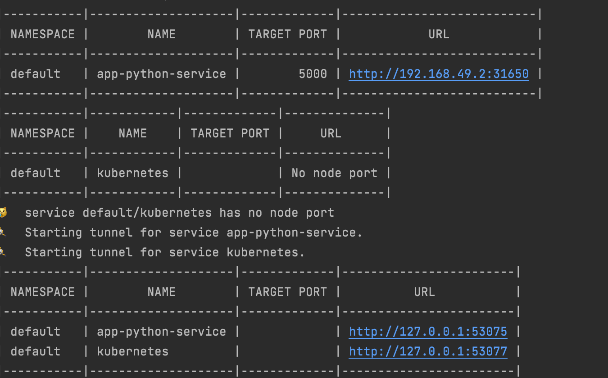
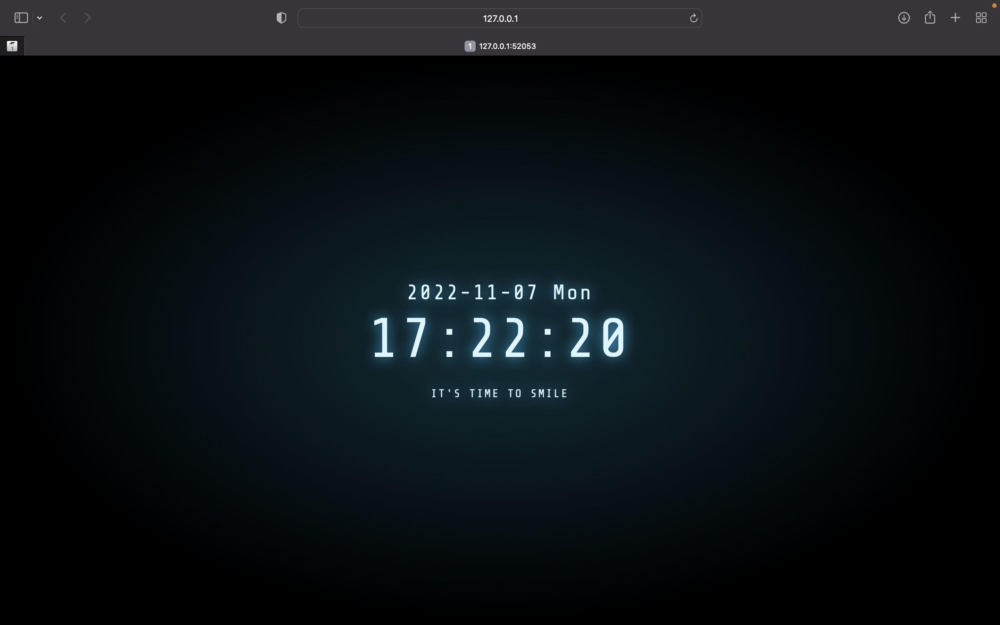

## Result of kubectl get pods,svc:
___
```
$ kubectl expose deployment app-python--type=LoadBalancer --port=8080
service/app-python exposed
$ kubectl get pods, svc
NAME                                READY   STATUS      RESTARTS    AGE
pod/app-python-5c74b64f85-vnr9r     1/1     Running     0           112s
pod/hello-node-87cd7d8f5-8nbvv      1/1     Running     0           9m

NAME                  TYPE           CLUSTER-IP       EXTERNAL-IP    PORT(S)           AGE
service/app-python    LoadBalancer   10.96.10.153     <pending>      8080:31267/TCP    6s
service/hello_node    LoadBalancer   10.103.226.223   <pending>      8080:31898/TCP    9m
service/kubernetes    ClusterIP      10.96.0.1        <none>         443/TCP           11m
```

## Result of minikube service --all:
___



## Browser:
