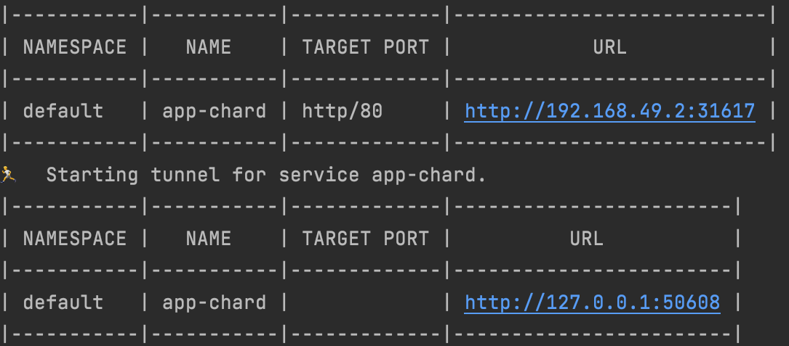

## Result of kubectl get pods,svc:
___
```
NAME                                READY   STATUS      RESTARTS    AGE
pod/app-python-5c74b64f85-vnr9r     1/1     Running     0           112s
pod/hello-node-87cd7d8f5-8nbvv      1/1     Running     0           9m

NAME                  TYPE           CLUSTER-IP       EXTERNAL-IP    PORT(S)           AGE
service/app-python    LoadBalancer   10.96.10.153     <pending>      8080:31267/TCP    6s
service/hello_node    LoadBalancer   10.103.226.223   <pending>      8080:31898/TCP    9m
service/kubernetes    ClusterIP      10.96.0.1        <none>         443/TCP           11m
```

## Result of minikube service --all:
___


## Browser:


## Result of kubectl get pods,svc in lab10:
___
```
NAME                                READY   STATUS      RESTARTS    AGE
pod/app-chard-755bf7fc58-54d42      1/1     Running     0           5m17s

NAME                  TYPE           CLUSTER-IP       EXTERNAL-IP    PORT(S)           AGE
service/app-chard     LoadBalancer   10.101.154.214   <pending>      80:31267/TCP      7m4s
service/kubernetes    ClusterIP      10.96.0.1        <none>         443/TCP           8m5s
```

## Result of minikube service app-chard:
___
