# Kubernetes

## Lab 10

I edited the template for [deployment.yaml](app-python-chart/templates/deployment.yaml) to include env variables and a value for `containerPort` from the `Values` file.

I checked the rendered configs.

```sh
helm install --debug --dry-run app-python-chart ./app-python-chart
```

After fixing the errors, I installed my chart.

```sh
helm install app-python-chart ./app-python-chart
```

I installed and checked my app in a `minikube` dashboard.

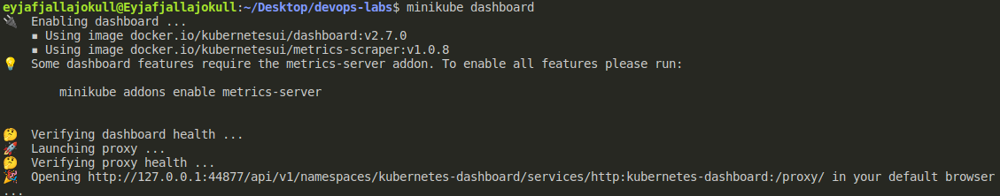
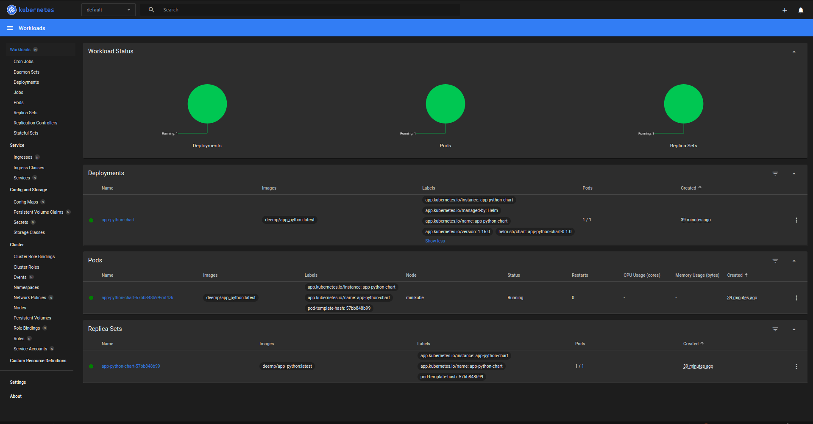

I changed the type of my service to `NodePort` and upgrdaded the chart.

```sh
helm upgrade app-python-chart ./app-python-chart
```

After that, I checked my service via `minikube`.

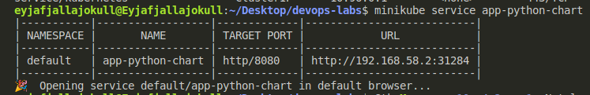

And I ran `kubectl get pods,svc`.

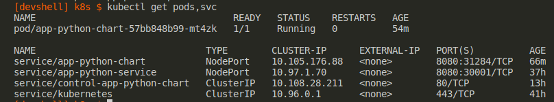

## Lab 9

### CLI deployment

I deployed my image and inspected it via `minikube`.

```sh
minikube start
kubectl create deployment app-purescript-node --image deemp/app_purescript:latest
kubectl set env deployment/app-purescript-node PORT=8001 HOST=0.0.0.0
kubectl expose deployment app-purescript-node --type=LoadBalancer --port=8001
minikube service app-purescript-node
```

I go the following data.

The `minicube` readings after the deployment was completed:

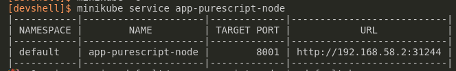

The corresponding screenshot from a browser:

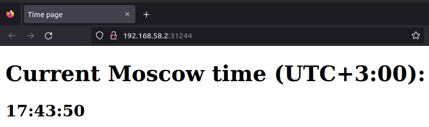

The output of `kubectl get pods,svc`

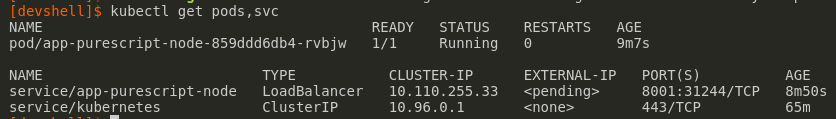

Finally, I deleted the deployment and the service

```sh
kubectl delete deployment app-purescript-node
kubectl delete service app-purescript-node
```

### Deployment from configs

I made config files in [app_python](./app_python) for `app_python` and started a cluster.

```sh
minikube start
kubectl apply -f app_python
minikube service --all
```

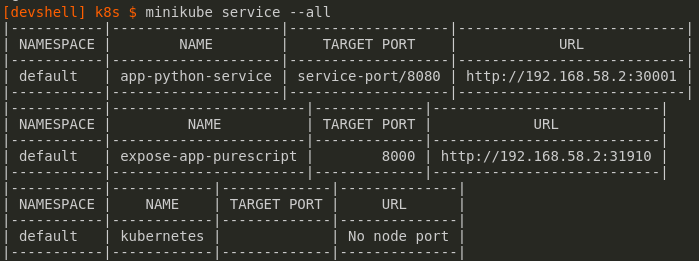

Next, I checked that the service is available in a browser.

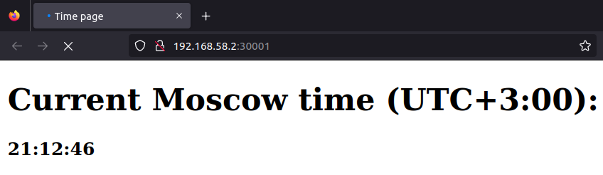

### Bonus

I adapted the configs for `app_purescript`, put them into [app_purescript](./app_purescript) and deployed.

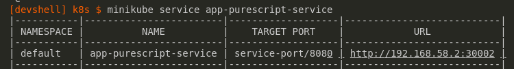

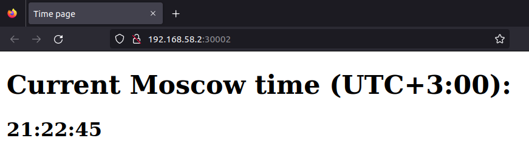

## References

- [Using Helm](https://helm.sh/docs/intro/using_helm/)
- `port`, `targetPort`, `nodePort` - [src](https://www.bmc.com/blogs/kubernetes-port-targetport-nodeport/)
  - `Port` exposes the Kubernetes service on the specified port within the cluster. Other pods within the cluster can communicate with this server on the specified port.
  - `targetPort` is the port on which the service will send requests to, that your pod will be listening on. Your application in the container will need to be listening on this port also.
  - `NodePort` exposes a service externally to the cluster by means of the target nodes IP address and the NodePort. NodePort is the default setting if the port field is not specified.
