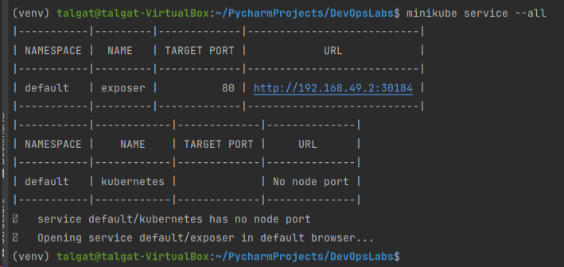

Run the following commands:

```shell
minikube start
```

And then, 

```shell
minikube dashboard --url
```

```shell
 kubectl create deployment devopslabs --image=tbektleuov/devopslabs:lab7
```

Output:

```shell
deployment.apps/devopslabs created
```

Run:
```shell
kubectl expose deployment devopslabs --type=LoadBalancer --port=8000
```

Output:
```shell
service/devopslabs exposed
```

Run:
```shell
kubectl get pods,svc
```

Output:


Run:
```shell
minikube service --all
```

Output:




To simplify the above command, create service.yml and deployment.yml, run:

```shell
 kubectl apply -f k8s/deployment.yml
```

And

```shell
kubectl apply -f k8s/service.yml
```

You will see that deployment.apps/devops-labs created and service/exposer created

That is it.
