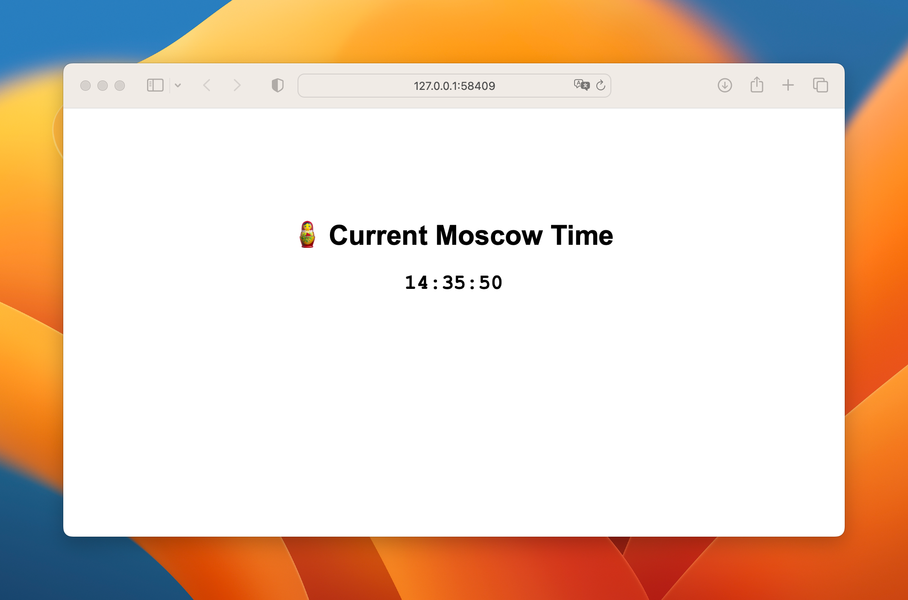
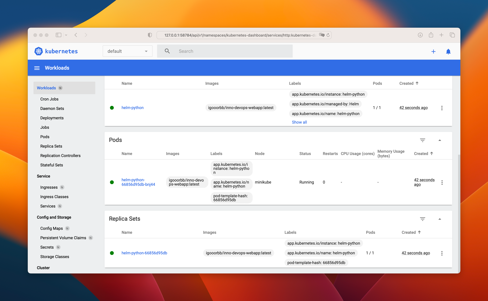

# Kubernetes

## Manual deployment

After manually creating deployment and service, the output of the `kubectl get pods,svc` is as follows:

```plain
NAME                              READY   STATUS    RESTARTS   AGE
pod/app-python-6f456b58c4-tkf4j   1/1     Running   0          3m50s

NAME                 TYPE           CLUSTER-IP     EXTERNAL-IP   PORT(S)          AGE
service/app-python   LoadBalancer   10.96.28.193   <pending>     5000:30157/TCP   89s
service/kubernetes   ClusterIP      10.96.0.1      <none>        443/TCP          25m
```

## Deployment with Configuration Files

After applying the configuration files, the output of the `kubectl get pods,svc` is as follows:

```plain
NAME                                         READY   STATUS    RESTARTS   AGE
pod/app-python-deployment-84bb5fdcfb-cfg4x   1/1     Running   0          92s
pod/app-python-deployment-84bb5fdcfb-thcrn   1/1     Running   0          92s
pod/app-python-deployment-84bb5fdcfb-xk6f8   1/1     Running   0          92s

NAME                         TYPE           CLUSTER-IP       EXTERNAL-IP   PORT(S)          AGE
service/app-python-service   LoadBalancer   10.111.144.172   <pending>     5000:31450/TCP   88s
service/kubernetes           ClusterIP      10.96.0.1        <none>        443/TCP          43m
```

And here is the output of the `minikube service --all` command:

```plain
|-----------|--------------------|-------------|---------------------------|
| NAMESPACE |        NAME        | TARGET PORT |            URL            |
|-----------|--------------------|-------------|---------------------------|
| default   | app-python-service |        5000 | http://192.168.49.2:31450 |
|-----------|--------------------|-------------|---------------------------|
|-----------|------------|-------------|--------------|
| NAMESPACE |    NAME    | TARGET PORT |     URL      |
|-----------|------------|-------------|--------------|
| default   | kubernetes |             | No node port |
|-----------|------------|-------------|--------------|
😿  service default/kubernetes has no node port
🏃  Starting tunnel for service app-python-service.
🏃  Starting tunnel for service kubernetes.
|-----------|--------------------|-------------|------------------------|
| NAMESPACE |        NAME        | TARGET PORT |          URL           |
|-----------|--------------------|-------------|------------------------|
| default   | app-python-service |             | http://127.0.0.1:58409 |
| default   | kubernetes         |             | http://127.0.0.1:58411 |
|-----------|--------------------|-------------|------------------------|
🎉  Opening service default/app-python-service in default browser...
🎉  Opening service default/kubernetes in default browser...
```

As you can see in the screenshot, the address matches the one from the output of the command above:



## Helm

The `helm install app-python ./app-python-0.1.0.tgz` command outputs the following result:

```plain
NAME: helm-python
LAST DEPLOYED: Sun Nov  6 15:42:34 2022
NAMESPACE: default
STATUS: deployed
REVISION: 1
NOTES:
1. Get the application URL by running these commands:
     NOTE: It may take a few minutes for the LoadBalancer IP to be available.
           You can watch the status of by running 'kubectl get --namespace default svc -w helm-python'
  export SERVICE_IP=$(kubectl get svc --namespace default helm-python --template "{{ range (index .status.loadBalancer.ingress 0) }}{{.}}{{ end }}")
  echo http://$SERVICE_IP:80
```

After installing the package, the dashboard looks like this:



And here is the output of the `minikube service helm-python` command:

```plain
|-----------|-------------|-------------|---------------------------|
| NAMESPACE |    NAME     | TARGET PORT |            URL            |
|-----------|-------------|-------------|---------------------------|
| default   | helm-python | http/80     | http://192.168.49.2:30848 |
|-----------|-------------|-------------|---------------------------|
🏃  Starting tunnel for service helm-python.
|-----------|-------------|-------------|------------------------|
| NAMESPACE |    NAME     | TARGET PORT |          URL           |
|-----------|-------------|-------------|------------------------|
| default   | helm-python |             | http://127.0.0.1:58880 |
|-----------|-------------|-------------|------------------------|
🎉  Opening service default/helm-python in default browser...
❗  Because you are using a Docker driver on darwin, the terminal needs to be open to run it.
```

The output of the `kubectl get pods,svc` is as follows:

```plain
NAME                               READY   STATUS    RESTARTS   AGE
pod/helm-python-66856d95db-bnj44   1/1     Running   0          111s

NAME                  TYPE           CLUSTER-IP      EXTERNAL-IP   PORT(S)        AGE
service/helm-python   LoadBalancer   10.99.196.174   <pending>     80:30848/TCP   111s
service/kubernetes    ClusterIP      10.96.0.1       <none>        443/TCP        8m45s
```
