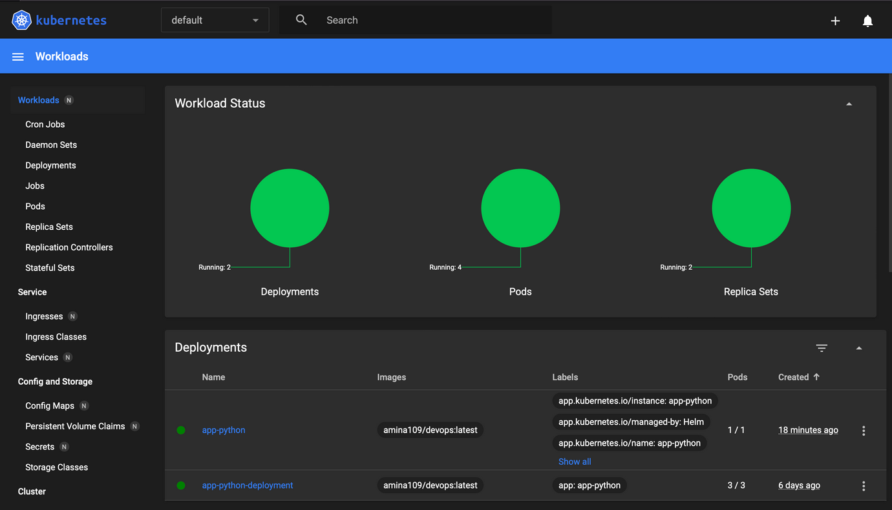
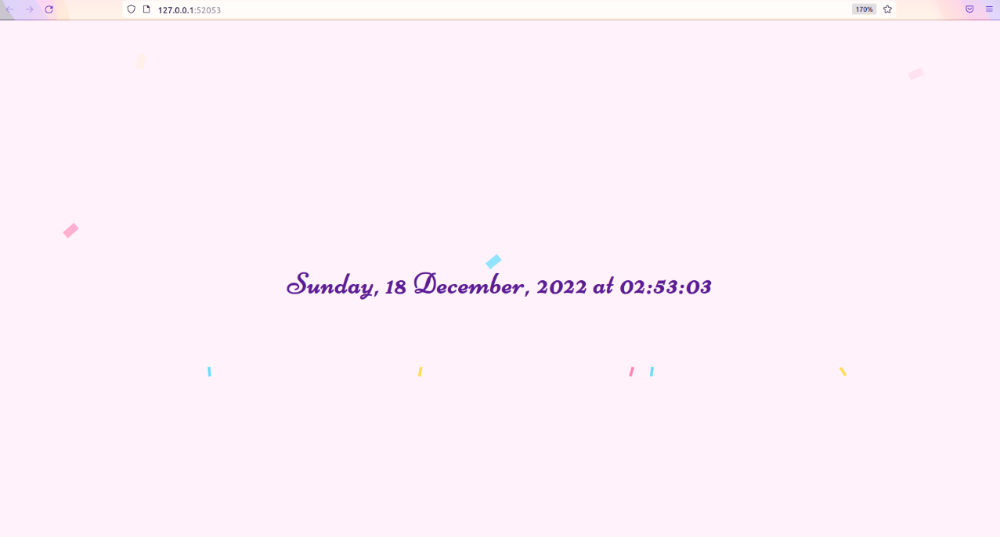

# Lab 9

## k8s

`Kubernetes`. Setup local development environment and prepare a
few manifests for your application.


1. I have installed `kubectl` according to [this tutorial](https://kubernetes.io/docs/tasks/tools/):

    

1. The next step was the installation of the minicube according to [the following manual](https://kubernetes.io/ru/docs/tasks/tools/install-minikube/).

1. I deployed my application in the `minikube` with the use of the `kubectl create`:

    ```terminal
    kubectl create deployment app-python --image=ksev13/devops_forked:latest
    deployment.apps/app-python created
    ```
    And then I confirmed it:
    ```bash
    kubectl get deployment app-python
    NAME         READY   UP-TO-DATE   AVAILABLE   AGE
    app-python   1/1     1            1           49s
    ```

1. I made my application accessible from outside the `Kubernetes` virtual network.
    By following [this example](https://kubernetes.io/docs/tutorials/hello-minikube/#create-a-service), I exposed the Pod to the public internet using the kubectl expose command: 
    
    ```bash 
    kubectl expose deployment app-python --type=LoadBalancer --port=8000
    service/app-python exposed
    ```

1. The output of `kubectl get pods,svc` command:
    ```bash
    The output of kubectl get pods,svc command:

    NAME                             READY   STATUS    RESTARTS   AGE
    pod/app-python-84977b4d7-lm8dr   1/1     Running   0          11m

    NAME                 TYPE           CLUSTER-IP     EXTERNAL-IP   PORT(S)          AGE
    service/app-python   LoadBalancer   10.109.1.144   <pending>     8000:31261/TCP   8m8s
    service/kubernetes   ClusterIP      10.96.0.1      <none>        443/TCP          13m
    ```
1. It wasn't convenient way to manage an app. Therefore, I 1. I cleaned up by `minikube delete` command. 

1. I created a new `deployment.yml` file with the help of [this tutorial](https://kubernetes.io/docs/concepts/workloads/controllers/deployment/#creating-a-deployment) and a new `service.yml` file following [this one](https://kubernetes.io/docs/concepts/services-networking/service/#defining-a-service).

1. After that I created the Deployment by running the following commands:
    ```sh
    minikube start
    kubectl apply -f deployment.yml
    kubectl apply -f service.yml
    ```

1. The output of `kubectl get pods,svc` command:

    ```sh
    NAME                                         READY   STATUS    RESTARTS   AGE
    pod/app-python-deployment-575dcb886f-4mpb2   1/1     Running   0          32s
    pod/app-python-deployment-575dcb886f-qdbt7   1/1     Running   0          32s
    pod/app-python-deployment-575dcb886f-qgdrs   1/1     Running   0          32s

    NAME                         TYPE           CLUSTER-IP     EXTERNAL-IP   PORT(S)        AGE
    service/app-python-service   LoadBalancer   10.102.34.62   <pending>     80:30545/TCP   23s
    service/kubernetes           ClusterIP      10.96.0.1      <none>        443/TCP        55s
    ```

1.  The output of `minikube service --all` command:

    ```sh

    |-----------|--------------------|-------------|---------------------------|
    | NAMESPACE |        NAME        | TARGET PORT |            URL            |
    |-----------|--------------------|-------------|---------------------------|
    | default   | app-python-service |          80 | http://192.168.49.2:30545 |
    |-----------|--------------------|-------------|---------------------------|
    |-----------|------------|-------------|--------------|
    | NAMESPACE |    NAME    | TARGET PORT |     URL      |
    |-----------|------------|-------------|--------------|
    | default   | kubernetes |             | No node port |
    |-----------|------------|-------------|--------------|
    😿  service default/kubernetes has no node port
    🏃  Starting tunnel for service app-python-service.
    🏃  Starting tunnel for service kubernetes.
    |-----------|--------------------|-------------|------------------------|
    | NAMESPACE |        NAME        | TARGET PORT |          URL           |
    |-----------|--------------------|-------------|------------------------|
    | default   | app-python-service |             | http://127.0.0.1:54670 |
    | default   | kubernetes         |             | http://127.0.0.1:54671 |
    |-----------|--------------------|-------------|------------------------|
    🎉  Opening service default/app-python-service in default browser...
    🎉  Opening service default/kubernetes in default browser...
    ❗  Because you are using a Docker driver on darwin, the terminal needs to be open to run it.

1. Screenshot from a browser that shows the same ip as in the latter command:
    

## Bonus

### `Ingress, Ingress controller, StatefulSet, DaemonSet,  PersistentVolumes` in a nutshell:


**Ingress** is an API object, a set of rules within the cluster being created to describe the way how incoming connections can reach the services of one developer's application.

**Ingress controller** is a pod, an Kubernetes application due to which Ingress runs.

**DaemonSet** creates a guarantee that a certain sub will run on the specified nodes of the cluster.

**PersistentVolumes** is analogous to the Kubernetes' physical or virtual machines on which application containers are deployed and run.

# Lab 10

## Helm

1. I installed helm by following [this tutorial](https://helm.sh/docs/intro/install/):
    ```bash
    curl https://baltocdn.com/helm/signing.asc | gpg --dearmor | sudo tee /usr/share/keyrings/helm.gpg > /dev/null
    sudo apt-get install apt-transport-https --yes
    echo "deb [arch=$(dpkg --print-architecture) signed-by=/usr/share/keyrings/helm.gpg] https://baltocdn.com/helm/stable/debian/ all main" | sudo tee /etc/apt/sources.list.d/helm-stable-debian.list
    sudo apt-get update
    sudo apt-get install helm```

1. Inside the `k8s` folder I used `helm create` in order to create a template for the chart:
    ```sh
    cd k8s
    helm create app-python
    ```

1. To use my own application repository instead of the default repository provided, I replaced the default `repository name` and `tag` inside the `values.yaml` with my values.

1. Also, I changed `containerPort` in the `deployment.yml`.

1. After that, I packaged the chart up for distribution:
    `helm package app-python`

1. And that chart can now easily be installed by:
    `helm install app-python .//app-python-0.1.0.tgz`

1. The result:

    ```sh
    NAME: app-python
    LAST DEPLOYED: Sun Dec 18 02:43:31 2022
    NAMESPACE: default
    STATUS: deployed
    REVISION: 1
    NOTES:
    1. Get the application URL by running these commands:
        NOTE: It may take a few minutes for the LoadBalancer IP to be available.
            You can watch the status of by running 'kubectl get --namespace default svc -w app-python'
    export SERVICE_IP=$(kubectl get svc --namespace default app-python --template "{{ range (index .status.loadBalancer.ingress 0) }}{{.}}{{ end }}")
    echo http://$SERVICE_IP:80
    ```

1. Result of `minikube dashboard` command for troubleshooting:

    ```sh
    🤔  Verifying dashboard health ...
    🚀  Launching proxy ...
    🤔  Verifying proxy health ...
    🎉  Opening http://127.0.0.1:51708/api/v1/namespaces/kubernetes-dashboard/services/http:kubernetes-dashboard:/proxy/ in your default browser...
    ```

    

1. I checked this task with `minikube service app-python`:

    ```sh
    |-----------|------------|-------------|---------------------------|
    | NAMESPACE |    NAME    | TARGET PORT |            URL            |
    |-----------|------------|-------------|---------------------------|
    | default   | app-python | http/80     | http://192.168.49.2:30298 |
    |-----------|------------|-------------|---------------------------|
    🏃  Starting tunnel for service app-python.
    |-----------|------------|-------------|------------------------|
    | NAMESPACE |    NAME    | TARGET PORT |          URL           |
    |-----------|------------|-------------|------------------------|
    | default   | app-python |             | http://127.0.0.1:52053 |
    |-----------|------------|-------------|------------------------|
    🎉  Opening service default/app-python in default browser...
    ❗  Because you are using a Docker driver on darwin, the terminal needs to be open to run it.
    ```

    

1. The output of `kubectl get pods,svc` command:

    ```sh
    NAME                                         READY   STATUS    RESTARTS        AGE
    pod/app-python-849ff67fc8-mpt45              1/1     Running   1 (4m11s ago)   10m
    pod/app-python-deployment-575dcb886f-4mpb2   1/1     Running   1 (4m10s ago)   20h
    pod/app-python-deployment-575dcb886f-qdbt7   1/1     Running   1 (4m10s ago)   20h
    pod/app-python-deployment-575dcb886f-qgdrs   1/1     Running   1 (4m10s ago)   20h
    NAME                         TYPE           CLUSTER-IP      EXTERNAL-IP   PORT(S)        AGE
    service/app-python           LoadBalancer   10.107.53.172   <pending>     80:30298/TCP   10m
    service/app-python-service   LoadBalancer   10.102.34.62    <pending>     80:30545/TCP   20h
    service/kubernetes           ClusterIP      10.96.0.1       <none>        443/TCP        20h
    ```

## Bonus

### `Library Charts` and `Umbrella charts` in a nutshell.


`Library Charts` are ready-made charts templates (files inside some directory) with primitives and definitions that can be used in the code, avoiding repetitive code fragments. This happens since they can be used by Helm templates in other charts.

`Umbrella charts` are used to create charts of charts; it is a powerful technique for establishing several components as one. 
