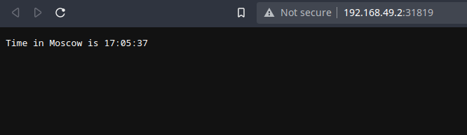
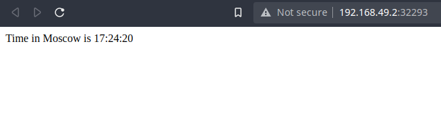
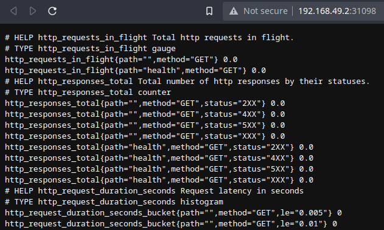
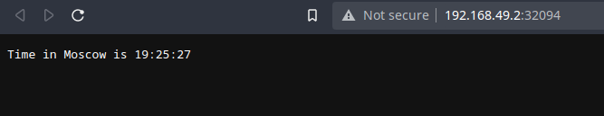
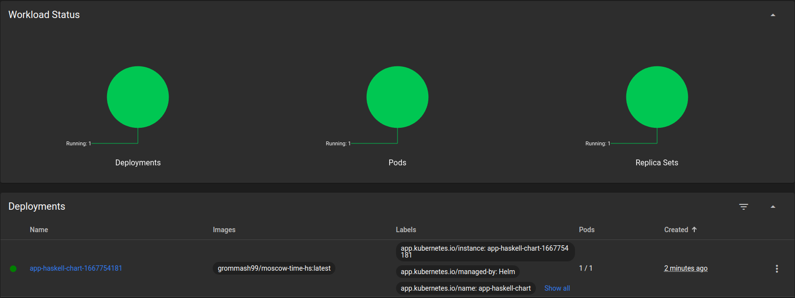
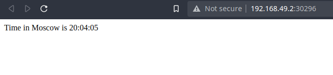

# k8s

## Manual deploy of `app_python`

```bash
$ kubectl create deployment app-python --image=grommash99/moscow-time-py:latest
deployment.apps/app-python created
```

```bash
$ kubectl expose deployment app-python --type=LoadBalancer --port=8080
service/app-python exposed
```

```bash
$ kubectl get pods,svc
NAME                              READY   STATUS    RESTARTS   AGE
pod/app-python-7b8f59b4b9-k728h   1/1     Running   0          5m18s

NAME                 TYPE           CLUSTER-IP     EXTERNAL-IP   PORT(S)          AGE
service/app-python   LoadBalancer   10.96.25.113   <pending>     8080:32070/TCP   3m12s
service/kubernetes   ClusterIP      10.96.0.1      <none>        443/TCP          2d22h
```

```bash
$ minikube service app-python
|-----------|------------|-------------|---------------------------|
| NAMESPACE |    NAME    | TARGET PORT |            URL            |
|-----------|------------|-------------|---------------------------|
| default   | app-python |        8080 | http://192.168.49.2:32070 |
|-----------|------------|-------------|---------------------------|
🎉  Opening service default/app-python in default browser...
```

```bash
$ kubectl delete deployment,svc app-python
deployment.apps "app-python" deleted
service "app-python" deleted
```

## Deploy of `app_python` using config files

```bash
$ kubectl apply -f app_python
deployment.apps/app-python-deployment created
service/app-python-service created
```

```bash
$ kubectl get pods,svc
NAME                                         READY   STATUS    RESTARTS   AGE
pod/app-python-deployment-7f5b5c9588-nkbqt   1/1     Running   0          54s
pod/app-python-deployment-7f5b5c9588-qks7z   1/1     Running   0          54s
pod/app-python-deployment-7f5b5c9588-w62b8   1/1     Running   0          54s

NAME                         TYPE           CLUSTER-IP      EXTERNAL-IP   PORT(S)          AGE
service/app-python-service   LoadBalancer   10.111.136.78   <pending>     8080:31819/TCP   54s
service/kubernetes           ClusterIP      10.96.0.1       <none>        443/TCP          2d22h
```

```bash
$ minikube service --all
|-----------|--------------------|-------------|---------------------------|
| NAMESPACE |        NAME        | TARGET PORT |            URL            |
|-----------|--------------------|-------------|---------------------------|
| default   | app-python-service |        8080 | http://192.168.49.2:31819 |
|-----------|--------------------|-------------|---------------------------|
|-----------|------------|-------------|--------------|
| NAMESPACE |    NAME    | TARGET PORT |     URL      |
|-----------|------------|-------------|--------------|
| default   | kubernetes |             | No node port |
|-----------|------------|-------------|--------------|
😿  service default/kubernetes has no node port
🎉  Opening service default/app-python-service in default browser...
```



## Deploy of `app_haskell` using config files

```bash
$ kubectl apply -f app_haskell
deployment.apps/app-haskell-deployment created
service/app-haskell-service created
```

```bash
$ kubectl get pods,svc
NAME                                          READY   STATUS    RESTARTS   AGE
pod/app-haskell-deployment-77789959bf-8zkgv   1/1     Running   0          38s
pod/app-haskell-deployment-77789959bf-kxxxg   1/1     Running   0          38s
pod/app-haskell-deployment-77789959bf-lqkq2   1/1     Running   0          38s

NAME                          TYPE           CLUSTER-IP      EXTERNAL-IP   PORT(S)                         AGE
service/app-haskell-service   LoadBalancer   10.106.36.230   <pending>     8080:32293/TCP,8081:31098/TCP   38s
service/kubernetes            ClusterIP      10.96.0.1       <none>        443/TCP                         2d23h
```

```bash
$ minikube service --all
|-----------|---------------------|----------------------|---------------------------|
| NAMESPACE |        NAME         |     TARGET PORT      |            URL            |
|-----------|---------------------|----------------------|---------------------------|
| default   | app-haskell-service | web-app/8080         | http://192.168.49.2:32293 |
|           |                     | web-app-metrics/8081 | http://192.168.49.2:31098 |
|-----------|---------------------|----------------------|---------------------------|
|-----------|------------|-------------|--------------|
| NAMESPACE |    NAME    | TARGET PORT |     URL      |
|-----------|------------|-------------|--------------|
| default   | kubernetes |             | No node port |
|-----------|------------|-------------|--------------|
😿  service default/kubernetes has no node port
[default app-haskell-service web-app/8080
web-app-metrics/8081 http://192.168.49.2:32293
http://192.168.49.2:31098]
```




## Reading

### Ingress

Manages external access to services running in cluster.

### Ingress controller

Controls the ingress resources.

### StatefulSet

Manages stateful applications.
Provide ordering and uniqueness guarantees for Pods.

### DaemonSet

DaemonSet makes sure that all or some specified Nodes have a copy of a Pod. Usually used for logging and monitoring.

### PersistentVolumes

PersistentVolumes are a way for developers to "claim" durable storage abstracted from realization and place of this storage.

## Helm

All commands run in `k8s` directory.

### Deploying `app_python`

```bash
$ helm install ./app-python-chart/ --generate-name
NAME: app-python-chart-1667751845
LAST DEPLOYED: Sun Nov  6 19:24:05 2022
NAMESPACE: default
STATUS: deployed
REVISION: 1
NOTES:
1. Get the application URL by running these commands:
     NOTE: It may take a few minutes for the LoadBalancer IP to be available.
           You can watch the status of by running 'kubectl get --namespace default svc -w app-python-chart-1667751845'
  export SERVICE_IP=$(kubectl get svc --namespace default app-python-chart-1667751845 --template "{{ range (index .status.loadBalancer.ingress 0) }}{{.}}{{ end }}")
  echo http://$SERVICE_IP:80
```


```bash
$ minikube service app-python-chart-1667751845
|-----------|-----------------------------|-------------|---------------------------|
| NAMESPACE |            NAME             | TARGET PORT |            URL            |
|-----------|-----------------------------|-------------|---------------------------|
| default   | app-python-chart-1667751845 | http/80     | <http://192.168.49.2:32094> |
|-----------|-----------------------------|-------------|---------------------------|
🎉  Opening service default/app-python-chart-1667751845 in default browser...
```



```bash
$ kubectl get pods,svc
NAME                                               READY   STATUS    RESTARTS   AGE
pod/app-python-chart-1667751845-5f964949f5-k9kmv   1/1     Running   0          3m54s

NAME                                  TYPE           CLUSTER-IP    EXTERNAL-IP   PORT(S)        AGE
service/app-python-chart-1667751845   LoadBalancer   10.96.8.213   <pending>     80:32094/TCP   3m54s
service/kubernetes                    ClusterIP      10.96.0.1     <none>        443/TCP        10d
```

### Deploying `app_haskell`

```bash
$ helm install ./app-haskell-chart/ --generate-name
NAME: app-haskell-chart-1667754181
LAST DEPLOYED: Sun Nov  6 20:03:01 2022
NAMESPACE: default
STATUS: deployed
REVISION: 1
NOTES:
1. Get the application URL by running these commands:
     NOTE: It may take a few minutes for the LoadBalancer IP to be available.
           You can watch the status of by running 'kubectl get --namespace default svc -w app-haskell-chart-1667754181'
  export SERVICE_IP=$(kubectl get svc --namespace default app-haskell-chart-1667754181 --template "{{ range (index .status.loadBalancer.ingress 0) }}{{.}}{{ end }}")
  echo http://$SERVICE_IP:80
```



```bash
$ minikube service app-haskell-chart-1667754181
|-----------|------------------------------|-------------|---------------------------|
| NAMESPACE |             NAME             | TARGET PORT |            URL            |
|-----------|------------------------------|-------------|---------------------------|
| default   | app-haskell-chart-1667754181 | http/80     | http://192.168.49.2:30296 |
|           |                              | metrics/81  | http://192.168.49.2:30628 |
|-----------|------------------------------|-------------|---------------------------|
[default app-haskell-chart-1667754181 http/80
metrics/81 http://192.168.49.2:30296
http://192.168.49.2:30628]
```




```bash
$ kubectl get pods,svc
NAME                                                READY   STATUS    RESTARTS   AGE
pod/app-haskell-chart-1667754181-6b595dbc67-c59qc   1/1     Running   0          70s

NAME                                   TYPE           CLUSTER-IP      EXTERNAL-IP   PORT(S)                     AGE
service/app-haskell-chart-1667754181   LoadBalancer   10.98.188.177   <pending>     80:30296/TCP,81:30628/TCP   70s
service/kubernetes                     ClusterIP      10.96.0.1       <none>        443/TCP                     10d
```

### Reading

### Library Charts

Library charts are charts, which can be reused by other charts.
They like to libraries in programming languages.

### Umbrella charts

Umbrella charts provide grouping possibility, so that many charts could be
grouped into one and deployed as one chart.
