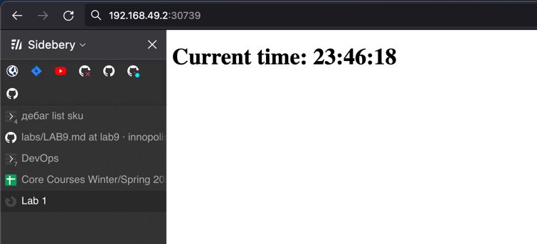

# k8s

## manual deploy 
```plain
$ minikube start 
😄  minikube v1.29.0 on Darwin 13.2 (arm64)
🆕  Kubernetes 1.26.1 is now available. If you would like to upgrade, specify: --kubernetes-version=v1.26.1
✨  Using the docker driver based on existing profile
👍  Starting control plane node minikube in cluster minikube
🚜  Pulling base image ...
🤷  docker "minikube" container is missing, will recreate.
🔥  Creating docker container (CPUs=2, Memory=4000MB) ...
🐳  Preparing Kubernetes v1.24.1 on Docker 20.10.17 ...
🔗  Configuring bridge CNI (Container Networking Interface) ...
🔎  Verifying Kubernetes components...
    ▪ Using image gcr.io/k8s-minikube/storage-provisioner:v5
🌟  Enabled addons: storage-provisioner, default-storageclass

❗  /opt/homebrew/bin/kubectl is version 1.26.1, which may have incompatibilities with Kubernetes 1.24.1.
    ▪ Want kubectl v1.24.1? Try 'minikube kubectl -- get pods -A'
🏄  Done! kubectl is now configured to use "minikube" cluster and "default" namespace by default

$ # i hate this, i had my working cluster set by default

$  kubectl create deployment app-python-node --image semior/innodevops    
deployment.apps/app-python-node created

$ kubectl expose deployment app-python-node --type=LoadBalancer --port=5000 
service/app-python-node exposed

$ minikube service app-python-node 
|-----------|-----------------|-------------|---------------------------|
| NAMESPACE |      NAME       | TARGET PORT |            URL            |
|-----------|-----------------|-------------|---------------------------|
| default   | app-python-node |        5000 | http://192.168.49.2:30739 |
|-----------|-----------------|-------------|---------------------------|
🏃  Starting tunnel for service app-python-node.
|-----------|-----------------|-------------|------------------------|
| NAMESPACE |      NAME       | TARGET PORT |          URL           |
|-----------|-----------------|-------------|------------------------|
| default   | app-python-node |             | http://127.0.0.1:58971 |
|-----------|-----------------|-------------|------------------------|
🎉  Opening service default/app-python-node in default browser...
❗  Because you are using a Docker driver on darwin, the terminal needs to be open to run it.

$ # other terminal
$ kubectl get pods 
NAME                              READY   STATUS    RESTARTS   AGE
app-python-node-f7cff858c-pm2xk   1/1     Running   0          4m34s
```

## applying manifests

```plain
$ # deleting existing deployments
$ kubectl delete deployments app-python-node 
deployment.apps "app-python-node" deleted

 $ kubectl apply -f k8s/app_python/deployment.yml 
deployment.apps/app-python-deployment created
 $ kubectl apply -f k8s/app_python/service.yml 
service/app-python-service created

 $ minikube service --all           
|-----------|-----------------|-------------|---------------------------|
| NAMESPACE |      NAME       | TARGET PORT |            URL            |
|-----------|-----------------|-------------|---------------------------|
| default   | app-python-node |        5000 | http://192.168.49.2:30739 |
|-----------|-----------------|-------------|---------------------------|
|-----------|--------------------|-------------|---------------------------|
| NAMESPACE |        NAME        | TARGET PORT |            URL            |
|-----------|--------------------|-------------|---------------------------|
| default   | app-python-service |        8000 | http://192.168.49.2:31434 |
|-----------|--------------------|-------------|---------------------------|
|-----------|------------|-------------|--------------|
| NAMESPACE |    NAME    | TARGET PORT |     URL      |
|-----------|------------|-------------|--------------|
| default   | kubernetes |             | No node port |
|-----------|------------|-------------|--------------|
😿  service default/kubernetes has no node port
🏃  Starting tunnel for service app-python-node.
🏃  Starting tunnel for service app-python-service.
🏃  Starting tunnel for service kubernetes.
|-----------|--------------------|-------------|------------------------|
| NAMESPACE |        NAME        | TARGET PORT |          URL           |
|-----------|--------------------|-------------|------------------------|
| default   | app-python-node    |             | http://127.0.0.1:60524 |
| default   | app-python-service |             | http://127.0.0.1:60526 |
| default   | kubernetes         |             | http://127.0.0.1:60528 |
|-----------|--------------------|-------------|------------------------|
🎉  Opening service default/app-python-node in default browser...
🎉  Opening service default/app-python-service in default browser...
🎉  Opening service default/kubernetes in default browser...
❗  Because you are using a Docker driver on darwin, the terminal needs to be open to run it.
```



## answers
- ingress: k8s resource for routing traffic from external sources to internal services based on rules you define.
- ingress controller: cluster-level component that implements and enforces the rules defined in your ingress resources.
- stateful set: k8s resource for managing stateful applications that require unique hostnames and storage.
- daemon set: k8s resource for ensuring that a specific pod is running on every node in the cluster.
- persistent volumes: k8s resource for using network-attached storage that can persist beyond the lifecycle of individual pods.


# helm
```plain
$ pwd
<hidden>/innopolis-devops-labs/k8s/helm/app-python

$ helm install app-python . 
NAME: app-python
LAST DEPLOYED: Sun Feb 19 00:10:32 2023
NAMESPACE: default
STATUS: deployed
REVISION: 1
NOTES:
1. Get the application URL by running these commands:
     NOTE: It may take a few minutes for the LoadBalancer IP to be available.
           You can watch the status of by running 'kubectl get --namespace default svc -w app-python'
  export SERVICE_IP=$(kubectl get svc --namespace default app-python --template "{{ range (index .status.loadBalancer.ingress 0) }}{{.}}{{ end }}")
  echo http://$SERVICE_IP:80

$ kubectl get pods,svc 
NAME                              READY   STATUS    RESTARTS      AGE
pod/app-python-6b8687d4fd-8244l   1/1     Running   2 (26s ago)   2m27s

NAME                         TYPE           CLUSTER-IP      EXTERNAL-IP   PORT(S)          AGE
service/app-python           LoadBalancer   10.98.43.38     <pending>     80:32592/TCP     2m27s
service/app-python-node      LoadBalancer   10.107.42.4     <pending>     5000:30739/TCP   42m
service/app-python-service   LoadBalancer   10.107.37.154   <pending>     8000:31434/TCP   29m
service/kubernetes           ClusterIP      10.96.0.1       <none>        443/TCP          218d

$ minikube service --all 
|-----------|------------|-------------|---------------------------|
| NAMESPACE |    NAME    | TARGET PORT |            URL            |
|-----------|------------|-------------|---------------------------|
| default   | app-python | http/80     | http://192.168.49.2:32592 |
|-----------|------------|-------------|---------------------------|
|-----------|-----------------|-------------|---------------------------|
| NAMESPACE |      NAME       | TARGET PORT |            URL            |
|-----------|-----------------|-------------|---------------------------|
| default   | app-python-node |        5000 | http://192.168.49.2:30739 |
|-----------|-----------------|-------------|---------------------------|
|-----------|--------------------|-------------|---------------------------|
| NAMESPACE |        NAME        | TARGET PORT |            URL            |
|-----------|--------------------|-------------|---------------------------|
| default   | app-python-service |        8000 | http://192.168.49.2:31434 |
|-----------|--------------------|-------------|---------------------------|
|-----------|------------|-------------|--------------|
| NAMESPACE |    NAME    | TARGET PORT |     URL      |
|-----------|------------|-------------|--------------|
| default   | kubernetes |             | No node port |
|-----------|------------|-------------|--------------|
😿  service default/kubernetes has no node port
🏃  Starting tunnel for service app-python.
🏃  Starting tunnel for service app-python-node.
🏃  Starting tunnel for service app-python-service.
🏃  Starting tunnel for service kubernetes.
|-----------|--------------------|-------------|------------------------|
| NAMESPACE |        NAME        | TARGET PORT |          URL           |
|-----------|--------------------|-------------|------------------------|
| default   | app-python         |             | http://127.0.0.1:63309 |
| default   | app-python-node    |             | http://127.0.0.1:63311 |
| default   | app-python-service |             | http://127.0.0.1:63313 |
| default   | kubernetes         |             | http://127.0.0.1:63315 |
|-----------|--------------------|-------------|------------------------|
🎉  Opening service default/app-python in default browser...
🎉  Opening service default/app-python-node in default browser...
🎉  Opening service default/app-python-service in default browser...
🎉  Opening service default/kubernetes in default browser...
❗  Because you are using a Docker driver on darwin, the terminal needs to be open to run it.

```
