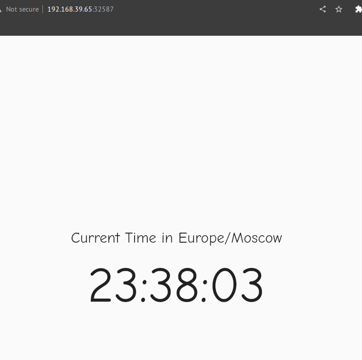
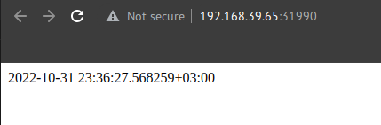
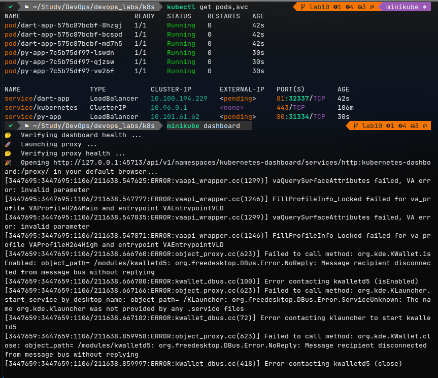

# K8s

## manual

```bash
$ kubectl get deployments                   
NAME   READY   UP-TO-DATE   AVAILABLE   AGE
py     1/1     1            1           2m13s

$ kubectl get services
NAME         TYPE           CLUSTER-IP     EXTERNAL-IP   PORT(S)          AGE
kubernetes   ClusterIP      10.96.0.1      <none>        443/TCP          7m56s
py           LoadBalancer   10.99.160.29   <pending>     5000:31590/TCP   27s

$ kubectl get pods               
NAME                  READY   STATUS    RESTARTS   AGE
py-658bb98896-2ggcp   1/1     Running   0          2m50s
```

## manifest with bonus

```bash
kubectl get pods,svc         
NAME                        READY   STATUS    RESTARTS   AGE
pod/dart-575c87bcbf-hmflj   1/1     Running   0          91s
pod/dart-575c87bcbf-xhh6c   1/1     Running   0          91s
pod/dart-575c87bcbf-xr8r6   1/1     Running   0          91s
pod/py-7c5b75df97-627m5     1/1     Running   0          26m
pod/py-7c5b75df97-wqdgz     1/1     Running   0          26m
pod/py-7c5b75df97-z8t7r     1/1     Running   0          26m

NAME                   TYPE           CLUSTER-IP      EXTERNAL-IP   PORT(S)        AGE
service/dart-service   LoadBalancer   10.107.225.56   <pending>     81:32587/TCP   91s
service/kubernetes     ClusterIP      10.96.0.1       <none>        443/TCP        26m
service/py-service     LoadBalancer   10.101.175.79   <pending>     80:31990/TCP   26m

minikube service --all     
|-----------|--------------|-------------|----------------------------|
| NAMESPACE |     NAME     | TARGET PORT |            URL             |
|-----------|--------------|-------------|----------------------------|
| default   | dart-service |          81 | http://192.168.39.65:32587 |
|-----------|--------------|-------------|----------------------------|
|-----------|------------|-------------|--------------|
| NAMESPACE |    NAME    | TARGET PORT |     URL      |
|-----------|------------|-------------|--------------|
| default   | kubernetes |             | No node port |
|-----------|------------|-------------|--------------|
😿  service default/kubernetes has no node port
|-----------|------------|-------------|----------------------------|
| NAMESPACE |    NAME    | TARGET PORT |            URL             |
|-----------|------------|-------------|----------------------------|
| default   | py-service |          80 | http://192.168.39.65:31990 |
|-----------|------------|-------------|----------------------------|
🎉  Opening service default/dart-service in default browser...
🎉  Opening service default/py-service in default browser...
```

## Screen shots

dart:


python:


## Helm

1. Build helm package:

    ```bash
    cd k8s
    helm package helm/package  
    ```

2. Run py app:

    ```bash
    helm install py-app app-0.1.0.tgz 
    ```

3. Run dart app:

    ```bash
    helm install dart-app app-0.1.0.tgz --values helm/dart_values.yml
    ```

4. Results

    ```bash
    kubectl get pods,svc 
    NAME                            READY   STATUS    RESTARTS   AGE
    pod/dart-app-575c87bcbf-8hzgj   1/1     Running   0          42s
    pod/dart-app-575c87bcbf-bcspd   1/1     Running   0          42s
    pod/dart-app-575c87bcbf-md7h5   1/1     Running   0          42s
    pod/py-app-7c5b75df97-lswdn     1/1     Running   0          30s
    pod/py-app-7c5b75df97-qjzsw     1/1     Running   0          30s
    pod/py-app-7c5b75df97-vw26f     1/1     Running   0          30s

    NAME                 TYPE           CLUSTER-IP       EXTERNAL-IP   PORT(S)        AGE
    service/dart-app     LoadBalancer   10.100.194.229   <pending>     81:32337/TCP   42s
    service/kubernetes   ClusterIP      10.96.0.1        <none>        443/TCP        106m
    service/py-app       LoadBalancer   10.101.61.62     <pending>     80:31334/TCP   30s
    
    minikube service --all
    |-----------|----------|-------------|-----------------------------|
    | NAMESPACE |   NAME   | TARGET PORT |             URL             |
    |-----------|----------|-------------|-----------------------------|
    | default   | dart-app |          81 | http://192.168.39.179:30357 |
    |-----------|----------|-------------|-----------------------------|
    |-----------|------------|-------------|--------------|
    | NAMESPACE |    NAME    | TARGET PORT |     URL      |
    |-----------|------------|-------------|--------------|
    | default   | kubernetes |             | No node port |
    |-----------|------------|-------------|--------------|
    😿  service default/kubernetes has no node port
    |-----------|--------|-------------|-----------------------------|
    | NAMESPACE |  NAME  | TARGET PORT |             URL             |https://github.com/innopolis-devops/labs/pull/585
    |-----------|--------|-------------|-----------------------------|
    | default   | py-app |          80 | http://192.168.39.179:30466 |
    |-----------|--------|-------------|-----------------------------|
    🎉  Opening service default/dart-app in default browser...
    🎉  Opening service default/py-app in default browser...
    ```

5. Note
    I could not provide `minikube dashboard` since I cannot troubleshoot it

    

    