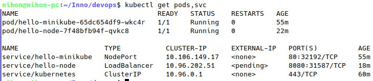
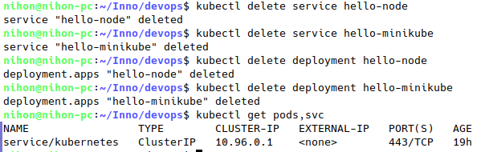
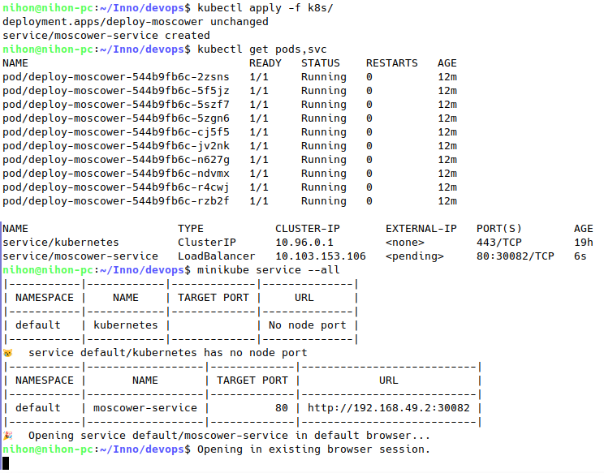
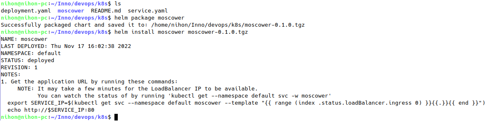
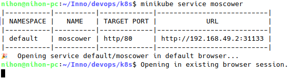
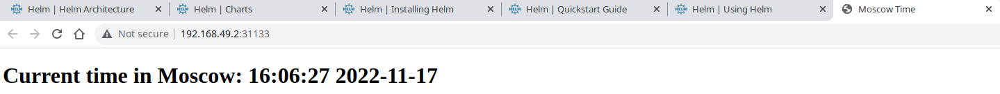
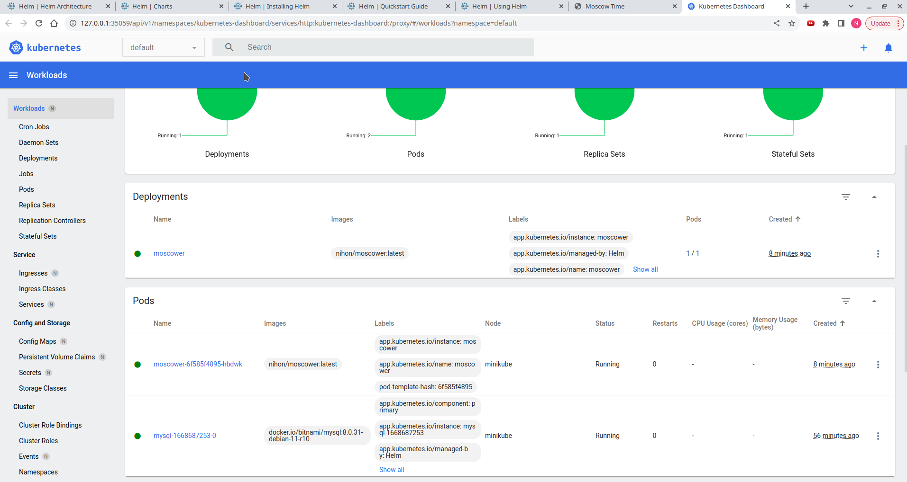
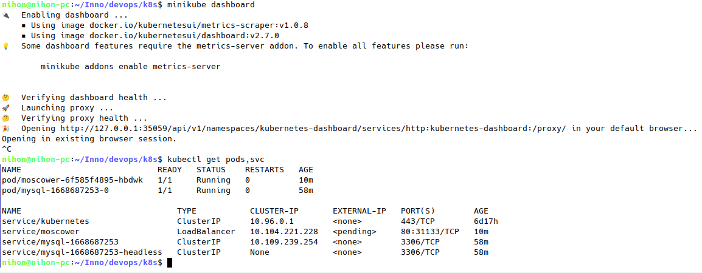

# Kubernetes
## **Manual**

### **after clean up**

## **Declarative**

# Lab 10

## Create and install chart

## Check service

## Library and Umbrella Charts

A **library chart** is a special type of chart used to store a number of utility functions to be used in other charts, thus increasing code reusability. Helm 3 introduced a *type* field in the Chart.yaml to officially differentiate between application and library charts. One nice feature of this is that Helm will make sure that no template is renderred in a library chart. Moreover, it is impossible to install a library chart - after all, it was designed to be *used* by other charts, it is not supposed to be installed itself.

An **umbrella chart**, on the other hand, is not a special kind of chart, but a piece of terminology. An umbrella chart is a chart which groups togather multiple uncoupled charts. For example, your application may consist of a number of different services, many of which may not interact with each other, and you create a top-level chart which combines all of these together. This top level chart is exactly called an umbrella chart.
