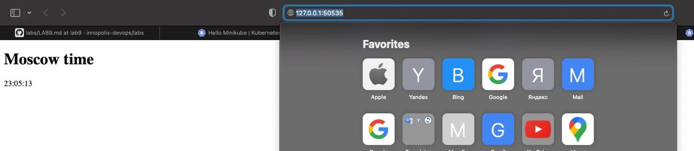
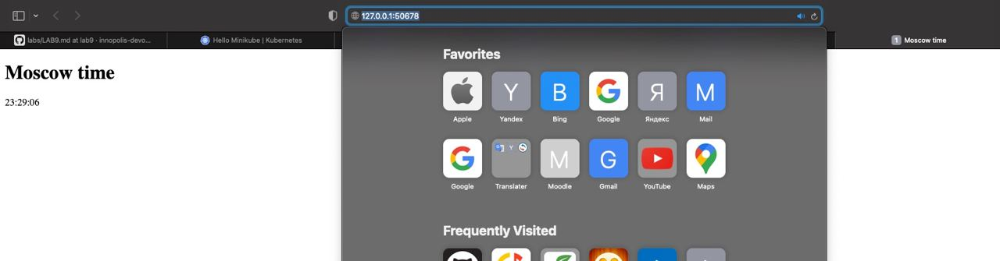
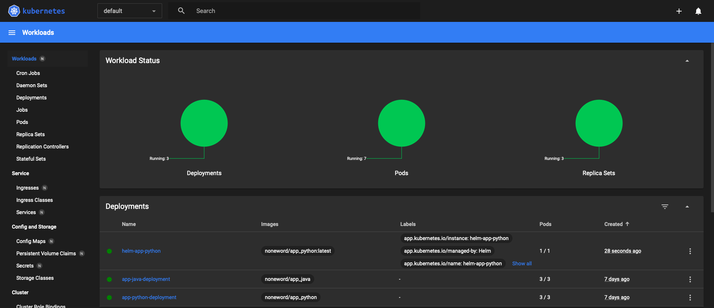

# k8s 

Grigorii Kostarev

### Output of `kubectl get pods,svc` (inconvenient way):
```
grishakostarev@Grishas-MacBook-Pro labs % kubectl get pods,svc
NAME                            READY   STATUS    RESTARTS   AGE
pod/app-python-8496f845-bhh9d   1/1     Running   0          5m37s

NAME                 TYPE           CLUSTER-IP       EXTERNAL-IP   PORT(S)          AGE
service/app-python   LoadBalancer   10.104.223.168   <pending>     8080:32592/TCP   2m55s
service/kubernetes   ClusterIP      10.96.0.1        <none>        443/TCP          7m23s
```

### Output of `kubectl get pods,svc`:
```
grishakostarev@Grishas-MacBook-Pro k8s % kubectl get pods,svc                    
NAME                                         READY   STATUS    RESTARTS   AGE
pod/app-python-deployment-5bddc779cf-p6mcr   1/1     Running   0          74m
pod/app-python-deployment-5bddc779cf-p9xdn   1/1     Running   0          74m
pod/app-python-deployment-5bddc779cf-r7lz9   1/1     Running   0          74m

NAME                         TYPE           CLUSTER-IP     EXTERNAL-IP   PORT(S)          AGE
service/app-python-service   LoadBalancer   10.98.64.140   <pending>     8080:31507/TCP   65m
service/kubernetes           ClusterIP      10.96.0.1      <none>        443/TCP          70m
```

### Output of `minikube service --all`:
```
grishakostarev@Grishas-MacBook-Pro k8s % minikube service --all                  
|-----------|--------------------|-------------|---------------------------|
| NAMESPACE |        NAME        | TARGET PORT |            URL            |
|-----------|--------------------|-------------|---------------------------|
| default   | app-python-service |        8080 | http://192.168.49.2:31507 |
|-----------|--------------------|-------------|---------------------------|
|-----------|------------|-------------|--------------|
| NAMESPACE |    NAME    | TARGET PORT |     URL      |
|-----------|------------|-------------|--------------|
| default   | kubernetes |             | No node port |
|-----------|------------|-------------|--------------|
😿  service default/kubernetes has no node port
🏃  Starting tunnel for service app-python-service.
🏃  Starting tunnel for service kubernetes.
|-----------|--------------------|-------------|------------------------|
| NAMESPACE |        NAME        | TARGET PORT |          URL           |
|-----------|--------------------|-------------|------------------------|
| default   | app-python-service |             | http://127.0.0.1:50535 |
| default   | kubernetes         |             | http://127.0.0.1:50537 |
|-----------|--------------------|-------------|------------------------|
🎉  Opening service default/app-python-service in default browser...
🎉  Opening service default/kubernetes in default browser...
❗  Because you are using a Docker driver on darwin, the terminal needs to be open to run it.
```

### Screen:


## Bonus
### Output of `kubectl get pods,svc`:
```
grishakostarev@Grishas-MacBook-Pro k8s % kubectl get pods,svc  
NAME                                         READY   STATUS    RESTARTS   AGE
pod/app-java-deployment-dbdc7b8f7-4rc9f      1/1     Running   0          3m4s
pod/app-java-deployment-dbdc7b8f7-jv55v      1/1     Running   0          3m4s
pod/app-java-deployment-dbdc7b8f7-skj9t      1/1     Running   0          3m4s
pod/app-python-deployment-5bddc779cf-p6mcr   1/1     Running   0          87m
pod/app-python-deployment-5bddc779cf-p9xdn   1/1     Running   0          87m
pod/app-python-deployment-5bddc779cf-r7lz9   1/1     Running   0          87m

NAME                         TYPE           CLUSTER-IP      EXTERNAL-IP   PORT(S)          AGE
service/app-java-service     LoadBalancer   10.110.127.10   <pending>     8080:32324/TCP   3m4s
service/app-python-service   LoadBalancer   10.98.64.140    <pending>     8080:31507/TCP   79m
service/kubernetes           ClusterIP      10.96.0.1       <none>        443/TCP          83m
```

### Output of `minikube service --all`:
```
grishakostarev@Grishas-MacBook-Pro k8s % minikube service --all
|-----------|------------------|-------------|---------------------------|
| NAMESPACE |       NAME       | TARGET PORT |            URL            |
|-----------|------------------|-------------|---------------------------|
| default   | app-java-service |        8080 | http://192.168.49.2:32324 |
|-----------|------------------|-------------|---------------------------|
|-----------|--------------------|-------------|---------------------------|
| NAMESPACE |        NAME        | TARGET PORT |            URL            |
|-----------|--------------------|-------------|---------------------------|
| default   | app-python-service |        8080 | http://192.168.49.2:31507 |
|-----------|--------------------|-------------|---------------------------|
|-----------|------------|-------------|--------------|
| NAMESPACE |    NAME    | TARGET PORT |     URL      |
|-----------|------------|-------------|--------------|
| default   | kubernetes |             | No node port |
|-----------|------------|-------------|--------------|
😿  service default/kubernetes has no node port
🏃  Starting tunnel for service app-java-service.
🏃  Starting tunnel for service app-python-service.
🏃  Starting tunnel for service kubernetes.
|-----------|--------------------|-------------|------------------------|
| NAMESPACE |        NAME        | TARGET PORT |          URL           |
|-----------|--------------------|-------------|------------------------|
| default   | app-java-service   |             | http://127.0.0.1:50678 |
| default   | app-python-service |             | http://127.0.0.1:50680 |
| default   | kubernetes         |             | http://127.0.0.1:50682 |
|-----------|--------------------|-------------|------------------------|
🎉  Opening service default/app-java-service in default browser...
🎉  Opening service default/app-python-service in default browser...
🎉  Opening service default/kubernetes in default browser...
❗  Because you are using a Docker driver on darwin, the terminal needs to be open to run it.
```

### Screen


### Terminology
* __Ingress__: interface which makes accessible inner cluster services from external world. 
* __Ingress controller__: pod for processing and routing the incoming request, mostly as a load balancer.
* __StatefulSet__: interface for managing the application such aspects as deployment and scaling, for example.
* __DaemonSet__: object for placing the same pods on all nodes. 
* __PersistentVolumes__: piece of storage for managing it.

# Helm

## Python

### Output of `helm install helm-app-python ./helm-app-python-0.1.0.tgz`:
```
grishakostarev@Grishas-MacBook-Pro k8s % helm install helm-app-python ./helm-app-python-0.1.0.tgz 
NAME: helm-app-python
LAST DEPLOYED: Mon Nov  7 23:50:09 2022
NAMESPACE: default
STATUS: deployed
REVISION: 1
NOTES:
1. Get the application URL by running these commands:
     NOTE: It may take a few minutes for the LoadBalancer IP to be available.
           You can watch the status of by running 'kubectl get --namespace default svc -w helm-app-python'
  export SERVICE_IP=$(kubectl get svc --namespace default helm-app-python --template "{{ range (index .status.loadBalancer.ingress 0) }}{{.}}{{ end }}")
  echo http://$SERVICE_IP:80
```

### `minikube dashboard` screenshot:


### Output of `minikube service helm-app-python`:
```
grishakostarev@Grishas-MacBook-Pro k8s % minikube service helm-app-python  
|-----------|-----------------|-------------|---------------------------|
| NAMESPACE |      NAME       | TARGET PORT |            URL            |
|-----------|-----------------|-------------|---------------------------|
| default   | helm-app-python | http/80     | http://192.168.49.2:30635 |
|-----------|-----------------|-------------|---------------------------|
🏃  Starting tunnel for service helm-app-python.
|-----------|-----------------|-------------|------------------------|
| NAMESPACE |      NAME       | TARGET PORT |          URL           |
|-----------|-----------------|-------------|------------------------|
| default   | helm-app-python |             | http://127.0.0.1:62501 |
|-----------|-----------------|-------------|------------------------|
🎉  Opening service default/helm-app-python in default browser...
❗  Because you are using a Docker driver on darwin, the terminal needs to be open to run it.
```

### Output of `kubectl get pods,svc`:
```
grishakostarev@Grishas-MacBook-Pro k8s % kubectl get pods,svc
NAME                                         READY   STATUS    RESTARTS        AGE
pod/app-java-deployment-dbdc7b8f7-4rc9f      1/1     Running   5 (3m9s ago)    7d
pod/app-java-deployment-dbdc7b8f7-jv55v      1/1     Running   5 (3m17s ago)   7d
pod/app-java-deployment-dbdc7b8f7-skj9t      1/1     Running   4 (3m14s ago)   7d
pod/app-python-deployment-5bddc779cf-p6mcr   1/1     Running   2 (4m14s ago)   7d2h
pod/app-python-deployment-5bddc779cf-p9xdn   1/1     Running   2 (4m1s ago)    7d2h
pod/app-python-deployment-5bddc779cf-r7lz9   1/1     Running   2 (4m1s ago)    7d2h
pod/helm-app-python-7d56dff5d8-8vz96         1/1     Running   0               2m13s

NAME                         TYPE           CLUSTER-IP      EXTERNAL-IP   PORT(S)          AGE
service/app-java-service     LoadBalancer   10.110.127.10   <pending>     8080:32324/TCP   7d
service/app-python-service   LoadBalancer   10.98.64.140    <pending>     8080:31507/TCP   7d2h
service/helm-app-python      LoadBalancer   10.104.2.207    <pending>     80:30635/TCP     2m13s
service/kubernetes           ClusterIP      10.96.0.1       <none>        443/TCP          7d2h
```

## Java

### Output of `helm install helm-app-java ./helm-app-java-0.1.0.tgz`:
```
grishakostarev@Grishas-MacBook-Pro k8s % helm install helm-app-java ./helm-app-java-0.1.0.tgz  
NAME: helm-app-java
LAST DEPLOYED: Tue Nov  8 00:20:30 2022
NAMESPACE: default
STATUS: deployed
REVISION: 1
NOTES:
1. Get the application URL by running these commands:
     NOTE: It may take a few minutes for the LoadBalancer IP to be available.
           You can watch the status of by running 'kubectl get --namespace default svc -w helm-app-java'
  export SERVICE_IP=$(kubectl get svc --namespace default helm-app-java --template "{{ range (index .status.loadBalancer.ingress 0) }}{{.}}{{ end }}")
  echo http://$SERVICE_IP:80
```

### Output of `minikube service helm-app-python`:
```
grishakostarev@Grishas-MacBook-Pro k8s % minikube service helm-app-java  
|-----------|---------------|-------------|---------------------------|
| NAMESPACE |     NAME      | TARGET PORT |            URL            |
|-----------|---------------|-------------|---------------------------|
| default   | helm-app-java | http/80     | http://192.168.49.2:31070 |
|-----------|---------------|-------------|---------------------------|
🏃  Starting tunnel for service helm-app-java.
|-----------|---------------|-------------|------------------------|
| NAMESPACE |     NAME      | TARGET PORT |          URL           |
|-----------|---------------|-------------|------------------------|
| default   | helm-app-java |             | http://127.0.0.1:62613 |
|-----------|---------------|-------------|------------------------|
🎉  Opening service default/helm-app-java in default browser...
❗  Because you are using a Docker driver on darwin, the terminal needs to be open to run it.
```

### Output of `kubectl get pods,svc`:
```
grishakostarev@Grishas-MacBook-Pro k8s % kubectl get pods,svc
NAME                                         READY   STATUS             RESTARTS      AGE
pod/app-java-deployment-dbdc7b8f7-4rc9f      1/1     Running            5 (13m ago)   7d1h
pod/app-java-deployment-dbdc7b8f7-jv55v      1/1     Running            5 (13m ago)   7d1h
pod/app-java-deployment-dbdc7b8f7-skj9t      1/1     Running            4 (13m ago)   7d1h
pod/app-python-deployment-5bddc779cf-p6mcr   1/1     Running            2 (14m ago)   7d2h
pod/app-python-deployment-5bddc779cf-p9xdn   1/1     Running            2 (14m ago)   7d2h
pod/app-python-deployment-5bddc779cf-r7lz9   1/1     Running            2 (14m ago)   7d2h
pod/helm-app-java-7588dd5d9-fdn46            1/1     Running            0             2m55s
pod/helm-app-python-7d56dff5d8-8vz96         1/1     Running            0             12m

NAME                         TYPE           CLUSTER-IP      EXTERNAL-IP   PORT(S)          AGE
service/app-java-service     LoadBalancer   10.110.127.10   <pending>     8080:32324/TCP   7d1h
service/app-python-service   LoadBalancer   10.98.64.140    <pending>     8080:31507/TCP   7d2h
service/helm-app-java        LoadBalancer   10.109.2.155    <pending>     80:31070/TCP     2m56s
service/helm-app-python      LoadBalancer   10.104.2.207    <pending>     80:30635/TCP     12m
service/kubernetes           ClusterIP      10.96.0.1       <none>        443/TCP          7d2h
```

### Terminology
* __Library Charts__: chart which contains of primitives and definitions as a shared templates.
* __Umbrella charts__: chart which create new abstraction as a chart for k8s components (encapsulation).