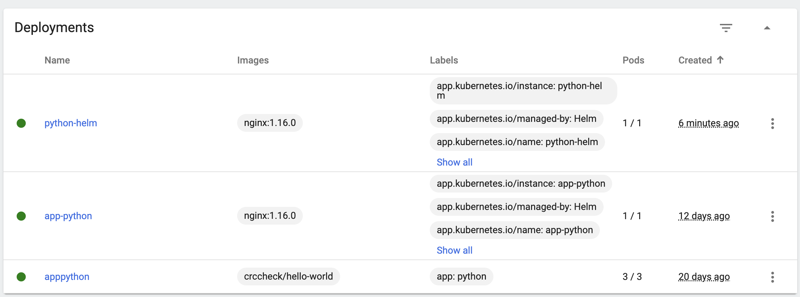

# K8S Lab

`kubectl get pods,svc` when manually creating deployment and service

NAME                 TYPE           CLUSTER-IP    EXTERNAL-IP   PORT(S)          AGE
service/hello-node   LoadBalancer   10.111.5.17   <pending>     8080:32170/TCP   3m29s
service/kubernetes   ClusterIP      10.96.0.1     <none>        443/TCP          6m4s

`kubectl get pods,svc` when creating deployment and service using yml

NAME                             READY   STATUS    RESTARTS   AGE
pod/apppython-66f4c9df47-9lrbh   1/1     Running   0          37s
pod/apppython-66f4c9df47-9npk4   1/1     Running   0          37s
pod/apppython-66f4c9df47-cbg48   1/1     Running   0          37s

NAME                    TYPE        CLUSTER-IP     EXTERNAL-IP   PORT(S)   AGE
service/kubernetes      ClusterIP   10.96.0.1      <none>        443/TCP   18m
service/pythonservice   ClusterIP   10.111.0.100   <none>        80/TCP    33s

minikube service --all

|-----------|------------|-------------|--------------|
| NAMESPACE |    NAME    | TARGET PORT |     URL      |
|-----------|------------|-------------|--------------|
| default   | kubernetes |             | No node port |
|-----------|------------|-------------|--------------|
😿  service default/kubernetes has no node port
|-----------|---------------|-------------|--------------|
| NAMESPACE |     NAME      | TARGET PORT |     URL      |
|-----------|---------------|-------------|--------------|
| default   | pythonservice |             | No node port |
|-----------|---------------|-------------|--------------|
😿  service default/pythonservice has no node port
🏃  Starting tunnel for service kubernetes.
🏃  Starting tunnel for service pythonservice.
|-----------|---------------|-------------|------------------------|
| NAMESPACE |     NAME      | TARGET PORT |          URL           |
|-----------|---------------|-------------|------------------------|
| default   | kubernetes    |             | http://127.0.0.1:61508 |
| default   | pythonservice |             | http://127.0.0.1:61511 |
|-----------|---------------|-------------|------------------------|

## Helm

