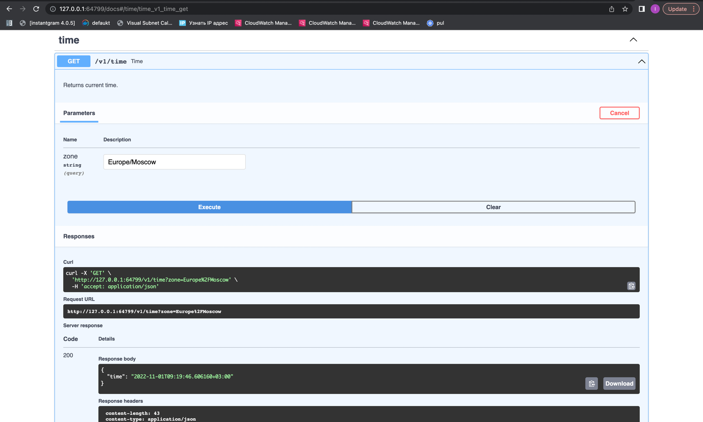

1)
```bash
devops % kubectl get pods,svc
NAME                              READY   STATUS    RESTARTS   AGE
pod/hello-node-858f588b48-rpqsw   1/1     Running   0          4m52s

NAME                 TYPE           CLUSTER-IP     EXTERNAL-IP   PORT(S)          AGE
service/hello-node   LoadBalancer   10.97.89.112   <pending>     5000:31104/TCP   2m29s
service/kubernetes   ClusterIP      10.96.0.1      <none>        443/TCP          12m
```
2)
```bash
k8s % kubectl get pods,svc           
NAME                                       READY   STATUS    RESTARTS   AGE
pod/time-app-deployment-5dffcb8747-chqp6   1/1     Running   0          21s
pod/time-app-deployment-5dffcb8747-s8wxf   1/1     Running   0          21s
pod/time-app-deployment-5dffcb8747-xd84w   1/1     Running   0          21s

NAME                       TYPE           CLUSTER-IP     EXTERNAL-IP   PORT(S)          AGE
service/kubernetes         ClusterIP      10.96.0.1      <none>        443/TCP          22h
service/time-app-service   LoadBalancer   10.97.30.174   <pending>     5000:31695/TCP   31s
```

3)
```bash
k8s % minikube service --all         
|-----------|------------|-------------|--------------|
| NAMESPACE |    NAME    | TARGET PORT |     URL      |
|-----------|------------|-------------|--------------|
| default   | kubernetes |             | No node port |
|-----------|------------|-------------|--------------|
😿  service default/kubernetes has no node port
|-----------|------------------|-------------|---------------------------|
| NAMESPACE |       NAME       | TARGET PORT |            URL            |
|-----------|------------------|-------------|---------------------------|
| default   | time-app-service |        5000 | http://192.168.49.2:31695 |
|-----------|------------------|-------------|---------------------------|
🏃  Starting tunnel for service kubernetes.
🏃  Starting tunnel for service time-app-service.
|-----------|------------------|-------------|------------------------|
| NAMESPACE |       NAME       | TARGET PORT |          URL           |
|-----------|------------------|-------------|------------------------|
| default   | kubernetes       |             | http://127.0.0.1:57710 |
| default   | time-app-service |             | http://127.0.0.1:57725 |
|-----------|------------------|-------------|------------------------|
🎉  Opening service default/kubernetes in default browser...
🎉  Opening service default/time-app-service in default browser...
❗  Because you are using a Docker driver on darwin, the terminal needs to be open to run it.
```

4)


#Lab 10
1) 
```bash
k8s % minikube service time-app
|-----------|----------|-------------|---------------------------|
| NAMESPACE |   NAME   | TARGET PORT |            URL            |
|-----------|----------|-------------|---------------------------|
| default   | time-app | http/5000   | http://192.168.49.2:31193 |
|-----------|----------|-------------|---------------------------|
🏃  Starting tunnel for service time-app.
|-----------|----------|-------------|------------------------|
| NAMESPACE |   NAME   | TARGET PORT |          URL           |
|-----------|----------|-------------|------------------------|
| default   | time-app |             | http://127.0.0.1:52815 |
|-----------|----------|-------------|------------------------|
🎉  Opening service default/time-app in default browser...
❗  Because you are using a Docker driver on darwin, the terminal needs to be open to run it.
```

My service opened:


```bash
k8s % kubectl get pods,svc
NAME                            READY   STATUS    RESTARTS   AGE
pod/time-app-5d6bb85f87-dlt69   1/1     Running   0          67m

NAME                 TYPE           CLUSTER-IP       EXTERNAL-IP   PORT(S)          AGE
service/kubernetes   ClusterIP      10.96.0.1        <none>        443/TCP          7d1h
service/time-app     LoadBalancer   10.107.217.170   <pending>     5000:31193/TCP   67m
```