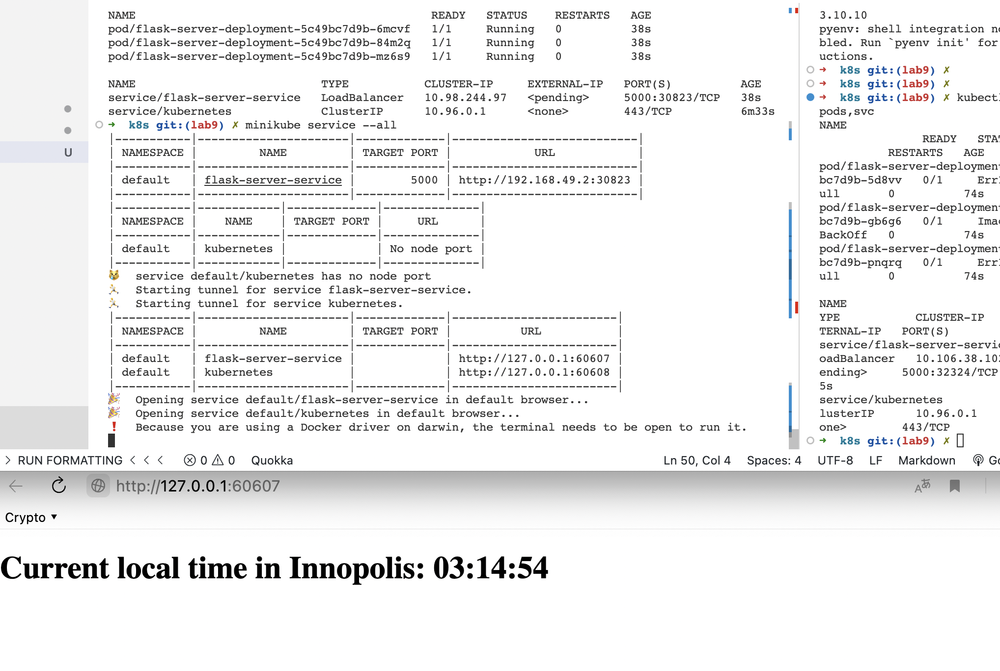

# Kubernetes

1. Create Deployment

```
kubectl create deployment hello-node --image=timurbl/devops_labs:latest
```

2. Create Service

```
kubectl expose deployment hello-node --type=LoadBalancer --port=8080
```

3. Run `kubectl get pods,svc`

```
NAME                             READY   STATUS             RESTARTS   AGE
pod/hello-node-74c9fd485-t2cth   0/1     ImagePullBackOff   0          3m30s

NAME                 TYPE           CLUSTER-IP      EXTERNAL-IP   PORT(S)          AGE
service/hello-node   LoadBalancer   10.108.104.40   <pending>     8080:30268/TCP   112s
service/kubernetes   ClusterIP      10.96.0.1       <none>        443/TCP          3m45s
```

4. Clean up

```
➜  ~ kubectl delete service hello-node
service "hello-node" deleted
➜  ~ kubectl delete deployment hello-node
deployment.apps "hello-node" deleted
```

5. Create a configuration files `deployment.yml` to deploy application
6. Create a `service.yml` manifest for your app
7. Provide those files in the k8s folder

```
➜  k8s git:(lab9) ✗ kubectl get pods,svc
NAME                                           READY   STATUS    RESTARTS   AGE
pod/flask-server-deployment-5c49bc7d9b-6mcvf   1/1     Running   0          38s
pod/flask-server-deployment-5c49bc7d9b-84m2q   1/1     Running   0          38s
pod/flask-server-deployment-5c49bc7d9b-mz6s9   1/1     Running   0          38s

NAME                           TYPE           CLUSTER-IP     EXTERNAL-IP   PORT(S)          AGE
service/flask-server-service   LoadBalancer   10.98.244.97   <pending>     5000:30823/TCP   38s
service/kubernetes             ClusterIP      10.96.0.1      <none>        443/TCP          6m33s

```

8. Run `minikube service --all`
   
