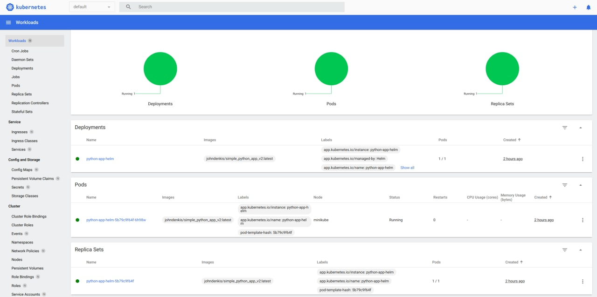

# Lab 10 (Kubernetes, Helm)

## Part I: python app

Deployment: 

```
$ cd ./k8s/app_python

$ helm create python-app-helm
Creating python-app-helm

$ helm package python-app-helm                            
Successfully packaged chart and saved it to: /home/skywlkr/Innopolis_DevOps2022/app_python/python-app-helm-0.1.0.tgz

$ helm install python-app-helm ./python-app-helm-0.1.0.tgz
NAME: python-app-helm
LAST DEPLOYED: Sun Nov  6 15:40:43 2022
NAMESPACE: default
STATUS: deployed
REVISION: 1
NOTES:
1. Get the application URL by running these commands:
     NOTE: It may take a few minutes for the LoadBalancer IP to be available.
           You can watch the status of by running 'kubectl get --namespace default svc -w python-app-helm'
  export SERVICE_IP=$(kubectl get svc --namespace default python-app-helm --template "{{ range (index .status.loadBalancer.ingress 0) }}{{.}}{{ end }}")
  echo http://$SERVICE_IP:80
```

Result:

```
$ helm list
NAME             NAMESPACE  REVISION  UPDATED                                  STATUS    CHART                  APP VERSION
python-app-helm  default    1         2022-11-06 15:40:43.595218976 +0300 MSK  deployed  python-app-helm-0.1.0  1.16.0
```

```
$ kubectl get pods,svc                  
NAME                                   READY   STATUS    RESTARTS   AGE
pod/python-app-helm-5b79c9f64f-6h98w   1/1     Running   0          127m

NAME                      TYPE           CLUSTER-IP       EXTERNAL-IP   PORT(S)        AGE
service/kubernetes        ClusterIP      10.96.0.1        <none>        443/TCP        5d14h
service/python-app-helm   LoadBalancer   10.111.205.221   <pending>     80:30012/TCP   127m
```

```
$ minikube service python-app-helm
|-----------|-----------------|-------------|---------------------------|
| NAMESPACE |      NAME       | TARGET PORT |            URL            |
|-----------|-----------------|-------------|---------------------------|
| default   | python-app-helm | http/80     | http://192.168.49.2:30012 |
|-----------|-----------------|-------------|---------------------------|
🎉  Opening service default/python-app-helm in default browser...
➜  app_python git:(lab10) ✗ Opening in existing browser session.
```


```
$ minikube dashboard              
🤔  Verifying dashboard health ...
🚀  Launching proxy ...
🤔  Verifying proxy health ...
🎉  Opening http://127.0.0.1:44231/api/v1/namespaces/kubernetes-dashboard/services/http:kubernetes-dashboard:/proxy/ in your default browser...
Opening in existing browser session.
```



## Part II: golang app (bonus)


Deployment:

```
$ cd ./k8s/app_go

$ helm create go-app-helm
Creating go-app-helm

$ helm package go-app-helm                                                  
Successfully packaged chart and saved it to: /home/skywlkr/Innopolis_DevOps2022/k8s/app_go/go-app-helm-0.1.0.tgz

$ helm install go-app-helm ./go-app-helm-0.1.0.tgz
NAME: go-app-helm
LAST DEPLOYED: Sun Nov  6 18:16:56 2022
NAMESPACE: default
STATUS: deployed
REVISION: 1
NOTES:
1. Get the application URL by running these commands:
     NOTE: It may take a few minutes for the LoadBalancer IP to be available.
           You can watch the status of by running 'kubectl get --namespace default svc -w go-app-helm'
  export SERVICE_IP=$(kubectl get svc --namespace default go-app-helm --template "{{ range (index .status.loadBalancer.ingress 0) }}{{.}}{{ end }}")
  echo http://$SERVICE_IP:80
```

Result:

```
$ helm list
NAME         NAMESPACE  REVISION  UPDATED                                  STATUS    CHART              APP VERSION
go-app-helm  default    1         2022-11-06 18:16:56.273819071 +0300 MSK  deployed  go-app-helm-0.1.0  1.16.0
```

```
$ kubectl get pods,svc                  
NAME                               READY   STATUS    RESTARTS   AGE
pod/go-app-helm-8598987cb4-bzrbd   1/1     Running   0          3m40s

NAME                  TYPE           CLUSTER-IP      EXTERNAL-IP   PORT(S)        AGE
service/go-app-helm   LoadBalancer   10.104.63.126   <pending>     80:31862/TCP   3m40s
service/kubernetes    ClusterIP      10.96.0.1       <none>        443/TCP        5d15h
```

```
$ minikube service python-app-helm
|-----------|-------------|-------------|---------------------------|
| NAMESPACE |    NAME     | TARGET PORT |            URL            |
|-----------|-------------|-------------|---------------------------|
| default   | go-app-helm | http/80     | http://192.168.49.2:31862 |
|-----------|-------------|-------------|---------------------------|
🎉  Opening service default/go-app-helm in default browser...
```


```
$ minikube dashboard                                   
🤔  Verifying dashboard health ...
🚀  Launching proxy ...
🤔  Verifying proxy health ...
🎉  Opening http://127.0.0.1:32879/api/v1/namespaces/kubernetes-dashboard/services/http:kubernetes-dashboard:/proxy/ in your default browser...
Opening in existing browser session.
```


## Part III: description (bonus)

* **Library Charts** is used when there is a lot of repetitions of code in many charts that can be simplified by using same template. This chart defines primitives which can be used in other charts.
* **Umbrella charts** is global chart that can have multiple subcharts.

----------------------------------------

# Lab 9 (Kubernetes)

## Part I: python app

### Manual deployment (python)

```
$ minikube start --kubernetes-version=v1.23.12
...
$ kubectl create deployment simple-python-app --image=johndenkis/simple_python_app_v2:latest 
deployment.apps/simple-python-app created

$ kubectl expose deployment simple-python-app --type=LoadBalancer --port=5000
service/simple-python-app exposed

$ kubectl get pods,svc
NAME                                     READY   STATUS    RESTARTS   AGE
pod/simple-python-app-68dbb78977-kpgvb   1/1     Running   0          2m4s

NAME                        TYPE           CLUSTER-IP      EXTERNAL-IP   PORT(S)          AGE
service/kubernetes          ClusterIP      10.96.0.1       <none>        443/TCP          2m19s
service/simple-python-app   LoadBalancer   10.106.118.18   <pending>     5000:31721/TCP   30s

$minikube service simple-python-app                
|-----------|-------------------|-------------|---------------------------|
| NAMESPACE |       NAME        | TARGET PORT |            URL            |
|-----------|-------------------|-------------|---------------------------|
| default   | simple-python-app |        5000 | http://192.168.49.2:31721 |
|-----------|-------------------|-------------|---------------------------|
🎉  Opening service default/simple-python-app in default browser...
➜   Opening in existing browser session.

$ kubectl delete service simple-python-app
service "simple-python-app" deleted
$ kubectl delete deployment simple-python-app
deployment.apps "simple-python-app" deleted
```

Result from browser at http://192.168.49.2:31721:


### Manifest deployment (python)

```
$ cd ./app_python

$ kubectl apply -f .
deployment.apps/simple-python-app-deployment created
service/simple-python-app-service created

$ kubectl get pods,svc                    
NAME                                               READY   STATUS    RESTARTS   AGE
pod/simple-python-app-deployment-b4c87b497-bjz9v   1/1     Running   0          54s
pod/simple-python-app-deployment-b4c87b497-pvnwq   1/1     Running   0          54s
pod/simple-python-app-deployment-b4c87b497-wmgh6   1/1     Running   0          54s

NAME                                TYPE           CLUSTER-IP      EXTERNAL-IP   PORT(S)          AGE
service/kubernetes                  ClusterIP      10.96.0.1       <none>        443/TCP          12m
service/simple-python-app-service   LoadBalancer   10.109.26.231   <pending>     5000:31540/TCP   54s

$ minikube service --all
|-----------|------------|-------------|--------------|
| NAMESPACE |    NAME    | TARGET PORT |     URL      |
|-----------|------------|-------------|--------------|
| default   | kubernetes |             | No node port |
|-----------|------------|-------------|--------------|
😿  service default/kubernetes has no node port
|-----------|---------------------------|-------------|---------------------------|
| NAMESPACE |           NAME            | TARGET PORT |            URL            |
|-----------|---------------------------|-------------|---------------------------|
| default   | simple-python-app-service |        5000 | http://192.168.49.2:31540 |
|-----------|---------------------------|-------------|---------------------------|
🎉  Opening service default/simple-python-app-service in default browser...
➜   Opening in existing browser session.
```

Result from the browser at http://192.168.49.2:31540:


## Part II: golang app (bonus)

### Manifest deployment (golang)

```
$ cd ./app_go

$ kubectl apply -f .                                
deployment.apps/simple-go-app-deployment created
service/simple-go-app-service created

$ kubectl get pods,svc  
NAME                                            READY   STATUS    RESTARTS   AGE
pod/simple-go-app-deployment-68b65f9694-b6kms   1/1     Running   0          2m11s
pod/simple-go-app-deployment-68b65f9694-pg2m5   1/1     Running   0          2m11s
pod/simple-go-app-deployment-68b65f9694-w6gp6   1/1     Running   0          2m11s

NAME                            TYPE           CLUSTER-IP     EXTERNAL-IP   PORT(S)          AGE
service/kubernetes              ClusterIP      10.96.0.1      <none>        443/TCP          28m
service/simple-go-app-service   LoadBalancer   10.96.210.97   <pending>     2222:31937/TCP   2m11s

$ minikube service --all
|-----------|------------|-------------|--------------|
| NAMESPACE |    NAME    | TARGET PORT |     URL      |
|-----------|------------|-------------|--------------|
| default   | kubernetes |             | No node port |
|-----------|------------|-------------|--------------|
😿  service default/kubernetes has no node port
|-----------|-----------------------|-------------|---------------------------|
| NAMESPACE |         NAME          | TARGET PORT |            URL            |
|-----------|-----------------------|-------------|---------------------------|
| default   | simple-go-app-service |        2222 | http://192.168.49.2:31937 |
|-----------|-----------------------|-------------|---------------------------|
🎉  Opening service default/simple-go-app-service in default browser...
➜   Opening in existing browser session.
```

Result from the browser at http://192.168.49.2:31937:


## Part III: description (bonus)

* Ingress - the rules for proxying traffic from an external source to services inside the k8s cluster.
* Ingress controller - the implementation for the Ingress (for example, GCE and Nginx)
* StatefulSet - resource used for managing deployment and scaling of pods of stateful apps
* DaemonSet - resource that ensures the pod runs on all the nodes of the cluster; automatically adds and deletes the pod
* PersistentVolumes - storage system that have a lifecycle independent of any individual pod