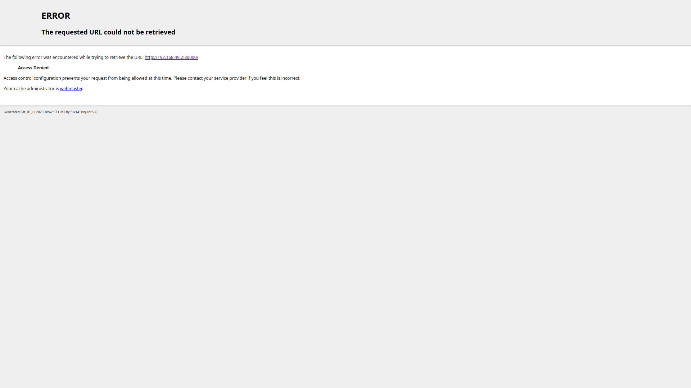

# Output of 'kubectl get pods,svc' on manual config

```
    NAME                                       READY   STATUS    RESTARTS      AGE
pod/lab9-5bcbd77446-qg2cw                  1/1     Running   1 (14m ago)   18m

NAME                 TYPE           CLUSTER-IP     EXTERNAL-IP   PORT(S)          AGE
service/kubernetes   ClusterIP      10.96.0.1      <none>        443/TCP          15h
service/lab9         LoadBalancer   10.99.147.37   <pending>     8080:31572/TCP   8s
```

# 'kubectl get pods,svc' with config files

```
    NAME                                       READY   STATUS    RESTARTS      AGE
pod/app-deployment-656cb6959-l9dmd         1/1     Running   0             5m56s
pod/app-deployment-656cb6959-tzqzl         1/1     Running   0             5m56s
pod/app-deployment-656cb6959-z7d46         1/1     Running   0             5m56s

NAME                  TYPE           CLUSTER-IP     EXTERNAL-IP   PORT(S)          AGE
service/app-service   LoadBalancer   10.98.154.39   <pending>     8081:32614/TCP   5m57s
service/kubernetes    ClusterIP      10.96.0.1      <none>        443/TCP          15h
```

# `minikube service --all`

```
|-----------|-------------|-------------|---------------------------|
|-----------|-------------|-------------|---------------------------|
|-----------|-------------|-------------|---------------------------|
|-----------|-------------|-------------|---------------------------|
|-----------|-------------|-------------|---------------------------|
| NAMESPACE |    NAME     | TARGET PORT |            URL            |
|-----------|-------------|-------------|---------------------------|
| default   | app-service |        8081 | http://192.168.49.2:32614 |
|-----------|-------------|-------------|---------------------------|
🏃  Starting tunnel for service app-service.
🏃  Starting tunnel for service app-service.
🏃  Starting tunnel for service app-service.
🏃  Starting tunnel for service app-service.
docker@127.0.0.1's password: |-----------|-------------|-------------|------------------------|
| NAMESPACE |    NAME     | TARGET PORT |          URL           |
|-----------|-------------|-------------|------------------------|
|-----------|-------------|-------------|------------------------|
|-----------|-------------|-------------|------------------------|
|-----------|-------------|-------------|------------------------|
| default   | app-service |             | http://127.0.0.1:49446 |
|-----------|-------------|-------------|------------------------|
🎉  Opening service default/app-service in default browser...
❗  Because you are using a Docker driver on windows, the terminal needs to be open to run it.
```

# Screenshot from browser



# lab 10

## minikube service app-python

```

|-----------|------------|-------------|--------------|
| NAMESPACE |    NAME    | TARGET PORT |     URL      |
|-----------|------------|-------------|--------------|
| default   | app-python |             | No node port |
| default   | app-python |             | No node port |
| default   | app-python |             | No node port |
|-----------|------------|-------------|--------------|
|-----------|------------|-------------|--------------|
|-----------|------------|-------------|--------------|
|-----------|------------|-------------|--------------|
|-----------|------------|-------------|--------------|
|-----------|------------|-------------|--------------|
😿  service default/app-python has no node port
🏃  Starting tunnel for service app-python.
|-----------|------------|-------------|------------------------|
| NAMESPACE |    NAME    | TARGET PORT |          URL           |
|-----------|------------|-------------|------------------------|
| default   | app-python |             | http://127.0.0.1:64486 |
|-----------|------------|-------------|------------------------|
```

## kubectl get pods,svc

```
    NAME                              READY   STATUS    RESTARTS   AGE
pod/app-python-65bc8bc876-gnpxb   1/1     Running   0          6m1s

NAME                 TYPE        CLUSTER-IP      EXTERNAL-IP   PORT(S)   AGE
service/app-python   ClusterIP   10.109.99.104   <none>        80/TCP    7m28s
service/kubernetes   ClusterIP   10.96.0.1       <none>        443/TCP   7d2h
```


