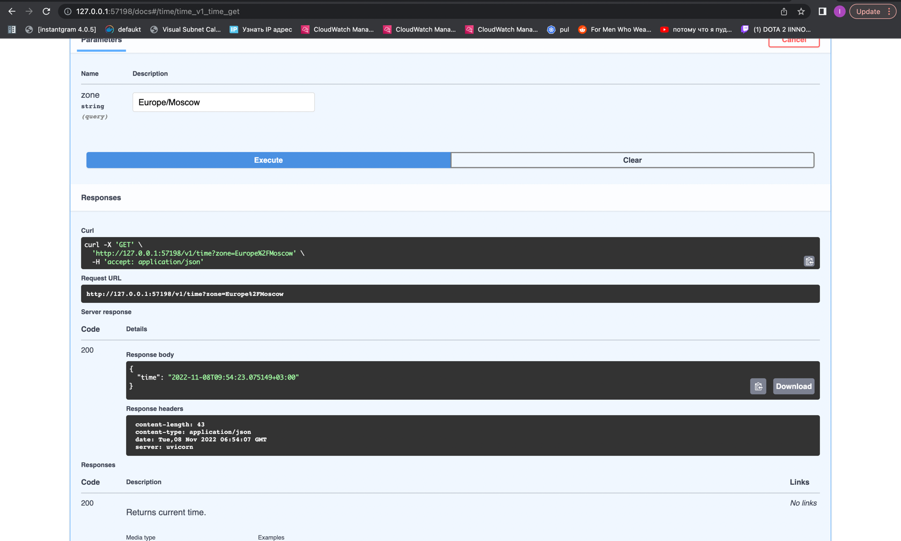

# Manual
Since we cannot make the kubernetes pull images from AWS ECR when you run it in command line, I pushed it to docker hub.

Run deployment.
```shell
kubectl create deployment app-python --image=smthngslv/iu-devops-labs:latest \
    -- bash -c "cd ./src && gunicorn --config gunicorn.conf.py app_python.api:app" 
```

And expose the port:
```shell
kubectl expose deployment app-python --type=LoadBalancer --port=8000
```

Run `minikube tunnel` to proxy the traffic and `minikube service app-python` to start the service.
```shell
(iu-devops-labs) f3line@kitty-2 k8s % minikube tunnel
✅  Tunnel successfully started

📌  NOTE: Please do not close this terminal as this process must stay alive for the tunnel to be accessible ...

🏃  Starting tunnel for service api-python.
```
```shell
(iu-devops-labs) f3line@kitty-2 k8s % minikube service app-python
|-----------|------------|-------------|---------------------------|
| NAMESPACE |    NAME    | TARGET PORT |            URL            |
|-----------|------------|-------------|---------------------------|
| default   | app-python |        8000 | http://192.168.49.2:32267 |
|-----------|------------|-------------|---------------------------|
🏃  Starting tunnel for service app-python.
|-----------|------------|-------------|------------------------|
| NAMESPACE |    NAME    | TARGET PORT |          URL           |
|-----------|------------|-------------|------------------------|
| default   | app-python |             | http://127.0.0.1:64799 |
|-----------|------------|-------------|------------------------|
🎉  Opening service default/app-python in default browser...
❗  Because you are using a Docker driver on darwin, the terminal needs to be open to run it.
```

Validating that it's working:
```shell
(iu-devops-labs) f3line@kitty-2 k8s % kubectl get deployments
NAME     READY   UP-TO-DATE   AVAILABLE   AGE
app-python   1/1     1            1           96s
```
```shell
(iu-devops-labs) f3line@kitty-2 k8s % kubectl get pods,svc
NAME                              READY   STATUS    RESTARTS   AGE
pod/app-python-79f87588c6-nprcm   1/1     Running   0          101s

NAME                 TYPE           CLUSTER-IP       EXTERNAL-IP   PORT(S)          AGE
service/app-python   LoadBalancer   10.109.151.253   127.0.0.1     8000:32267/TCP   98s
service/kubernetes   ClusterIP      10.96.0.1        <none>        443/TCP          103m
```

And it's working just fine:


Cleanup.
```shell
(iu-devops-labs) f3line@kitty-2 k8s % kubectl delete service app-python                                                                                             
service "app-python" deleted
```
```shell
(iu-devops-labs) f3line@kitty-2 k8s % kubectl delete deployment app-python                                                                                               
deployment.apps "app-python" deleted
```

# With config
Fkn magic to make the kubernetes pull images from ECR:
```shell
sh ecr_login.sh
```

Apply.
```shell
kubectl apply -f ./app_python/deployment.yml
kubectl apply -f ./app_python/service.yml
```

Validating that it's working:
```shell
(iu-devops-labs) f3line@kitty-2 k8s % kubectl get pods,svc
NAME                                         READY   STATUS    RESTARTS   AGE
pod/app-python-deployment-5f59b7b77b-89vwf   1/1     Running   0          17s
pod/app-python-deployment-5f59b7b77b-j5j75   1/1     Running   0          17s
pod/app-python-deployment-5f59b7b77b-pdd4z   1/1     Running   0          17s

NAME                         TYPE           CLUSTER-IP    EXTERNAL-IP   PORT(S)          AGE
service/app-python-service   LoadBalancer   10.96.27.83   127.0.0.1     8000:31157/TCP   11s
service/kubernetes           ClusterIP      10.96.0.1     <none>        443/TCP          133m
```

```shell
(iu-devops-labs) f3line@kitty-2 k8s % minikube service --all
|-----------|--------------------|-------------|---------------------------|
| NAMESPACE |        NAME        | TARGET PORT |            URL            |
|-----------|--------------------|-------------|---------------------------|
| default   | app-python-service |        8000 | http://192.168.49.2:31157 |
|-----------|--------------------|-------------|---------------------------|
|-----------|------------|-------------|--------------|
| NAMESPACE |    NAME    | TARGET PORT |     URL      |
|-----------|------------|-------------|--------------|
| default   | kubernetes |             | No node port |
|-----------|------------|-------------|--------------|
😿  service default/kubernetes has no node port
🏃  Starting tunnel for service app-python-service.
🏃  Starting tunnel for service kubernetes.
|-----------|--------------------|-------------|------------------------|
| NAMESPACE |        NAME        | TARGET PORT |          URL           |
|-----------|--------------------|-------------|------------------------|
| default   | app-python-service |             | http://127.0.0.1:65111 |
| default   | kubernetes         |             | http://127.0.0.1:65121 |
|-----------|--------------------|-------------|------------------------|
🎉  Opening service default/app-python-service in default browser...
🎉  Opening service default/kubernetes in default browser...
❗  Because you are using a Docker driver on darwin, the terminal needs to be open to run it.
```

And it's working:


Delete:
```shell
kubectl delete -f ./app_python/deployment.yml
kubectl delete -f ./app_python/service.yml
```

# Helm
1. Create template via `helm create app-python`.
2. Update `image` and `service` options in `values.yaml`
3. Update ports, command and health checks config in templates.
4. Create a package via `helm package app-python`.
5. Run via `helm install app-python app-python-0.1.0.tgz`.
6. Check dashboard

7. Check output of `kubectl get pods,svc`
```shell
(iu-devops-labs) f3line@kitty-2 iu-devops-labs % kubectl get pods,svc                        
NAME                              READY   STATUS    RESTARTS   AGE
pod/app-python-548c67b566-728hn   1/1     Running   0          55s

NAME                 TYPE        CLUSTER-IP      EXTERNAL-IP   PORT(S)          AGE
service/app-python   NodePort    10.99.152.229   <none>        8000:30999/TCP   55s
service/kubernetes   ClusterIP   10.96.0.1       <none>        443/TCP          7d2h
```
8. Check application.
```shell
(iu-devops-labs) f3line@kitty-2 iu-devops-labs % minikube service app-python       
|-----------|------------|-------------|---------------------------|
| NAMESPACE |    NAME    | TARGET PORT |            URL            |
|-----------|------------|-------------|---------------------------|
| default   | app-python |        8000 | http://192.168.49.2:30999 |
|-----------|------------|-------------|---------------------------|
🏃  Starting tunnel for service app-python.
|-----------|------------|-------------|------------------------|
| NAMESPACE |    NAME    | TARGET PORT |          URL           |
|-----------|------------|-------------|------------------------|
| default   | app-python |             | http://127.0.0.1:57198 |
|-----------|------------|-------------|------------------------|
🎉  Opening service default/app-python in default browser...
❗  Because you are using a Docker driver on darwin, the terminal needs to be open to run it.
```


9. Uninstall
```shell
(iu-devops-labs) f3line@kitty-2 k8s % helm uninstall app-python                   
release "app-python" uninstalled
```
