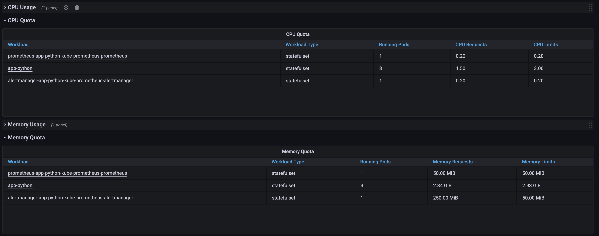
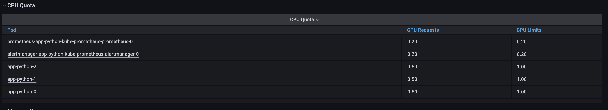
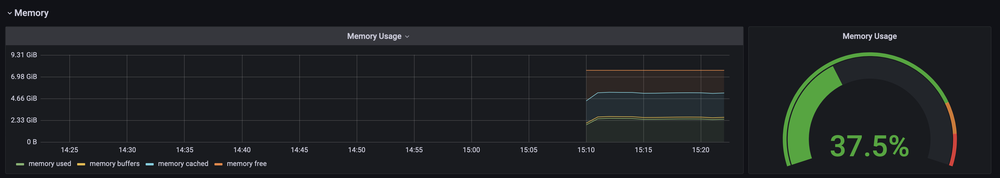
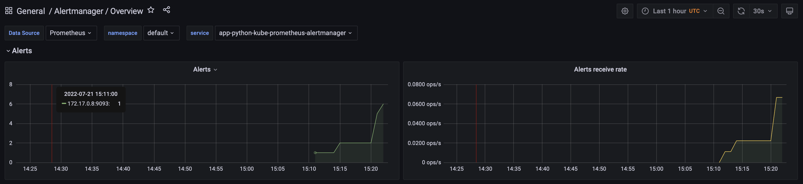
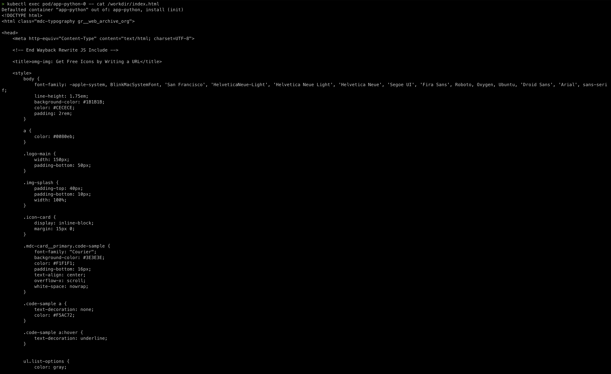

## Kube Prometheus Stack

* The **Prometheus Operator** - Simplify and automate config of a Prometheus by stack monitoring for k8s clusters.
* Highly available **Prometheus** - Collect metrics
* Highly available **Alertmanager**- Managing alerts from clients application and direct it to the receivers.
* **Prometheus node-exporter** - Export os and hardware metrics
* **Prometheus Adapter for Kubernetes Metrics APIs** - Adapt data for autoscaling/v2 Horizontal Pod Autoscaler in k8s and replace metrics servers on clusters that already run Prometheus.
* **kube-state-metrics** - listens for k8s API and generate metrics about it.
* **Grafana** - visualize metrics.

```console
> kubectl get po,sts,svc,pvc,cm
NAME                                                         READY   STATUS    RESTARTS   AGE
pod/alertmanager-app-python-kube-prometheus-alertmanager-0   2/2     Running   0          85s
pod/app-python-0                                             1/1     Running   0          86s
pod/app-python-1                                             1/1     Running   0          86s
pod/app-python-2                                             1/1     Running   0          86s
pod/app-python-grafana-784c57d9d-vjkbc                       3/3     Running   0          86s
pod/app-python-kube-prometheus-operator-7955594ff6-jwdnh     1/1     Running   0          86s
pod/app-python-kube-state-metrics-78dfb7fb7d-gk6rp           1/1     Running   0          86s
pod/app-python-prometheus-node-exporter-g4gtf                1/1     Running   0          86s
pod/prometheus-app-python-kube-prometheus-prometheus-0       2/2     Running   0          84s

NAME                                                                    READY   AGE
statefulset.apps/alertmanager-app-python-kube-prometheus-alertmanager   1/1     85s
statefulset.apps/app-python                                             3/3     86s
statefulset.apps/prometheus-app-python-kube-prometheus-prometheus       1/1     84s

NAME                                              TYPE        CLUSTER-IP       EXTERNAL-IP   PORT(S)                      AGE
service/alertmanager-operated                     ClusterIP   None             <none>        9093/TCP,9094/TCP,9094/UDP   85s
service/app-python                                ClusterIP   10.110.74.123    <none>        80/TCP                       86s
service/app-python-grafana                        ClusterIP   10.96.129.58     <none>        80/TCP                       86s
service/app-python-kube-prometheus-alertmanager   ClusterIP   10.102.22.26     <none>        9093/TCP                     86s
service/app-python-kube-prometheus-operator       ClusterIP   10.107.105.212   <none>        443/TCP                      86s
service/app-python-kube-prometheus-prometheus     ClusterIP   10.100.206.58    <none>        9090/TCP                     86s
service/app-python-kube-state-metrics             ClusterIP   10.103.107.177   <none>        8080/TCP                     86s
service/app-python-prometheus-node-exporter       ClusterIP   10.103.112.27    <none>        9100/TCP                     86s
service/kubernetes                                ClusterIP   10.96.0.1        <none>        443/TCP                      24d
service/prometheus-operated                       ClusterIP   None             <none>        9090/TCP                     85s

NAME                                        STATUS   VOLUME                                     CAPACITY   ACCESS MODES   STORAGECLASS   AGE
persistentvolumeclaim/visits-app-python-0   Bound    pvc-1b9e386e-d11b-4a3f-9011-ec03481cdf8e   128M       RWO            standard       9d
persistentvolumeclaim/visits-app-python-1   Bound    pvc-510688f9-00c8-4e47-a7b7-488be1c573ee   128M       RWO            standard       9d
persistentvolumeclaim/visits-app-python-2   Bound    pvc-e2244a0f-7bef-4e6a-81cd-f3042e8bda4e   128M       RWO            standard       9d

NAME                                                                     DATA   AGE
configmap/app-python-config                                              1      86s
configmap/app-python-grafana                                             2      86s
configmap/app-python-grafana-config-dashboards                           2      86s
configmap/app-python-grafana-test                                        1      86s
configmap/app-python-kube-prometheus-alertmanager-overview               1      86s
configmap/app-python-kube-prometheus-apiserver                           1      86s
configmap/app-python-kube-prometheus-cluster-total                       1      86s
configmap/app-python-kube-prometheus-controller-manager                  1      86s
configmap/app-python-kube-prometheus-etcd                                1      86s
configmap/app-python-kube-prometheus-grafana-datasource                  1      86s
configmap/app-python-kube-prometheus-grafana-overview                    1      86s
configmap/app-python-kube-prometheus-k8s-coredns                         1      86s
configmap/app-python-kube-prometheus-k8s-resources-cluster               1      86s
configmap/app-python-kube-prometheus-k8s-resources-namespace             1      86s
configmap/app-python-kube-prometheus-k8s-resources-node                  1      86s
configmap/app-python-kube-prometheus-k8s-resources-pod                   1      86s
configmap/app-python-kube-prometheus-k8s-resources-workload              1      86s
configmap/app-python-kube-prometheus-k8s-resources-workloads-namespace   1      86s
configmap/app-python-kube-prometheus-kubelet                             1      86s
configmap/app-python-kube-prometheus-namespace-by-pod                    1      86s
configmap/app-python-kube-prometheus-namespace-by-workload               1      86s
configmap/app-python-kube-prometheus-node-cluster-rsrc-use               1      86s
configmap/app-python-kube-prometheus-node-rsrc-use                       1      86s
configmap/app-python-kube-prometheus-nodes                               1      86s
configmap/app-python-kube-prometheus-nodes-darwin                        1      86s
configmap/app-python-kube-prometheus-persistentvolumesusage              1      86s
configmap/app-python-kube-prometheus-pod-total                           1      86s
configmap/app-python-kube-prometheus-prometheus                          1      86s
configmap/app-python-kube-prometheus-proxy                               1      86s
configmap/app-python-kube-prometheus-scheduler                           1      86s
configmap/app-python-kube-prometheus-workload-total                      1      86s
configmap/kube-root-ca.crt                                               1      24d
configmap/prometheus-app-python-kube-prometheus-prometheus-rulefiles-0   29     85s
```


```kubectl get po,sts,svc,pvc,cm``` - request to show list of pods, stateful sets, services, config maps, percictent volume claims 

## Monitoring

### StatefullSet CPU and Memory consuming



### Which Pod is using CPU more than others and which is less in the default namespace



### Node memory usage




### Amount of pods and containers actually ran by the Kubelet service.


### Alerts




## Init containers

```console
> kubectl exec pod/app-python-0 -- cat /workdir/index.html
```

