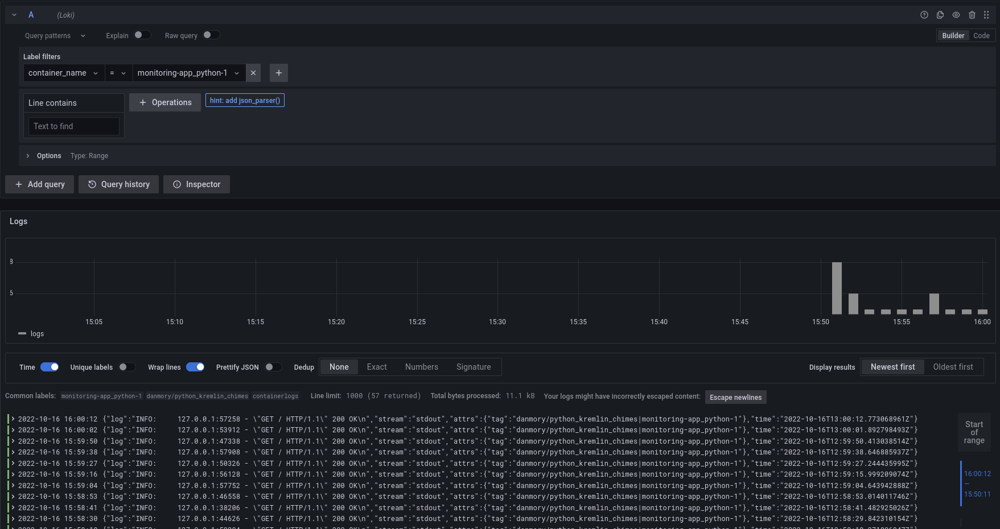
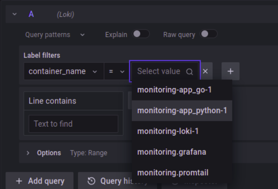
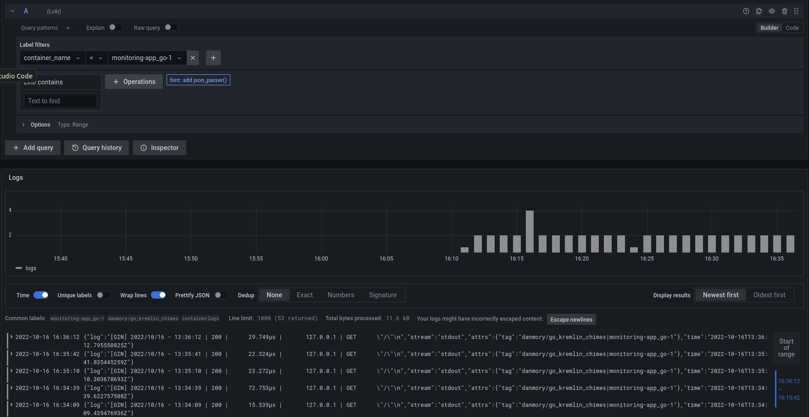

# Report

## Description

The logging stack consists of Promtail, Loki, Grafana.

The logs are collected from all containers.

## Proof that it works

1. Only python application

    

2. Go + Python application

    1. Available containers:

        

    2. Go application logs:

        

    3. Python application logs:

        
