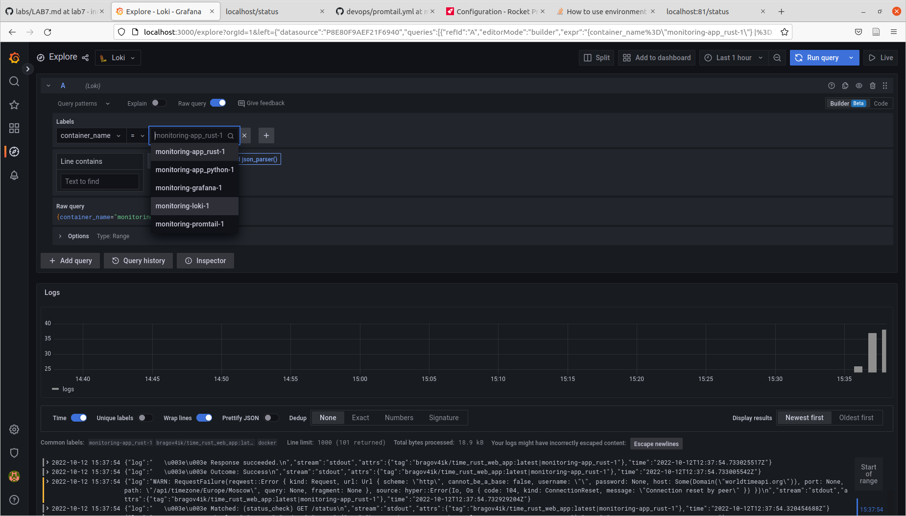

# Logging report

## Promtail + Loki + Graphana

### Result

The containers are launched succesfully, Graphana starts at port 8000. Logs are collected and can be retrieved:

### Solution description

The compose file contains (at the moment of writing report)

* **the app** itself
* **promtail** that has mounted docker folder for container information, where it finds logs for launched containers (also has config)
* **loki** to collect the logs from promtail
* **graphana** that launches with preconfigured loki data source

As a result, the logs are collected from all running containers, and those without particular labels are filtered out.

It is probably not the ideal solution, since running multiple such docker-composes will result in cross-collection of logs (which is likely to be not intended). However, for the purpose of this lab task I think it should be fine.

## Bonus task

Logs from all containers are already collected, I've just added bonus app.

In the screenshot you can see logs from the app + selection to see logs from all other containers:

