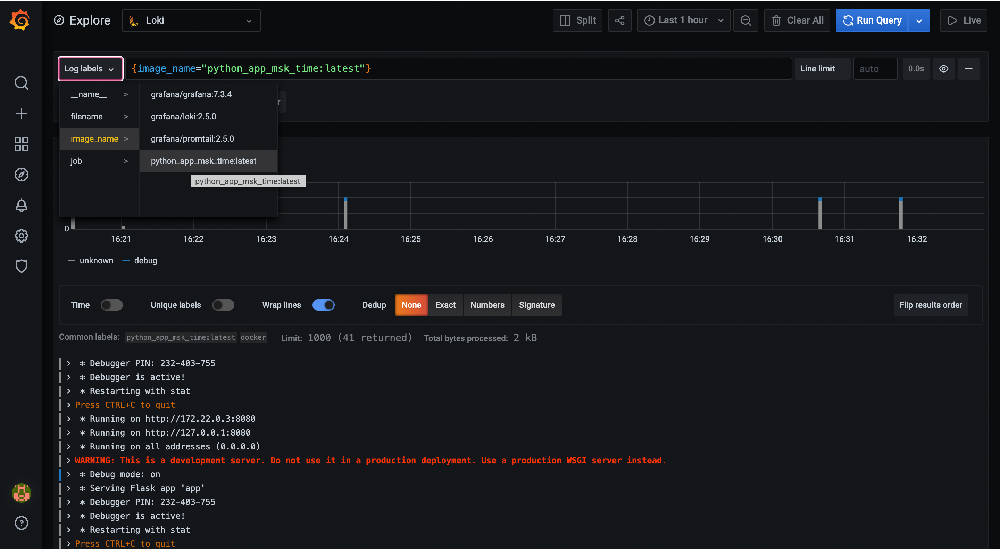

# Logging

## Run
1. run `docker-compose up` in the direcory with `docker-compose.yml`
2. use http://localhost:80 to go to the app
3. use http://localhost:3000 to go to the Grafana UI

## Screenshot
Grafana UI

