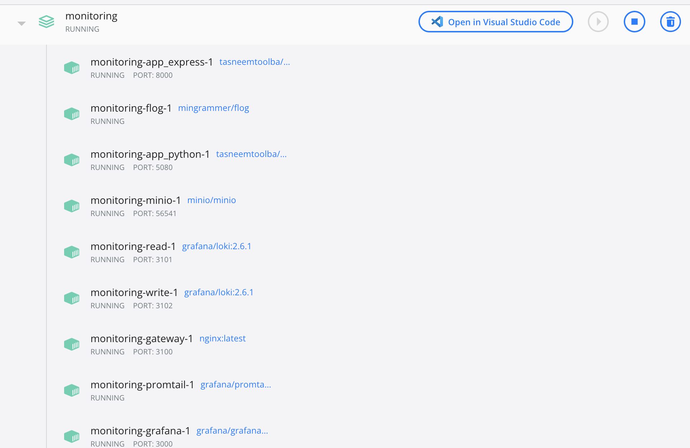
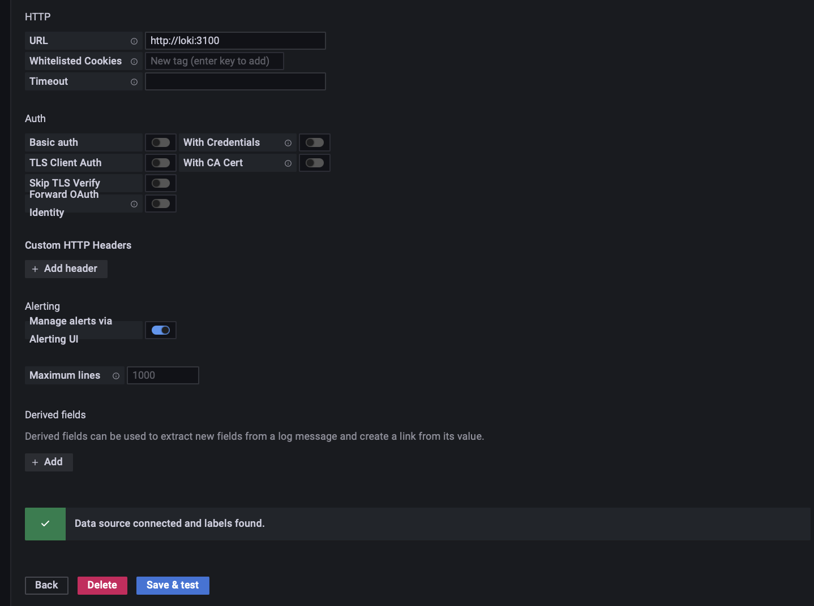
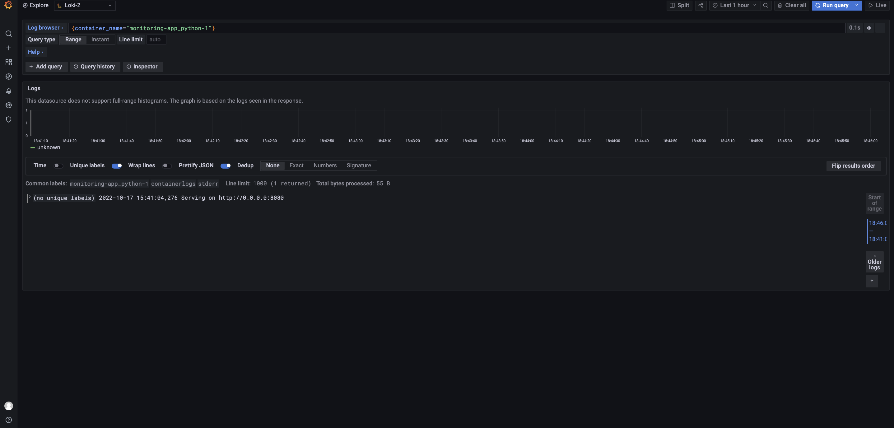
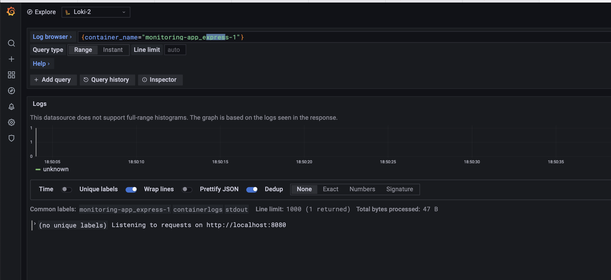
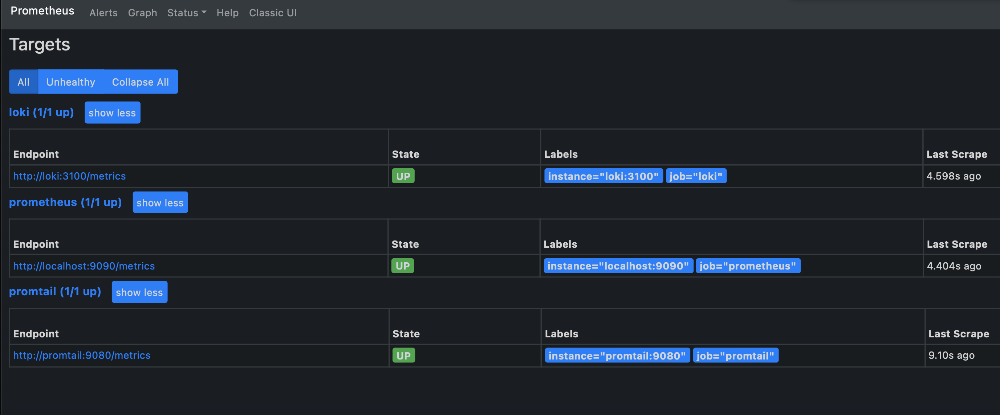

# Logging

Logging is done using the PLG stack (Promtail, Loki, and Grafana).

## Screenshots

- Running containers in Docker Compose:
  
- Adding Loki data source:
  
- Grafana dashboard:
  
- Extra app logs:
  
- Prometheus targets page:
  